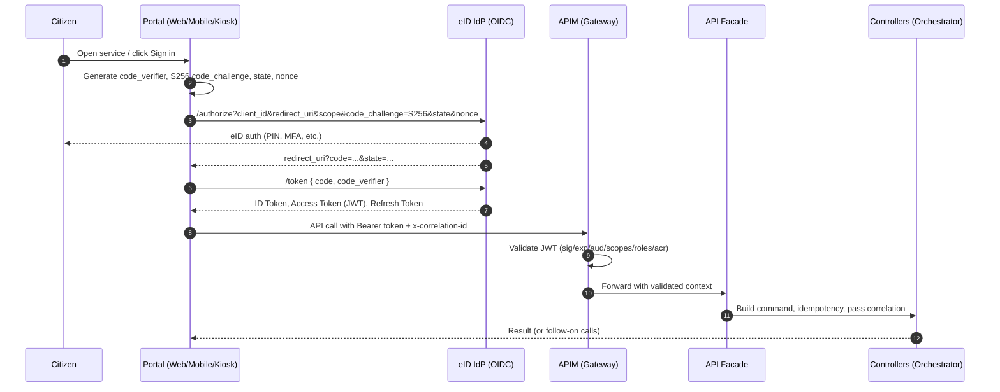
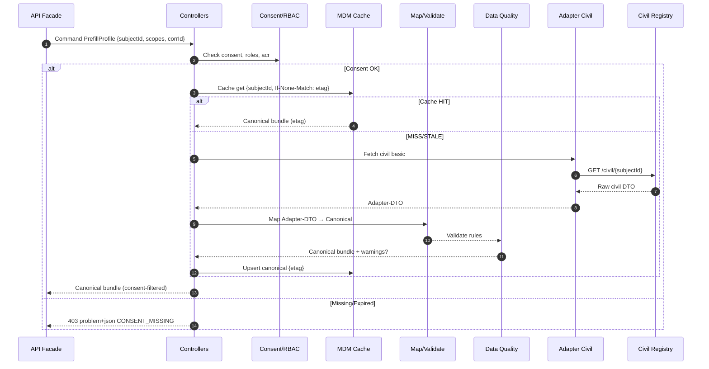
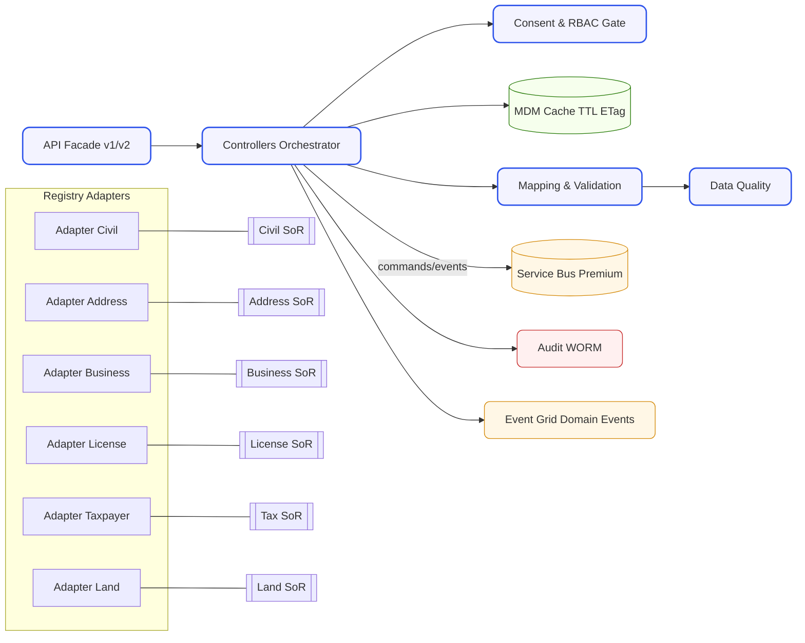
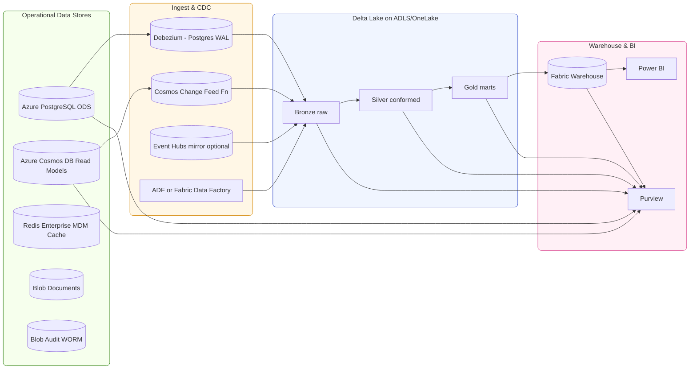
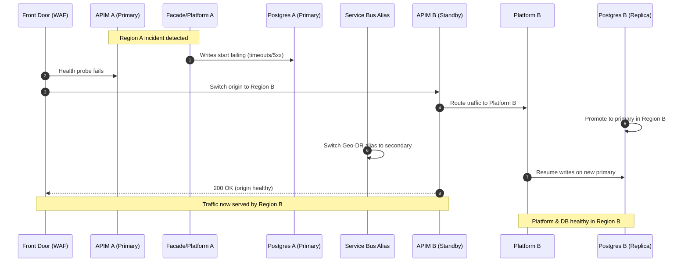
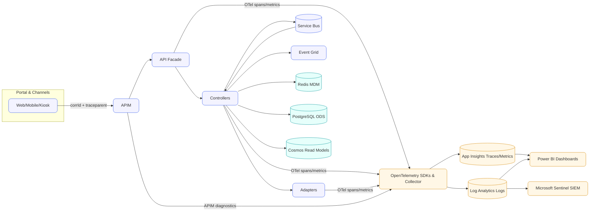

## Table of Contents

* [0. Introduction](#0-introduction)

  * [Purpose & Scope](#purpose--scope)
  * [Audience](#audience)
  * [Design Tenets (at a glance)](#design-tenets-at-a-glance)
  * [What This Pack Contains](#what-this-pack-contains)
  * [Key RFP Term: Only-Once (a.k.a. Once-Only)](#key-rfp-term-only-once-aka-once-only)
  * [How to Use This Document](#how-to-use-this-document)
  * [Out of Scope (explicit)](#out-of-scope-explicit)
  * [Versioning & Governance](#versioning--governance)
  * [Acronyms & Glossary](#acronyms--glossary)

* [1. RFP Compliance at a Glance](#1-rfp-compliance-at-a-glance)

  * [1.1 Executive Summary](#11-executive-summary)
  * [1.2 Overall Compliance Statement](#12-overall-compliance-statement)
  * [1.3 RFP Traceability Matrix (Top-Level)](#13-rfp-traceability-matrix-top-level)

* [2. Scope & Objectives](#2-scope--objectives)

  * [2.1 In-Scope Services](#21-in-scope-services)
  * [2.2 Out-of-Scope](#22-out-of-scope)
  * [2.3 Assumptions & Dependencies](#23-assumptions--dependencies)
  * [2.4 Objectives & Success Criteria](#24-objectives--success-criteria)

* [3. Solution Overview](#3-solution-overview)

  * [3.1 Problem Context & Goals](#31-problem-context--goals)
  * [3.2 Design Tenets (Solution Principles)](#32-design-tenets-solution-principles)
  * [3.3 Capability Map (What the platform does)](#33-capability-map-what-the-platform-does)
  * [3.4 Actors & Roles](#34-actors--roles)
  * [3.5 Component Overview (What each part is for)](#35-component-overview-what-each-part-is-for)
  * [3.6 Data Overview (at a glance)](#36-data-overview-at-a-glance)
  * [3.7 Security Overview (high level)](#37-security-overview-high-level)
  * [3.8 Integration Patterns](#38-integration-patterns)
  * [3.9 Environments & Deployment](#39-environments--deployment)

* [4. Master Architecture (Logical & Deployment)](#4-master-architecture-logical--deployment)

  * [4.1 Composite Logical Architecture (Architecture)](#41-composite-logical-architecture-architecture)
  * [4.2 Azure Deployment View (Regions, Zoning, Networking)](#42-azure-deployment-view-regions-zoning-networking)
  * [4.3 Data Flow Overview (Summary)](#43-data-flow-overview-summary)
  * [4.4 Trust Boundaries](#44-trust-boundaries)
  * [4.5 Network & Security Controls](#45-network--security-controls)
  * [4.6 Scaling Strategy](#46-scaling-strategy)
  * [4.7 High Availability & DR Topology](#47-high-availability--dr-topology)
  * [4.8 Service SKUs & Tiers (initial sizing)](#48-service-skus--tiers-initial-sizing)
  * [4.9 Endpoints, DNS & Certificates](#49-endpoints-dns--certificates)

* [5. Identity, Access & Consent (EPIC-A)](#5-identity-access--consent-epic-a)

  * [5.1 SSO/eID with OIDC + PKCE (S256)](#51-ssoeid-with-oidc--pkce-s256)
  * [5.2 Claims → RBAC Mapping](#52-claims--rbac-mapping)
  * [5.3 Consent Service (purpose/scopes/expiry)](#53-consent-service-purposescopesexpiry)
  * [5.4 Security Controls (end-to-end)](#54-security-controls-end-to-end)

* [6. API Gateway & Facade](#6-api-gateway--facade)

  * [6.1 Azure API Management (APIM) — Policies & Responsibilities](#61-azure-api-management-apim--policies--responsibilities)
  * [6.2 API Facade — Contracts & Responsibilities](#62-api-facade--contracts--responsibilities)
  * [6.3 Canonical Error Model (applicationproblemjson)](#63-canonical-error-model-applicationproblemjson)
  * [6.4 API Inventory (Facade) — Extract](#64-api-inventory-facade--extract)
  * [6.5 Versioning, Deprecation & Backward Compatibility](#65-versioning-deprecation--backward-compatibility)
  * [6.6 Webhook Ingress via APIM → Facade](#66-webhook-ingress-via-apim--facade)
  * [6.7 Non-Functional Targets (Gateway/Facade path)](#67-non-functional-targets-gatewayfacade-path)
  * [6.8 Operations & Runbooks (extract)](#68-operations--runbooks-extract)
  * [6.9 APIM vs. Facade — Quick Responsibility Split](#69-apim-vs-facade---quick-responsibility-split)

* [7. Interoperability Platform](#7-interoperability-platform)

  * [7.1 Controllers (Orchestrator) — “Brains”](#71-controllers-orchestrator--brains)
  * [7.2 Security & Consent Enforcement (SEC)](#72-security--consent-enforcement-sec)
  * [7.3 Mapping & Validation (Canonical DTO)](#73-mapping--validation-canonical-dto)
  * [7.4 Registry Adapters (6×)](#74-registry-adapters-6)
  * [7.5 Events, Retry & DLQ](#75-events-retry--dlq)
  * [7.6 Audit Evidence & Idempotency](#76-audit-evidence--idempotency)

* [8. Data Layer (OLTP/OLAP), Lakehouse & BI](#8-data-layer-oltpolap-lakehouse--bi)

  * [8.1 Operational Data Stores (PostgreSQL, Cosmos, Redis)](#81-operational-data-stores-postgresql-cosmos-redis)
  * [8.2 Read Models & Caching](#82-read-models--caching)
  * [8.3 Ingestion & CDC](#83-ingestion--cdc)
  * [8.4 Lakehouse (Delta) & Warehouse](#84-lakehouse-delta--warehouse)
  * [8.5 Governance (Purview) & Catalog](#85-governance-purview--catalog)
  * [8.6 Backup, Retention & Legal Holds](#86-backup-retention--legal-holds)
  * [8.7 BI (Power BI/Fabric) & RLS](#87-bi-power-bifabric--rls)

* [9. Key Journeys](#9-key-journeys)

* [10. Security & Privacy](#10-security--privacy)

* [11. Reliability, HA & DR](#11-reliability-ha--dr)

* [12. Observability & SLOs](#12-observability--slos)

* [13. Non-Functional Requirements](#13-non-functional-requirements)

* [14. Delivery & Environment Strategy](#14-delivery--environment-strategy)

* [15. Testing & Acceptance](#15-testing--acceptance)

* [16. Risk Register & Mitigations](#16-risk-register--mitigations)

* [17. Appendices & Evidence](#17-appendices--evidence)

* [18. Conclusion](#18-conclusion)

* [19. Only-Once Principle (RFP Key Term)](#19-only-once-principle-rfp-key-term)

---


# 0. Introduction

This document presents a **comprehensive technical design** for a national, multi-channel e-services platform with an **Interoperability Layer** that integrates six key registries. It is written to satisfy and evidence the RFP’s functional and non-functional requirements, with a focus on **security by design (OIDC+PKCE, RBAC/ABAC, consent)**, **once-only data reuse**, **API-first integration (no point-to-point)**, and **operational excellence** (observability, resilience, DR).

## Purpose & Scope

* Describe the end-to-end architecture (logical and deployment) covering **Portal, Identity, API Gateway, Facade, Interoperability Platform, Registries, Documents, eSign, Payments, Case, Data & Analytics, Observability, and DR**.
* Define **user journeys (US-1…US-38)** with happy/unhappy paths, controls, SLIs/SLOs, and acceptance tests.
* Provide **evidence** (API contracts, schemas, policies, KQL, runbooks) to demonstrate compliance.

## Audience

* **Technical evaluators & architects** (deep design, patterns, controls).
* **Business owners** (capabilities, compliance, risk posture).
* **Operations/SRE/SecOps** (SLOs, runbooks, DR).

## Design Tenets (at a glance)

* **Zero-trust**: all ingress via **Front Door → APIM**, short-lived tokens, `acr` step-up.
* **Consent-first & privacy-by-design**: consent gates before external calls; immutable audit (WORM).
* **Once-Only**: cache-first prefill with **ETag/TTL** and **event-driven invalidation**.
* **API-first**: versioned **Facade** contracts; **no direct system-to-system** links.
* **Resilient & observable**: retries/backoff, circuit breakers, DLQ; end-to-end tracing and SLOs.
* **Data-ready**: OLTP on Azure PostgreSQL, MDM on Redis Enterprise, analytics via Lakehouse/Warehouse.

## What This Pack Contains

* **RFP Compliance summary**, full **traceability matrix**, and **risk register**.
* **Master architecture** (Mermaid) + detailed flows, component responsibilities, and comms matrices.
* **Security & Privacy** controls, **Reliability/HA/DR** strategy, **Observability & SLOs**.
* **Delivery & Environment** plan (IaC, CI/CD, blue/green, canary), **Testing & Acceptance**.
* **Appendices & Evidence**: OpenAPI excerpts, schemas, APIM policies, KQL packs, chaos/DR checklists.

## How to Use This Document

* Start with **RFP Compliance at a Glance** for a one-page mapping.
* Review **Solution Overview** and **Master Architecture** for the big picture.
* Dive into **Key Journeys** (tables) to see happy/unhappy paths and the controls that fulfill the RFP.
* Use **Observability & SLOs** and **Testing & Acceptance** to verify measurable outcomes.
* Consult **Appendices & Evidence** for copy-ready artifacts to support evaluation.

## Out of Scope (explicit)

* Business policy content and legislation text (assumed given by the Customer).
* Non-API legacy batch integrations that bypass the platform (not permitted by design).

## Versioning & Governance

* APIs are versioned (`/v{major}`) with **Deprecation/Sunset** headers for breaking changes.
* Infrastructure, policies, and contracts are managed as **code** with gated promotion across environments.

**Summary:** The following sections show a solution that is **secure, resilient, measurable, and auditable**, meeting the RFP not only in principle but with **concrete artifacts** ready for implementation and verification.


## How to Read This Document

**Audience.** RFP evaluators, architecture reviewers, security & data officers, delivery teams.

**Scope.** Full solution design across identity, APIs, interoperability platform, documents/eSign/payments, case management, security, observability, reliability, and data (OLTP, lakehouse/warehouse, BI, backup/DR, retention).

**Navigation & Traceability.**

* Every major section ends with **“RFP Map”** listing the exact RFP references it satisfies.
* The **RFP Traceability Matrix** (Section 1.3) links **RFP-REQ-XX → Sections/Evidence**.
* **EPIC/US references** (e.g., *EPIC-A / US-1*) appear in flows and tables.
* **Phases A–H** appear on architecture diagrams to clarify where each step happens.
* **Architecture diagrams** are provided for the composite architecture and data layer.

**Diagram conventions.**

* **Green cylinders**: Azure data stores (PostgreSQL, Cosmos DB, Redis).
* **Pink/Red boxes**: Trust services & document/audit stores (Azure Blob + WORM for immutability).
* **Blue boxes**: Interoperability platform core services (Orchestrator, Map/Validate, DQ, MDM).
* **Gold edges**: Unique propositions (UP) when shown; **red dashed edges**: unhappy paths (X).
* **Database backups/DR** shown as purple nodes (PITR, cross-region replicas, continuous backup).

**Typographic conventions.**

* Monospace for APIs/payloads: `GET /v1/prefill/profile`, `application/problem+json`.
* Claims/scopes in code font: `acr`, `prefill.read`.
* **Bold** for key decisions and NFR targets.
* Tables for RBAC, comms matrices, retention, and RFP mapping.

**Assumptions.**

* Azure tenant & subscriptions provisioned; eID IdP reachable; six registries expose APIs.
* Network connectivity via approved routes (private endpoints where applicable).
* Language and accessibility: EN/NL, WCAG compliance at portal layer.

**Out of scope (this document).**

* Commercial pricing, legal T\&Cs, non-technical appendices (provided separately if required).

---

## Acronyms & Glossary

- **ABAC** — Attribute-Based Access Control; decisions use attributes like ownership/department.
- **ACR (claim)** — Authentication Context Class Reference (assurance level from IdP).
- **ADLS Gen2** — Azure Data Lake Storage Gen2 (OneLake backing store).
- **APIM** — Azure API Management; gateway enforcing JWT/RBAC/quotas/policies.
- **Audit WORM** — Write-Once Read-Many immutable storage in Azure Blob for evidence.
- **BI** — Business Intelligence (Power BI in Fabric).
- **CB (Circuit Breaker)** — Resilience pattern to fail fast and prevent cascading failures.
- **CDC** — Change Data Capture (Debezium for Postgres WAL; Cosmos Change Feed).
- **Consent Service** — Records citizen consent (purpose, scopes, expiry) and enforces it.
- **Correlation ID** — ID carried end-to-end for tracing (logs, events, headers).
- **Cosmos DB** — Azure Cosmos DB (multi-region writes) for high-read JSON models.
- **DLQ** — Dead Letter Queue for messages that failed after max retries.
- **DQ** — Data Quality rules applied after canonical mapping.
- **DR** — Disaster Recovery; cross-region strategies and RTO/RPO targets.
- **DTO** — Data Transfer Object (e.g., Adapter-DTO, Canonical DTO, Response DTO).
- **ELT** — Extract, Load, Transform (into Delta Lake Bronze/Silver/Gold).
- **ETag** — Opaque version token for optimistic concurrency and cache validation.
- **Event Grid / Service Bus / Event Hubs** — Azure messaging backbone components.
- **Fabric Warehouse** — Microsoft Fabric SQL endpoint over curated models.
- **gRPC / REST** — Service-to-service protocols; REST for external APIs; gRPC internal optional.
- **HA** — High Availability (zonal redundancy, autoscale).
- **HMAC / JWS** — Webhook signing/verification methods (anti-replay supported).
- **Idempotency-Key** — Header to safely retry POST/PUT without creating duplicates.
- **MDM (Once-Only)** — Minimal Data Model cache with TTL + ETag to reuse facts.
- **Medallion** — Delta Lake layers: Bronze (raw), Silver (cleansed), Gold (curated).
- **OIDC** — OpenID Connect (identity layer on OAuth 2.0).
- **PBI** — Power BI (Fabric) semantic models & reports.
- **PITR** — Point-In-Time Restore (Azure PostgreSQL; geo-redundant backups).
- **PKCE** — Proof Key for Code Exchange; binds authorization code to client.
- **PostgreSQL Flexible Server** — Azure managed Postgres (ZRS, read replicas).
- **Purview** — Microsoft Purview: data catalog, lineage, policy.
- **RBAC** — Role-Based Access Control (roles/scopes evaluated at APIM/Facade/Platform).
- **RLS** — Row-Level Security for Warehouse/BI access control.
- **RPO / RTO** — Recovery Point/Time Objectives for DR planning.
- **Rules Engine** — Eligibility and fee logic; explainable outcomes.
- **Sentinel** — Microsoft Sentinel SIEM for detections and threat hunting.
- **SoR** — System of Record (authoritative registry; platform does not overwrite).
- **Once-Only Principle** — Collect once; reuse with consent; avoid repeated citizen data entry.
- **UP (Unique Proposition)** — Differentiating features (e.g., once-only prefill, canonical model, zero p2p).
- **WORM** — Write-Once Read-Many immutable storage mode for evidence.

---


# 1. RFP Compliance at a Glance

## 1.1 Executive Summary

* **End-to-end Azure solution** delivering a **multi-channel portal** and an **Interoperability Platform** integrating **six key registries** with **no point-to-point** links.
* **Security by design:** **OIDC + PKCE**, **RBAC/ABAC**, consent gating before external calls, TLS1.2+, signed webhooks (JWS/HMAC), immutable audit.
* **Once-Only principle:** cache-first **MDM** with **ETag/TTL**, event-driven invalidation; reduces re-entry and improves UX.
* **Data to decisions:** **PostgreSQL ODS + Cosmos DB** (OLTP) → **ADLS/Delta Lake** (Bronze/Silver/Gold) → **Fabric Warehouse** → **Power BI**, governed by **Purview**.
* **Reliability:** timeouts, circuit breakers, **retry/DLQ**, autoscale, zone/cross-region redundancy, PITR/continuous backups; full runbooks.
* **Traceability:** RFP clause-by-clause mapping with section references, diagrams, and CSV evidence.

## 1.2 Overall Compliance Statement

* **Status:** **Compliant** with all mandatory requirements; **enhanced** in several areas (once-only, canonical DTOs, event-driven cache, Direct Lake BI).
* **Dependencies/Assumptions (gating):**

    * National **eID/IdP** reachable and supports standard OIDC endpoints; assurance conveyed via `acr`.
    * **Six registries** expose stable APIs (or gateways) with adequate SLAs and credentials.
    * **Azure tenant/network** readiness (private endpoints where applicable, DNS, certificates).
    * **Data-sharing & privacy agreements** approved for consented attributes.
* **Clarifications:**

    * **Write-back to registries** (if required) is handled through approved SoR change channels; platform does **not** overwrite SoR without mandate.
    * **Choice of warehouse**: Microsoft **Fabric Warehouse** is primary; **Synapse Dedicated SQL Pool** available if preferred.

## 1.3 RFP Traceability Matrix (Top-Level)

| RFP Ref        | Requirement (summary)                    |  Compliance | How We Meet                                                                                | Evidence (Sections / Diagrams)                             | Value-Add                                    |
| -------------- | ---------------------------------------- | ----------: | ------------------------------------------------------------------------------------------ | ---------------------------------------------------------- | -------------------------------------------- |
| **RFP-REQ-01** | Multi-channel portal for e-services      | ✅ Compliant | Portal (web/mobile/kiosk), schema-driven forms, localization                               | §§ **3**, **4.1**, **9**; *Composite Architecture Architecture* | Kiosk mode, UI schema service                |
| **RFP-REQ-02** | Interoperability with **six registries** | ✅ Compliant | API Facade + Orchestrator + **6 adapters**; no point-to-point                              | §§ **4.1**, **7.4**, **9**                                 | Canonical DTOs, versioned contracts          |
| **RFP-REQ-03** | Security (OAuth/OIDC/PKCE, RBAC, TLS)    | ✅ Compliant | OIDC+**PKCE**, `state`/`nonce`, JWT RS256/ES256, RBAC at APIM/Facade/Platform              | §§ **5**, **6**, **10**                                    | `acr`-gated high-assurance, signed webhooks  |
| **RFP-REQ-04** | API-first, managed gateway               | ✅ Compliant | **APIM** policies: JWT, quotas, transforms; Facade for stability                           | §§ **6**, **4.1**                                          | Idempotency keys, `application/problem+json` |
| **RFP-REQ-05** | Data management & governance             | ✅ Compliant | **PostgreSQL ODS**, **Cosmos DB** read models, **Purview** governance                      | §§ **8.1**, **8.5**                                        | Column protection/CMK (optional)             |
| **RFP-REQ-06** | Analytics / BI                           | ✅ Compliant | **ADLS/Delta** → **Fabric Warehouse** → **Power BI** (Direct Lake)                         | §§ **8.3–8.4**, **9**; *Data Layer Architecture*                | Star schemas, RLS, certified datasets        |
| **RFP-REQ-07** | Documents, eSign, Payments               | ✅ Compliant | Pre-sign upload + AV/MIME; eSign & payment with signed webhooks                            | §§ **9.2**, **6.4**, **10.5**                              | Immutable receipts in Blob WORM              |
| **RFP-REQ-08** | Event-driven integrations                | ✅ Compliant | Service Bus/Event Grid; **retry/DLQ**; idempotent handlers                                 | §§ **7.5**, **11.2**                                       | Event mirroring to analytics                 |
| **RFP-REQ-09** | Observability & SLOs                     | ✅ Compliant | OpenTelemetry → **App Insights/Log Analytics**; **Sentinel** detections                    | §§ **12.1–12.4**                                           | CB state, queue depth dashboards             |
| **RFP-REQ-10** | Privacy & consent                        | ✅ Compliant | Consent service, **consent gates before external calls**, PII-minimized logs               | §§ **5.3**, **10.2**, **10.6**                             | Attribute minimization, `no-store`           |
| **RFP-REQ-11** | Backup & DR                              | ✅ Compliant | **PITR** Postgres + cross-region replicas; **Cosmos continuous backup**; Blob immutability | §§ **8.6**, **11.4**; *DR nodes in Architecture*                | RTO/RPO targets with runbooks                |
| **RFP-REQ-12** | Data retention                           | ✅ Compliant | Retention table per dataset; lifecycle policies; legal holds                               | §§ **8.6**, Appendix F                                     | Automated purge jobs, audit immutability     |

**Notes for Evaluators**

* Each RFP reference above links to detailed subsections with **flows, tables, and policies**; the **composite architecture** and **data-layer diagrams** visually confirm end-to-end coverage.
* Where multiple Azure options exist (e.g., Fabric vs. Synapse), we identify a **primary** and a **compatible alternative** to de-risk delivery without scope change.

**Value-Adds Beyond the RFP**

* **Once-Only** with **ETag/TTL** and event-driven invalidation (reduced citizen effort).
* **API Facade** to shield channels from backend churn; versioned contracts and idempotency.
* **Direct Lake** BI for near-real-time dashboards without stressing OLTP.
* **Immutable audit** (WORM) for strong evidentiary posture.
* **End-to-end correlation** for faster incident triage and SLA reporting.

--- 

# 2. Scope & Objectives

## 2.1 In-Scope Services

* **Multi-channel citizen/business access:** Web, mobile, kiosk; schema-driven forms, localization (EN/NL), accessibility (WCAG).
* **Identity & consent:** OIDC + **PKCE** S256, `state`/`nonce`; claims→RBAC mapping; consent service (purpose, scopes, expiry, revocation).
* **API ingress:** Azure **API Management** (JWT validation, RBAC/scopes, quotas, transforms, threat protection).
* **API Facade:** Versioned contracts, schema validation, correlation IDs, **idempotency keys**, canonical error model (`application/problem+json`).
* **Interoperability Platform (controllers):** Orchestrator (sagas), consent gates, mapping/validation to **canonical DTO**, data-quality rules, rules/fees evaluation, **once-only MDM cache (ETag/TTL)**, events, retry/DLQ, immutable audit.
* **Registries (6):** Adapters for Civil, Address, Business, Business License, Taxpayer, Land; throttling, retries, circuit-breaker, protocol mediation.
* **Trust services:** Document intake (pre-sign, AV/MIME), **eSign**, **Payments** with signed, verified webhooks.
* **Case integration:** Submit application, link receipts/docs, case reference read-back.
* **Data layer (Azure):**

    * **OLTP:** Azure Database for **PostgreSQL Flexible Server** (ZRS, read replicas), optional **Cosmos DB** (multi-region writes) for high-read models, **Redis Enterprise** for MDM cache.
    * **Files:** Azure **Blob Storage** for docs; **Blob WORM** for immutable audit.
    * **Analytics:** ADLS Gen2/**Delta** (Bronze/Silver/Gold) → **Microsoft Fabric Warehouse** (or Synapse) → **Power BI**; **Purview** for catalog/lineage.
* **Observability & SecOps:** OpenTelemetry traces, **App Insights/Log Analytics**, **Microsoft Sentinel** detections, SLO dashboards.
* **Reliability/DR:** Timeouts, exponential backoff, circuit breakers, bulkheads, autoscale; **PITR** backups (Postgres), **Cosmos continuous backup**, Blob versioning/immutability; cross-region DR.
* **DevOps & IaC:** GitHub Actions/Azure DevOps, ACR, Container Apps/AKS deploy, blue-green/canary; Bicep/Terraform; signed images.
* **Documentation & runbooks:** API specs, comms matrices, RBAC matrix, retention schedule, DLQ/DR runbooks; knowledge transfer/training.

## 2.2 Out-of-Scope

* Changing or replacing **Systems of Record (SoR)**; platform will not overwrite registries unless separately mandated.
* Operating the national **IdP/eID** service; issuance of credentials, hardware tokens.
* Replacing the back-office **Case Management System** (integration only).
* Non-Azure hosting or cross-cloud deployment variants.
* Bulk historical data migrations outside the defined CDC/ELT scope.
* Custom BI tools beyond **Power BI in Fabric**; advanced ML/AI analytics (unless added by change request).
* Call-center telephony, chatbot/NLP, or content copywriting.
* Staff augmentation/services beyond delivery, enablement, and handover.

## 2.3 Assumptions & Dependencies

* **Identity:** IdP exposes standard OIDC endpoints; `acr` levels published; token lifetimes suitable for flows; well-known JWKS.
* **Registries:** Stable, documented APIs; non-prod environments; credentials; rate limits/SLAs published; change windows agreed.
* **Azure landing zone:** Subscriptions, RBAC, networks, private endpoints, DNS, certificates, **Key Vault**, Managed Identities available.
* **Data sharing & privacy:** DPIA completed; consentable attribute list and legal bases approved; retention durations confirmed.
* **Providers:** Payment and eSign vendors provide sandbox + webhook signing (JWS/HMAC) and IP allowlists; email/SMS providers available.
* **Business content:** Service catalog, eligibility rules, fees/tariffs, and form/UI schemas provided or co-designed and signed off.
* **Environments:** Dev/Test/Pre-Prod/Prod with promotion gates; test data or masking strategy available.
* **Support & change:** Incident process, change control calendar, maintenance windows, and on-call expectations defined.

## 2.4 Objectives & Success Criteria

* **Citizen experience:** Once-only data reuse; prefill hit-rate ≥ **80%** for eligible attributes; application completion time ↓ **30%**.
* **Security & privacy:** 100% OIDC+PKCE coverage; consent enforced **before** external calls; zero PII in logs; audit WORM for all submissions.
* **Performance:** P95 prefill (cache hit) < **600 ms**; APIM routing < **150 ms**; token exchange < **400 ms**; webhooks processed < **30 s** P95.
* **Availability & resilience:** Portal/APIM ≥ **99.9%**; platform controllers ≥ **99.9%**; defined RTO/RPO met in DR tests.
* **Data & BI:** Daily curated **Gold** refresh; key dashboards published (service KPIs, SLA, retry/DLQ heatmap, once-only savings).
* **Operability:** End-to-end correlation; actionable alerts; runbook MTTR ≤ **30 min** for priority incidents.

**RFP Map:** RFP-REQ-01, -02, -03, -04, -05, -06, -07, -08, -09, -10, -11, -12.

---

# 3. Solution Overview

## 3.1 Problem Context & Goals

The program must deliver a secure, high-availability **interoperability platform** and **multi-channel portal** that integrates **six key registries** to power e-services. The solution must:

* Provide **frictionless sign-in** via national eID (**OIDC + PKCE**), apply **consent** and **RBAC**, and reuse citizen data under the **once-only principle**.
* Expose **API-first** capabilities (no point-to-point), support **documents, eSign, payments**, and create **back-office cases**.
* Offer **observability, DR, backups, retention** and a modern **data/BI** stack (OLTP → Lakehouse/Warehouse → Power BI).

## 3.2 Design Tenets (Solution Principles)

* **API-first & No Point-to-Point:** All ingress via **APIM**; channels never call registries directly.
* **Identity-first Security:** **OIDC + PKCE**, `state`/`nonce`, JWT validation, **RBAC/ABAC**; **consent gates before external calls**.
* **Once-Only:** Cache canonical facts in **MDM** with **ETag/TTL**; event-driven invalidation on registry change.
* **Controller–Adapter Pattern:** Controllers (orchestrator) decide and sequence; **adapters** talk to registries/providers.
* **Event-driven Resilience:** Retries with **exponential backoff**, **circuit breakers**, **DLQ**, idempotency keys.
* **Azure-native & Portable:** Managed services on Azure; standards (OpenAPI/gRPC/JSON/Delta).
* **Data Governance:** Separation of **OLTP vs OLAP**; lineage with **Purview**; retention & legal holds.

## 3.3 Capability Map (What the platform does)

* **Access & Identity:** SSO/eID, claims→RBAC, consent lifecycle, high-assurance `acr`.
* **Interoperability:** Canonical data model, mapping/validation, DQ rules, orchestrated flows across **six registries**.
* **Citizen Experience:** Schema-driven forms (web/mobile/kiosk), **prefill** (once-only), save draft, resume, multilingual.
* **Transactions:** Eligibility, fees, documents (pre-sign, AV/MIME), **eSign**, **payments**, **submission → case**.
* **Operations & Security:** Observability (traces, metrics, logs), SIEM detections, runbooks, DR.
* **Data & BI:** Operational data stores; CDC/ELT to **Delta Lake**; curated **warehouse**; **Power BI** dashboards.

## 3.4 Actors & Roles

* **Citizen/Business User:** Authenticates, reviews prefill, uploads docs, eSigns, pays, submits.
* **Officer/Case Worker:** Views cases, acts on submissions (via existing back-office).
* **System Integrations:** eID IdP, payment and eSign providers, six registries (SoR).
* **Platform Ops/Sec:** Operate, monitor, tune, and respond (SRE, SOC).

## 3.5 Component Overview (What each part is for)

**Channel & Edge**

* **Portal & UI Schema Service:** Multi-channel forms, localization, accessibility, kiosk mode.
* **APIM:** JWT/RBAC enforcement, quotas, transforms, IP allowlists, webhook ingress security.

**Core Platform**

* **API Facade:** Stable, versioned API contracts; schema validation; correlation; **idempotency**; canonical error model.
* **Orchestrator (Controllers):** Drive workflows/sagas, enforce consent, call adapters, manage retries and idempotency.
* **Mapping/Validation (MAP/VAL):** Adapter-DTO → **Canonical DTO**; schema + business validation.
* **Data Quality (DQ):** Harmonization and rule checks; error catalog.
* **MDM (Once-Only Cache):** Canonical snapshots with **ETag/TTL**; cache-first reads.
* **Rules & Fees:** Eligibility decisions (explainable) and fee calculation.
* **Events/Retry/DLQ:** Service Bus/Event Grid backbone; backoff; DLQ & re-drive.
* **Audit Evidence:** Immutable **WORM** store for signed receipts and proof.

**Integrations**

* **Registry Adapters (6):** Civil, Address, Business, License, Taxpayer, Land; protocol mediation, throttling, CB/backoff.
* **Trust Services:** Document Intake (pre-sign, AV/MIME) + **Blob** store; **eSign**; **Payments**; **Case** adapter.

**Data & Analytics (Azure)**

* **OLTP:** Azure **PostgreSQL Flexible Server** (ODS), **Cosmos DB** (optional high-read models), **Redis** (MDM cache).
* **OLAP:** ADLS Gen2 + **Delta Lake** (Bronze/Silver/Gold) via **Data Factory / Fabric Spark** → **Fabric Warehouse** (or Synapse) → **Power BI**; governed by **Purview**.

**Ops & Security**

* **Observability:** OpenTelemetry → **App Insights/Log Analytics**; dashboards & alerts.
* **SecOps:** **Microsoft Sentinel** analytics, detections, and response.
* **DR & Retention:** Postgres **PITR** + cross-region replica; **Cosmos continuous backup**; Blob versioning/immutability; retention policies.

## 3.6 Data Overview (at a glance)

* **Transactional plane (OLTP):** Orchestrator persists drafts, receipts index, case refs in **PostgreSQL**; optional **Cosmos** read models; **Redis** for once-only snapshots.
* **Analytical plane (OLAP):** CDC via **Debezium** (Postgres WAL) + **Cosmos Change Feed** → **Delta Lake**; curated **warehouse**; **Power BI** with RLS and certified datasets.
* **Governance & Lifecycle:** **Purview** lineage; retention tables per dataset; GDPR purging; legal holds for audit.

## 3.7 Security Overview (high level)

* **AuthN/AuthZ:** **OIDC + PKCE**, JWT validation, `acr` enforcement; **RBAC/ABAC** at APIM, Facade, and controller layers.
* **Consent:** **Purpose-bound** attribute release; enforced **before** calling external registries.
* **Privacy:** PII-minimized logs, `Cache-Control: no-store` to channel, signed immutable audit.
* **Webhooks:** JWS/HMAC signatures, timestamp/nonce, IP allowlists, idempotent processing.

## 3.8 Integration Patterns

* **Sync:** REST over HTTPS (channels→APIM→Facade→controllers→adapters).
* **Async:** Events + queues for retries, sagas, and eventual consistency; webhook ingress normalized by Facade.
* **Internal:** REST/gRPC between microservices where beneficial; consistent **correlation IDs**.

## 3.9 Environments & Deployment

* **Envs:** Dev, Test, Pre-Prod, Prod with promotion gates.
* **CI/CD:** GitHub Actions/Azure DevOps → ACR → Container Apps/AKS; blue-green/canary; signed images.
* **IaC:** Bicep/Terraform; policies and guardrails; secrets in **Key Vault**; **Managed Identity** everywhere.

**RFP Map:** RFP-REQ-01, -02, -03, -04, -05, -06, -07, -08, -09, -10, -11, -12.

---

# 4. Master Architecture (Logical & Deployment)

## 4.1 Composite Logical Architecture (Architecture)

> End-to-end view across Channel, Identity, Gateway, Interoperability Platform, 6 Registries, Trust Services, Observability, and the full Azure data layer (OLTP → Lakehouse/Warehouse → BI).

```mermaid
flowchart TB
%% ==========================================
%% COMPOSITE AZURE LOGICAL ARCHITECTURE + DATA LAYERS
%% ==========================================

%% -------- Client & Channel --------
  CLIENT([Citizen or Business User])
  subgraph CH[Channel and Portal]
    PORTAL[Portal Web Mobile Kiosk]
    SCHEMA[Form Schema and UI Schema Service]
  end
  CLIENT -->|select service login or guest| PORTAL
  PORTAL -->|fetch schema and ui rules| SCHEMA

%% -------- Identity & Consent --------
  subgraph ID[Identity and Consent]
    EID[eID IdP OIDC plus PKCE]
    CONS[Consent Service purpose scopes expiry]
    CLAIMS[Claims Mapper roles scopes acr]
  end
  PORTAL -->|oidc request pkce code challenge state nonce| EID
  EID -->|authorization code| PORTAL
  PORTAL -->|token exchange code verifier| EID
  PORTAL -->|record consent| CONS
  PORTAL -->|map claims to rbac| CLAIMS

%% -------- API Gateway --------
  subgraph GW[API Gateway APIM products policies rbac]
    APIM[Azure API Management Premium]
  end

%% -------- API Facade --------
  FACADE[API Facade stable contracts versioning idempotency]

%% -------- Interoperability Platform --------
  subgraph INT[**Interoperability Platform**]
    ORCH[Controller Orchestrator workflows sagas]
    SEC[Security and Consent Enforcement]
    MAPVAL[Mapping and Validation canonical]
    DQ[Data Quality rules]
    MDM[MDM Cache ttl etag minimal snapshot]
    RULES[Eligibility Rules Engine]
    FEES[Fee Calculator]
    EVENT[Event Backbone Azure Service Bus or Event Grid]
    RETRY[Retry Queue exponential backoff]
    DLQ[Dead Letter Queue manual recovery]
    AUDIT[Audit Evidence Store signed immutable]
  end

%% -------- Registries via Adapters --------
  subgraph REG[Key Registries via Adapters]
    AD_CIV[Adapter Civil]
    RCIV[Civil Registry API SoR]
    AD_ADDR[Adapter Address]
    RADDR[Address Registry API SoR]
    AD_BUS[Adapter Business]
    RBUS[Business Registry API SoR]
    AD_LIC[Adapter License]
    RLIC[Business License API SoR]
    AD_TAX[Adapter Tax]
    RTAX[Taxpayer Registry API SoR]
    AD_LAND[Adapter Land]
    RLAND[Land Kadaster API SoR]
  end
  AD_CIV <--> RCIV
  AD_ADDR <--> RADDR
  AD_BUS <--> RBUS
  AD_LIC <--> RLIC
  AD_TAX <--> RTAX
  AD_LAND <--> RLAND

%% -------- Trust services & Case --------
  subgraph TRUST[Trust Services and Documents]
    DOCI[Document Intake presign av scan]
    DMS[Azure Blob Storage Document Store]
    ESIGN[eSign Provider package]
    PAY[Payment Gateway session]
  end
  subgraph CASE[Back Office and Case]
    CASESYS[Case Management System]
  end

%% -------- Observability & SecOps --------
  subgraph OBS[Observability and SecOps]
    APPLOGS[Azure Application Insights and Log Analytics]
    SENT[Microsoft Sentinel]
  end

%% -------- Operational Data Stores (Azure) --------
  subgraph OLTP[Operational Data Stores Azure]
    ODS_PG[(Azure Database for PostgreSQL Flexible Server ZRS Read Replicas)]
    COSMOS[(Azure Cosmos DB for NoSQL Multi region writes Read Models)]
    REDIS[(Azure Cache for Redis Enterprise Clustered)]
    BLOB_AUDIT[(Azure Blob Storage Audit Evidence Immutable WORM)]
  end

%% -------- Ingestion & CDC (Azure) --------
  subgraph ING[Integration and CDC Azure]
    DEBEZ[(Debezium on Azure Container Apps Postgres CDC)]
    CFEED[(Cosmos DB for NoSQL Change Feed via Azure Functions)]
    ADF[Azure Data Factory or Fabric Data Factory Orchestration]
    DATABRICKS[Azure Databricks or Fabric Spark ELT]
    EVH[(Azure Event Hubs Streaming Ingest)]
  end

%% -------- Lakehouse & Warehouse (Azure) --------
  subgraph LAKE[Lakehouse on OneLake ADLS Gen2 with Delta]
    ONELAKE[(Microsoft Fabric OneLake ADLS Gen2)]
    BRONZE[Delta Lake Bronze raw]
    SILVER[Delta Lake Silver cleaned]
    GOLD[Delta Lake Gold curated marts]
  end

  subgraph WHBI[Warehouse and BI Azure]
    FABWH[(Microsoft Fabric Warehouse SQL Endpoint)]
    SYNAPSE[(Azure Synapse Dedicated SQL Pool optional)]
    PBI[Power BI in Fabric semantic models reports]
    PURVIEW[Microsoft Purview catalog lineage governance]
  end

%% ======== APP PLANE FLOWS ========
  PORTAL -->|bearer token corr id x channel x api version| APIM
  APIM -->|jwt validate rbac quotas transform| FACADE
  FACADE -->|build clean command schema idempotency corr id| ORCH
  ORCH -->|consent gate purpose filter| SEC
  ORCH -->|cache first if none match etag| MDM
  ORCH -->|map and validate| MAPVAL
  MAPVAL -->|dq checks| DQ
  ORCH -->|need identity| AD_CIV
  ORCH -->|need address| AD_ADDR
  ORCH -->|need business| AD_BUS
  ORCH -->|need license| AD_LIC
  ORCH -->|need taxpayer| AD_TAX
  ORCH -->|need land| AD_LAND
  ORCH -->|create sign package| ESIGN
  ORCH -->|create payment session| PAY
  ORCH -->|pre sign upload enforce size mime| DOCI
  DOCI -->|store and receipt| DMS
  ORCH -->|submit or update case| CASESYS
  ORCH -->|persist signed evidence| BLOB_AUDIT
  ORCH -->|publish events| EVENT
  ORCH -->|enqueue transient failures| RETRY
  RETRY -->|redeliver idempotent| ORCH
  RETRY -->|max attempts to dlq| DLQ
  FACADE -->|uniform response envelope| APIM
  APIM -->|return to portal no store| PORTAL

  APIM -->|edge metrics and quotas| APPLOGS
  FACADE -->|api traces| APPLOGS
  ORCH -->|controller adapters cache traces| APPLOGS
  EVENT -->|backbone telemetry| APPLOGS
  APPLOGS -->|detections and alerts| SENT

%% ======== DATA LAYER CONNECTIONS (OLTP) ========
  ORCH -->|tx read write| ODS_PG
  ORCH -->|read model high read optional| COSMOS
  ORCH -->|fast cache snapshot ttl etag| REDIS

%% ======== CDC & ELT TO LAKEHOUSE ========
  ODS_PG -->|wal logical decoding| DEBEZ
  COSMOS -->|change feed| CFEED
  EVENT -->|optional event mirroring| EVH

  DEBEZ -->|land raw| BRONZE
  CFEED -->|land raw| BRONZE
  EVH -->|land raw| BRONZE
  BRONZE -->|clean conform| SILVER
  SILVER -->|curate marts| GOLD
  ADF -->|orchestrate pipelines| BRONZE
  DATABRICKS -->|transform medallion delta| SILVER
  DATABRICKS -->|curate dims facts| GOLD

  GOLD -->|sql models| FABWH
  SILVER -->|sql models| FABWH
  FABWH -->|direct lake directquery import| PBI
  GOLD -->|optional synapse star schema| SYNAPSE
  SYNAPSE -->|power bi model| PBI

%% ======== GOVERNANCE & LINEAGE ========
  ODS_PG --> PURVIEW
  COSMOS --> PURVIEW
  DMS --> PURVIEW
  BLOB_AUDIT --> PURVIEW
  BRONZE --> PURVIEW
  SILVER --> PURVIEW
  GOLD --> PURVIEW
  FABWH --> PURVIEW
  SYNAPSE --> PURVIEW

%% -------- Styles --------
  classDef chan fill:#eef7ff,stroke:#2a6fb1,rx:8,ry:8;
  classDef id fill:#fff0f6,stroke:#d63384,rx:8,ry:8;
  classDef gw fill:#fff7e6,stroke:#d48806,rx:8,ry:8;
  classDef facade fill:#fffbe6,stroke:#b37feb,rx:8,ry:8,stroke-width:2px;
  classDef int fill:#f3f3ff,stroke:#2f54eb,stroke-width:2px,rx:10,ry:10;
  classDef reg fill:#e8f5e9,stroke:#2e7d32,rx:8,ry:8;
  classDef trust fill:#fff0f0,stroke:#c62828,rx:8,ry:8;
  classDef case fill:#f0f5ff,stroke:#1d39c4,rx:8,ry:8;
  classDef obs fill:#e6f4ff,stroke:#1f6feb,rx:8,ry:8;
  classDef oltp fill:#f6ffed,stroke:#237804,rx:8,ry:8;
  classDef ingest fill:#fff7e6,stroke:#d48806,rx:8,ry:8;
  classDef lake fill:#f0f5ff,stroke:#1d39c4,rx:10,ry:10;
  classDef whbi fill:#fff0f6,stroke:#d63384,rx:10,ry:10;

  class CH chan; class ID id; class GW gw; class FACADE facade;
  class INT int; class REG reg; class TRUST trust; class CASE case; class OBS obs;
  class OLTP oltp; class ING ingest; class LAKE lake; class WHBI whbi;

```



---

## 4.2 Azure Deployment View (Regions, Zoning, Networking)

> Primary **Region A** (active) with **zone-redundant** services; **Region B** (warm DR). Global entry via **Azure Front Door Premium (WAF)**. Private networking and endpoints used for data stores and internal services.

```mermaid
flowchart TB
%% =======================
%% AZURE DEPLOYMENT VIEW
%% =======================
    FDOOR[Azure Front Door Premium WAF]

    subgraph REGION_A[Region A Primary, Zonal]
        subgraph VNET_A[VNet A]
            SUB_EDGE_A[Subnet Edge: APIM External]
            SUB_APP_A[Subnet Apps: Container Apps Env]
            SUB_PE_A[Subnet Private Endpoints]
            APIM_A[APIM Premium External VNet]
            FAC_A[API Facade Container Apps]
            ORCH_A[Orchestrator Container Apps]
            SVC_A[Adapters MapVal DQ SEC Rules Fees]
            SBUS_A[Azure Service Bus Premium]
            EVGR_A[Azure Event Grid]
            KV_A[Azure Key Vault]
            PG_A[Azure PostgreSQL Flexible Server ZRS]
            COS_A[Azure Cosmos DB Multi-region]
            RED_A[Azure Cache for Redis Enterprise]
            BLOB_A[Azure Storage Accounts Docs and Audit]
            LA_A[Log Analytics Workspace]
        end
    end

    subgraph REGION_B[Region B DR]
        subgraph VNET_B[VNet B]
            APIM_B[APIM Premium standby]
            FAC_B[Facade standby]
            ORCH_B[Orchestrator standby]
            PG_REPL[Postgres Cross-region Read Replica]
            COS_B[Cosmos Multi-region secondary]
            SBUS_B[Service Bus namespace paired]
            BLOB_B[Storage GRS secondary]
            LA_B[Log Analytics linked]
        end
    end

    FDOOR --> APIM_A
    APIM_A --> FAC_A
    FAC_A --> ORCH_A
    ORCH_A --> SVC_A
    ORCH_A --> SBUS_A
    ORCH_A --> EVGR_A
    SVC_A --> KV_A
    ORCH_A --> KV_A

%% Private Endpoints to data stores
    ORCH_A -.-> PG_A
    ORCH_A -.-> COS_A
    ORCH_A -.-> RED_A
    FAC_A -.-> SBUS_A
    FAC_A -.-> BLOB_A
    ORCH_A -.-> BLOB_A

%% Observability
    APIM_A --> LA_A
    FAC_A --> LA_A
    ORCH_A --> LA_A
    SBUS_A --> LA_A

%% DR Replication
    PG_A -.-> PG_REPL
    COS_A -.-> COS_B
    BLOB_A -.-> BLOB_B

%% Front Door DR origins
    FDOOR -.-> APIM_B

    classDef comp fill:#eef7ff,stroke:#2a6fb1,rx:8,ry:8;
    classDef data fill:#f6ffed,stroke:#237804,rx:8,ry:8;
    classDef bus fill:#fff7e6,stroke:#d48806,rx:8,ry:8;
    classDef dr fill:#f9f0ff,stroke:#722ed1,rx:8,ry:8;
    class REGION_A,REGION_B comp;
    class PG_A,COS_A,RED_A,BLOB_A,PG_REPL,COS_B,BLOB_B data;
    class SBUS_A,EVGR_A,SBUS_B bus;

```



**Key deployment notes**

* **Global entry:** Azure **Front Door Premium (WAF)** routes to **APIM (Premium)** in Region A; **APIM Region B** is a **standby origin** for failover.
* **Platform runtime:** **Azure Container Apps Environment** (zonal) hosting Facade, Orchestrator, and supporting microservices (Adapters, Map/Validate, DQ, SEC, Rules/Fees).
* **Networking:** APIM in VNet, Container Apps with **internal ingress**, all data stores via **Private Endpoints**; **Private DNS** zones in VNet(s).
* **Secrets/Keys:** **Managed Identity** for service-to-service; **Key Vault** for tickets/keys (webhook secrets, provider API keys).
* **Data stores:** Azure **PostgreSQL Flexible Server (ZRS)**, **Cosmos DB** (multi-region), **Redis Enterprise**, **Blob Storage** (docs + **WORM** for audit).
* **Messaging:** **Service Bus Premium** (queues, topics), **Event Grid** (domain events).
* **Observability:** **App Insights/Log Analytics**, linked to **Sentinel**.

---

## 4.3 Data Flow Overview (Summary)

* **North–South (Channel → Platform):** Portal → **APIM** (JWT/RBAC/quotas) → **Facade** (contract/idempotency) → **Orchestrator** (saga, consent, cache-first) → **Adapters** (registries) → back to Portal via APIM.
* **East–West (Inside Platform):** Orchestrator ↔ Map/Validate/DQ ↔ MDM cache; Rules/Fees as needed; publish **events**.
* **Data plane:** Orchestrator writes to **PostgreSQL ODS** (drafts, receipts index, case refs), uses **Redis MDM** for once-only snapshots; optional **Cosmos DB** read models.
* **Analytics:** CDC (Postgres WAL via **Debezium**), **Cosmos Change Feed**, and backbone events → **Delta Lake** (Bronze/Silver/Gold) → **Fabric Warehouse** → **Power BI**.

---

## 4.4 Trust Boundaries

* **Edge boundary:** Internet ↔ **Front Door (WAF)** ↔ **APIM**.
* **Gateway boundary:** **APIM** (public) ↔ **Platform VNet** (private microservices & data).
* **Data boundary:** Application services ↔ **Private Endpoints** for PostgreSQL, Cosmos, Storage, Key Vault.
* **Provider boundary:** **Webhook ingress** (Payment/eSign) via APIM allowlists + signatures (JWS/HMAC) → Facade normalizer.

---

## 4.5 Network & Security Controls

* **Ingress security:** Front Door WAF (OWASP), APIM **rate limits** & **IP allowlists** for webhooks, **JWT** + **RBAC** enforcement.
* **mTLS / TLS:** TLS 1.2+ everywhere; optional mTLS for provider callbacks if supported.
* **Private access:** Private Link/Endpoints for Postgres, Cosmos, Storage, Key Vault; **no public** data-store endpoints.
* **Identity:** Managed Identity for platform; secrets in **Key Vault**; key rotation policies.
* **Consent & privacy:** **Consent gates before external calls**; PII-minimized headers/logs; `Cache-Control: no-store` to channel.
* **Threat detection:** **Sentinel** analytics over App Insights/Log Analytics; detections for anomalous auth/traffic.

---

## 4.6 Scaling Strategy

* **APIM Premium:** autoscale unit counts based on RPS & latency SLOs; **products/quotas** per channel.
* **Container Apps:** horizontal auto-scaling (CPU/RAM/RPS/queue depth); min instances for cold-start protection.
* **Service Bus Premium:** partitioned queues/topics; scale throughput units.
* **Redis Enterprise:** clustered; size for MDM snapshot memory + headroom.
* **Cosmos DB:** RU **autoscale**, multi-region writes for read-heavy models.
* **PostgreSQL:** connection pooling, read replicas for reporting; partitioning for high-volume tables.
* **Event Hubs:** scale throughput units if streaming is enabled for analytics.

---

## 4.7 High Availability & DR Topology

* **HA (zonal):** APIM Premium, Container Apps, Redis, PostgreSQL (ZRS), Cosmos (multi-region), Service Bus Premium.
* **DR (regional):**

    * **PostgreSQL:** cross-region **read replica**; **PITR** backups (geo-redundant).
    * **Cosmos DB:** **multi-region** with automatic failover.
    * **Blob:** **GRS** with versioning & **immutability** for audit.
    * **Front Door:** two origin groups (Region A active, Region B standby).
* **Failover process:** health probe triggers Front Door origin switch; toggle APIM backends to Region B; promote Postgres replica if needed; resume pipelines.

---

## 4.8 Service SKUs & Tiers (initial sizing)

| Component     | Azure Service / SKU                                       | Notes                                            |
| ------------- | --------------------------------------------------------- | ------------------------------------------------ |
| API Gateway   | **APIM Premium**                                          | VNet integration, multi-region, external gateway |
| Runtime       | **Azure Container Apps** (Consumption or Dedicated)       | Zonal; alt: AKS if needed                        |
| Identity      | eID IdP (OIDC) + **Azure AD B2C** (bridge if required)    | `acr` handling                                   |
| Messaging     | **Service Bus Premium** + **Event Grid**                  | Queues/topics, domain events                     |
| Cache         | **Redis Enterprise**                                      | Clustered, TLS, eviction policy                  |
| OLTP          | **Azure Database for PostgreSQL – Flexible Server** (ZRS) | Read replicas + PITR                             |
| Read Models   | **Cosmos DB** (Autoscale RU, multi-region writes)         | Optional                                         |
| Files         | **Blob Storage** (ZRS/GRS)                                | WORM container for Audit                         |
| Observability | **App Insights / Log Analytics**                          | Linked to **Sentinel**                           |
| Analytics     | **Fabric OneLake + Warehouse** (or **Synapse**)           | Delta (Bronze/Silver/Gold), PBI                  |

---

## 4.9 Endpoints, DNS & Certificates

* **Front Door**: `https://portal.gov.sx/` (WAF).
* **APIM gateway**: `https://api.gov.sx/` (custom domain; TLS cert in Key Vault; managed identity).
* **Private DNS zones** for `privatelink.postgres.database.azure.com`, `privatelink.blob.core.windows.net`, `privatelink.documents.azure.com`, `privatelink.vaultcore.azure.net`.
* **Provider callbacks**: `https://api.gov.sx/webhooks/payment`, `.../esign` — IP allowlists, signed payloads, timestamp/nonce.

---

**RFP Map:** RFP-REQ-01 (multi-channel), -02 (interoperability w/ six registries), -03 (security), -04 (API-first), -05 (data management), -06 (analytics/BI), -08 (event-driven), -09 (observability), -11 (backup/DR).

---

# 5. Identity, Access & Consent (EPIC-A)

## 5.1 SSO/eID with OIDC + PKCE (S256)

**Approach.** All channels (web, mobile, kiosk) authenticate via **OpenID Connect (OIDC)** using the **Authorization Code flow with PKCE (S256)**. We use `state` and `nonce` to protect against CSRF and replay, and a strict **redirect URI allow-list**. Tokens are validated at **APIM** and inside the platform; claims (including `acr`) are mapped to **RBAC** and consent is enforced **before** any external registry call.

**Happy-path (compact):**

1. **Portal → IdP**: Build `code_verifier`, compute `code_challenge` (S256), send `/authorize` with `state`, `nonce`, `scope` (`openid profile` + app scopes), and `code_challenge`.
2. **IdP → Portal**: After citizen authenticates (eID), returns **Authorization Code** to whitelisted `redirect_uri`.
3. **Portal → IdP**: Exchange code at `/token` with the original **`code_verifier`**. IdP issues **ID Token (JWT)**, **Access Token (JWT)**, optional **Refresh Token**.
4. **Portal → APIM**: Call platform APIs with **Bearer** token and `x-correlation-id` (generated per request).
5. **APIM / Platform**: Validate JWT (sig/exp/aud/`nonce`), evaluate **RBAC**, pass to Facade → Orchestrator (controllers) for business flows.

**Unhappy-paths (key):**

* **PKCE mismatch** → `/token` denies (invalid\_grant) → friendly error + retry.
* **Expired/invalid JWT** at APIM → `401` with problem detail; portal triggers silent refresh or re-auth.
* **`acr` too low** for a sensitive operation → `403` with advice to re-authenticate at higher assurance.

**Token & session standards (defaults; adjustable by policy):**

* **ID Token**: short-lived (≤ 5 min), **Access Token**: ≤ 15 min, **Refresh Token**: rotation enabled (sliding window).
* Algorithms **RS256/ES256**; JWKS fetched and cached with key rollover support.
* Channel responses use `Cache-Control: no-store, no-cache` and do not persist tokens in local storage; session cookies `HttpOnly`, `Secure`, `SameSite=Lax`.

**Sequence (Architecture):**



---

## 5.2 Claims → RBAC Mapping

**Goal.** Convert IdP claims (including `acr`, `sub`, verified attributes) into **roles/scopes** enforced at **APIM**, **Facade**, and **Controllers**.

**Mapping model (illustrative):**

* `acr = "high"` (eID level) → role `citizen.verified`
* `sub` (subject) → resource ownership for ABAC checks (own data only)
* `azp`/`aud` → client application checks
* Custom IdP claim (e.g., `loa`) → minimum needed for high-risk actions (e.g., payment/submit)

**Sample scope/role table (extract; full in Section 9 RBAC Matrix):**

| Scope / Role              | Purpose                          | Enforced at                 |
| ------------------------- | -------------------------------- | --------------------------- |
| `prefill.read`            | Read once-only snapshot          | APIM → Facade → Controllers |
| `doc.upload`              | Pre-sign and upload docs         | APIM → Facade               |
| `payment.create`          | Start payment session            | APIM → Controllers          |
| `case.submit`             | Submit application / create case | APIM → Controllers          |
| `citizen.verified` (role) | Requires `acr=high`              | APIM policy + Controllers   |

**Notes.**

* **APIM** rejects calls missing required scopes/roles (fail fast).
* **Facade** double-checks resource ownership (ABAC) and idempotency keys.
* **Controllers** enforce business-level authorization (e.g., “modify only your own draft”).

---

## 5.3 Consent Service (purpose/scopes/expiry)

**Principle.** **Consent gates before external calls**: no attribute retrieval from any registry unless a valid consent record exists for the **purpose** and **scopes**.

**Data model (minimal):**

* `subjectId`, `purposeId`, `scopes[]`, `grantedAt`, `expiresAt`, `jurisdiction`, `version`, `revokedAt?`, `evidenceId?`.

**Runtime enforcement:**

1. Portal collects/updates consent UI (clear purposes & scopes).
2. Portal records consent via **Consent Service** (versioned).
3. **Orchestrator** checks Consent Service per request (cached briefly, e.g., 60s).
4. If missing/expired → **block** and return a friendly error with re-consent link.

**APIs (illustrative):**

* `POST /consents` — create/refresh consent (evidence link).
* `GET /consents?subjectId=&purposeId=` — check current status.
* `POST /consents/revoke` — revoke with reason.
* Emits **events** for audit/analytics; links **evidence** to immutable store (WORM).

**Privacy by design:**

* Store **only** the minimum necessary (purpose, scopes, timestamps).
* Non-PII event payloads; evidence IDs reference WORM artifacts.

---

## 5.4 Security Controls (end-to-end)

**Authentication & Tokens**

* OIDC **Authorization Code + PKCE (S256)**; `state` & `nonce` required.
* JWT validation (APIM & platform): `iss`, `aud`, `exp`, `iat`, **signature**, `acr` threshold when required.
* **Refresh token rotation**; revoke on anomaly; short token lifetimes.

**Transport & Boundaries**

* TLS 1.2+ everywhere; **Front Door WAF** at edge; **APIM** rate limits & IP allowlists (especially for webhooks).
* **Private Endpoints** to Postgres, Cosmos, Storage, Key Vault (no public endpoints for data stores).

**App & Browser Protections**

* Strict **redirect URI allow-list**; **CORS** for trusted origins only.
* Callback handler protects against **CSRF**; cookies `HttpOnly`, `Secure`, `SameSite=Lax`.
* **Content-Security-Policy (CSP)** to restrict script sources.

**Webhook Security**

* **JWS/HMAC** signatures, timestamp/nonce, replay protection; idempotent processing with `Idempotency-Key`.

**Secrets & Keys**

* **Managed Identity** preferred; keys in **Azure Key Vault** with rotation policies; JWKS cache with rollover handling.

**Logging & Privacy**

* **PII-minimized** logs; correlation IDs propagated; `Cache-Control: no-store` to channel; audit to **Blob WORM**.

**Resilience & Abuse Prevention**

* **Circuit breakers**, **exponential backoff**, quotas; bot protection via WAF & rate limiting.

**Non-functional targets (identity path)**

* Auth (IdP round-trip) **P95 < 1.8s** under normal load.
* Token exchange **< 400 ms**; APIM validation **< 150 ms** per call.

---

### RFP Map

* **RFP-REQ-03** (Security: OAuth/OIDC/PKCE, RBAC, TLS)
* **RFP-REQ-10** (Privacy & consent)
* **RFP-REQ-04** (API-first via APIM; no point-to-point) — via enforcement at gateway and Facade
* **RFP-REQ-09** (Observability & SLOs) — via correlation IDs and identity SLOs

---

**At a glance (why this matters):**

* **PKCE everywhere** prevents code interception across all channels.
* **Consent gates first** ensures lawful basis before touching any registry.
* **Claims→RBAC** gives least-privilege, auditable access control.
* **Short-lived tokens + rotation** reduce blast radius; immutable audit boosts trust.

---

# 6. API Gateway & Facade

## 6.1 Azure API Management (APIM) — Policies & Responsibilities

**Role.** APIM is the **managed ingress** for all channels and providers. It enforces **security, rate control, and stability** before a request can reach the platform.

**Key responsibilities**

* **AuthN/AuthZ at the edge:** Validate **JWT** (OIDC issuer/audience), require **scopes/roles**; enforce **`acr`** when needed.
* **Traffic governance:** **Rate-limit**, **quota**, **spike-arrest**; protect backends from bursts; **IP allowlists** for webhooks.
* **Request hygiene:** Required headers (`x-correlation-id`, `x-api-version`, `x-channel`), size limits, MIME allowlist.
* **Transformation (lightweight):** Header normalization, version routing (`/v1`), minor JSON/XML rewrites; **no business logic**.
* **Observability:** Access logs, metrics, policy outcomes; propagate **correlation IDs**.
* **Zero P2P:** Channels and providers **never** hit services directly—**APIM is the single front door**.

**Products & subscriptions (illustrative)**

* **Portal-Web**, **Portal-Mobile**, **Kiosk** — each with dedicated **Products**, quotas, and per-app keys (or OAuth2).
* **Webhooks-Trusted** — inbound product with strict **IP allowlists** and **signature headers required**.
* **Backoffice-APIs** — optional, for agency internal tools with stronger RBAC.

**Example inbound policy (extract)**

```xml
<policies>
  <inbound>
    <!-- Correlation ID: require or generate -->
    <set-variable name="corrId" value="@(context.Request.Headers.GetValueOrDefault("x-correlation-id", Guid.NewGuid().ToString()))" />
    <set-header name="x-correlation-id" exists-action="override">
      <value>@((string)context.Variables["corrId"])</value>
    </set-header>

    <!-- JWT validation -->
    <validate-jwt header-name="Authorization" require-signed-tokens="true" clock-skew="30">
      <openid-config url="https://idp.example/.well-known/openid-configuration" />
      <required-claims>
        <claim name="aud">
          <value>api.gov.sx</value>
        </claim>
      </required-claims>
      <required-scopes>
        <scope>prefill.read</scope>
      </required-scopes>
    </validate-jwt>

    <!-- Spike arrest and quota -->
    <rate-limit calls="50" renewal-period="1" />          <!-- 50 req/sec per subscription -->
    <quota calls="100000" renewal-period="86400" />       <!-- 100k req/day -->

    <!-- Basic hygiene -->
    <check-header name="x-api-version" failed-check-httpcode="400" failed-check-error-message="x-api-version required" />
    <set-header name="x-channel" exists-action="append">
      <value>@(context.Request.Headers.GetValueOrDefault("x-channel","web"))</value>
    </set-header>

    <!-- Optional: minor transform -->
    <set-backend-service base-url="https://facade.internal.svc/api" />
  </inbound>
  <backend />
  <outbound>
    <!-- Ensure problem+json on errors; pass corrId -->
    <set-header name="x-correlation-id" exists-action="override">
      <value>@((string)context.Variables["corrId"])</value>
    </set-header>
  </outbound>
  <on-error>
    <set-header name="x-correlation-id" exists-action="override">
      <value>@((string)context.Variables["corrId"])</value>
    </set-header>
  </on-error>
</policies>
```

**Webhook ingress hardening (APIM edge)**

* **IP allowlists** for provider ranges.
* **Require signature headers** (e.g., `stripe-signature`, `x-esign-signature`) and **timestamp/nonce**.
* **Short body size limit**, narrow **content-type**.
* Forward to Facade for **cryptographic verification** (JWS/HMAC) and idempotent processing.

---

## 6.2 API Facade — Contracts & Responsibilities

**Role.** The **Facade** is the platform’s **stable, versioned API surface**. It **does not** implement business workflows; it **mediates** and **stabilizes** them.

**Key responsibilities**

* **Versioned contracts:** `/v1`, `/v2`; **backward compatible** changes only within a major version.
* **Schema validation:** Request/response JSON schema; rejects incompatible clients early.
* **Idempotency & concurrency:** Accepts `Idempotency-Key` for POST/PUT; supports **ETag** for conditional GET/PUT.
* **Command building:** Translates request into **platform commands** for the Orchestrator (controllers).
* **Light enrichment:** Default locale, normalized headers, consistent **response envelope**.
* **Security checks (app level):** Secondary **RBAC**/ABAC (ownership), consent evidence presence, anti-replay for webhooks.
* **Observability:** Emits structured logs with **corrId**, API name/version, latency, outcome.

**Request path inside Facade**

1. **Validate** headers & body (OpenAPI/JSON Schema).
2. **Normalize** (defaults: locale, pagination, filters).
3. **Authorize** (scopes/roles, ownership ABAC).
4. **Assemble** a **command DTO**: `{ type, subjectId, payload, corrId, scopes, channel }`.
5. **Send** to **Orchestrator** (sync call or queued, by operation).
6. **Wrap** platform result: envelope `{ status, data|error, meta: { corrId, etag? } }`.

**What Facade is *not***

* Not a business workflow engine.
* Not a direct adapter to registries.
* Not a data store (only transient context).
* Not a bypass to APIM (always behind APIM).

---

## 6.3 Canonical Error Model (`application/problem+json`)

**Structure**

```json
{
  "type": "https://api.gov.sx/errors/consent-missing",
  "title": "Consent required",
  "status": 403,
  "detail": "Consent for purpose 'prefill' has not been granted or has expired.",
  "instance": "urn:trace:9e3c...42",
  "correlationId": "9e3c...42",
  "code": "CONSENT_MISSING"
}
```

**Conventions**

* Always include **`correlationId`** and human-readable **`title`**.
* Machine codes (e.g., `CONSENT_MISSING`, `ACR_TOO_LOW`, `JWT_INVALID`, `RATE_LIMITED`).
* For partial successes (degraded registry), return `"status":"partial"` in the envelope with a `problems[]` array.

---

## 6.4 API Inventory (Facade) — Extract

> Full inventory is in **Appendix D**; below are representative endpoints covering US-1…US-2 and core flows.

| Method | Path                                           | Auth        | Scopes           | Idempotent                  | Cache/ETag             | Purpose                                              |
| ------ | ---------------------------------------------- | ----------- | ---------------- | --------------------------- | ---------------------- | ---------------------------------------------------- |
| `GET`  | `/v1/prefill/profile?subjectId={id}&locale=en` | Bearer      | `prefill.read`   | N/A                         | `ETag`/`If-None-Match` | **US-1/US-2** prefill once-only facts                |
| `POST` | `/v1/consents`                                 | Bearer      | `consent.write`  | **Yes** (`Idempotency-Key`) | N/A                    | Create/update consent record                         |
| `POST` | `/v1/documents/presign`                        | Bearer      | `doc.upload`     | **Yes**                     | N/A                    | Obtain presigned URL for upload                      |
| `POST` | `/v1/esign/packages`                           | Bearer      | `esign.create`   | **Yes**                     | N/A                    | Create signing package                               |
| `POST` | `/v1/payments/sessions`                        | Bearer      | `payment.create` | **Yes**                     | N/A                    | Start payment session                                |
| `POST` | `/v1/applications`                             | Bearer      | `case.submit`    | **Yes**                     | `ETag` on draft        | Submit application; link docs                        |
| `POST` | `/v1/webhooks/esign`                           | none (edge) | —                | **Yes**                     | N/A                    | Webhook ingress (APIM IP allowlist + signature req.) |
| `POST` | `/v1/webhooks/payments`                        | none (edge) | —                | **Yes**                     | N/A                    | Webhook ingress (APIM IP allowlist + signature req.) |

**Headers (standard)**

* `Authorization: Bearer …` — validated at APIM and Facade.
* `x-correlation-id` — required; APIM generates if missing.
* `Idempotency-Key` — required for POST/PUT that create/modify resources.
* `x-api-version`, `x-channel`, `Accept-Language`.

**Versioning & evolution**

* **Major versions** (`/v1`, `/v2`) through APIM route; minor additive fields within version.
* **Deprecation**: `Deprecation` and `Sunset` headers; documentation and migration guide.

---

## 6.5 Versioning, Deprecation & Backward Compatibility

* **Contract-first** with OpenAPI; semantic versioning on **path** (major) and **schema** (minor).
* **Deprecated** fields allowed to exist within a major version until the **sunset date**; Facade tolerates them but no longer documents them.
* **APIM rewrite rules** enable co-existence of `/v1` and `/v2` backends during migration.

---

## 6.6 Webhook Ingress via APIM → Facade

**Edge (APIM)**

* **Product:** `Webhooks-Trusted`; **IP allowlists**; **rate-limit** (e.g., 10 rps per provider).
* **Header checks:** must include signature header(s), `Date`/`Timestamp`, `Idempotency-Key`.
* **Body size:** small limit (e.g., ≤ 1 MB).

**Facade verification**

* **Signature verification** (JWS/HMAC) using keys in **Key Vault**.
* **Replay protection** using timestamp + nonce window (e.g., ±5 min).
* **Idempotent** insert/update (same `Idempotency-Key` → 200 OK with prior result).
* Convert provider payload → **Canonical DTO** → **Orchestrator** command.

---

## 6.7 Non-Functional Targets (Gateway/Facade path)

* **APIM policy execution** P95 **< 150 ms**; 99% **< 250 ms** under load.
* **Facade** validation + command emission **< 100 ms** (no backend wait).
* **Availability:** APIM **≥ 99.9%**, Facade (Container Apps) **≥ 99.9%**.
* **Throughput:** Scales horizontally; APIM units sized to peak RPS + 20% headroom.
* **Error budget:** ≤ 0.1% 5xx from gateway/facade (excl. backend/registry faults).

---

## 6.8 Operations & Runbooks (extract)

* **Key rotation:** JWKS rollover watch; Key Vault rotation for webhook secrets; APIM named values update pipeline.
* **Throttling events:** If APIM throttles, surface **`RATE_LIMITED`** problem+json; dashboards show per-product usage.
* **DLQ re-drive:** Webhook messages that fail signature/validation are **parked** with evidence and can be re-driven after fix.
* **Blue/green:** New Facade versions deploy behind APIM with **header-based routing** (`x-api-canary: true`) for canary testing.

---

## 6.9 APIM vs. Facade — Quick Responsibility Split

| Concern                   | APIM (Edge)                      | Facade (Front-end to platform)                          |
| ------------------------- | -------------------------------- | ------------------------------------------------------- |
| Auth (JWT) & scopes/roles | ✅ Enforce at edge                | ✅ Double-check critical scopes/roles; ABAC ownership    |
| Quotas/rate/spike         | ✅                                | —                                                       |
| IP allowlists (webhooks)  | ✅                                | —                                                       |
| Schema validation         | ➖ Basic (optional)               | ✅ Full JSON Schema                                      |
| Command building          | —                                | ✅                                                       |
| Idempotency               | ➖ Basic via cache                | ✅ Strong (Idempotency-Key)                              |
| Consent checks            | —                                | ✅ Ensure evidence before command (controllers re-check) |
| Business logic            | ❌                                | ❌ (in controllers)                                      |
| Transformations           | ✅ Light (headers, version route) | ✅ Light (envelope, defaults)                            |
| Observability             | ✅ Edge metrics                   | ✅ API-level logs & corrId                               |

---

### RFP Map

* **RFP-REQ-04** (API-first, managed gateway, no point-to-point)
* **RFP-REQ-03** (Security at the edge: OAuth/OIDC/PKCE, JWT, RBAC, TLS)
* **RFP-REQ-08** (Event-driven + idempotency, DLQ — via Facade → Orchestrator contracts)
* **RFP-REQ-09** (Observability, correlation IDs, policy metrics)

**Why this matters:** APIM **protects and stabilizes** ingress, while the **Facade** keeps client contracts **stable and predictable**, isolating channels from backend churn and enabling **safe evolution** (versioning, idempotency, and clear error semantics).

---

Here’s **Section 7 — Interoperability Platform** ready to drop into your Markdown.

---

# 7. Interoperability Platform

The Interoperability Platform is the **business runtime** that turns API calls into orchestrated outcomes across **six registries**, trust services, and back-office systems. It follows a **Controller–Adapter** architecture: **Controllers (Orchestrator)** decide *what/when*; **Adapters** know *how* to talk to external Systems of Record (SoR). Everything is **API-first**, **once-only**, **event-capable**, and **idempotent**.

---

## 7.1 Controllers (Orchestrator) — “Brains”

**Responsibilities**

* Drive **workflows/sagas** (e.g., Prefill, Eligibility, Submit→Case).
* Enforce **consent gates** and **RBAC/ABAC** checks before external calls.
* Apply **idempotency** and **correlation**; assemble/merge partial results.
* Choose sync vs async paths; schedule **retries** with exponential backoff.
* Publish **domain events** and write **audit evidence**.

**Not responsible for**

* Registry protocol details (left to Adapters).
* Data shape conversions (left to Mapping/Validation).
* Long-term storage of raw PII (only transient context; durable data goes to ODS or WORM audit).

---

## 7.2 Security & Consent Enforcement (SEC)

* **Consent gate first:** Every external attribute read is predicated on a **valid consent** (purpose, scopes, expiry, jurisdiction).
* **RBAC/ABAC:** Re-check roles/scopes and **ownership** (e.g., citizen can access only their own subjectId).
* **Assurance:** Enforce `acr` thresholds for sensitive actions.
* **PII minimization:** Strip unnecessary attributes before leaving the platform.

---

## 7.3 Mapping & Validation (MAPVAL) → Canonical DTO

* **Input:** Adapter-DTOs (per registry/provider).
* **Process:** JSON Schema + business validations; harmonize to **Canonical DTO** (versioned).
* **Output:** **Canonical bundle** (e.g., `Person`, `Address`, `Business`, `Tax`, `Land`) with provenance + timestamps + `etag`.
* **Benefits:** Stable internal contracts; simpler rules/fees; easier BI/analytics.

**Canonical DTO (illustrative, trimmed)**

```json
{
  "subjectId":"sub-7c9e",
  "person":{"name":{"full":"Jane A. Doe"},"birthDate":"1990-03-02","source":"Civil"},
  "address":{"line1":"1 Front St","locality":"Philipsburg","source":"Address"},
  "meta":{"version":"canon-1.3","etag":"W/\"canon-1a2b\"","asOf":"2025-08-30T10:12Z"}
}
```

---

## 7.4 Data Quality (DQ)

* **Rules:** requiredness, range, cross-field consistency (e.g., municipality–postal alignment), recency/“asOf” freshness.
* **Outcomes:** accept, accept-with-warning, or reject with **problem+json**.
* **Provenance:** each attribute retains its **source registry** and capture time.

---

## 7.5 Adapters (6) — “Hands”

**Adapters are thin, stateless connectors** to SoR: Civil, Address, Business, Business License, Taxpayer, Land.

**Do**

* Protocol mediation (REST/XML/SOAP → REST JSON), auth (API key/mTLS), pagination, throttling.
* **Resilience:** timeout, **circuit breaker**, **retry with jitter**, error mapping to problem codes.
* Emit minimal telemetry; return **Adapter-DTO**.

**Don’t**

* Make workflow decisions, enforce consent, or aggregate cross-registry results.

**Adapter catalogue (extract)**

| Adapter  | Protocol  | Auth                | Throttle | Notes                        |
| -------- | --------- | ------------------- | -------- | ---------------------------- |
| Civil    | REST/XML  | API key             | yes      | Name/DOB/National ID         |
| Address  | REST      | mTLS                | yes      | Address by subject or parcel |
| Business | SOAP/REST | Basic over TLS      | yes      | Business registration        |
| License  | REST      | API key             | yes      | Current license list         |
| Taxpayer | REST      | OAuth2 Client Creds | yes      | Tax number & status          |
| Land     | REST      | API key             | yes      | Parcel/ownership lookup      |

---

## 7.6 Once-Only MDM Cache

* **What:** Minimal canonical snapshots per `subjectId` with **TTL** and **ETag**; **cache-first** for prefill.
* **Why:** Speed & UX (avoid repeated entry), reduced registry load.
* **Freshness:** **Event-driven invalidation** on SoR change (webhooks or polling), or **If-None-Match** conditional refresh.
* **PII hygiene:** Only what’s necessary for reuse; no secrets; clear retention.

---

## 7.7 Events, Retry, DLQ

* **Backbone:** Azure **Service Bus Premium** (queues/topics) + **Event Grid** for domain events.
* **Retry:** graded retry with **exponential backoff** and jitter; **idempotency keys** prevent duplicates.
* **DLQ:** bounded attempts; routed to **DLQ** with problem context; **runbook** for re-drive after remediation.
* **Events:** Non-PII event payloads with **correlationId** for traceability.

---

## 7.8 Audit Evidence (WORM)

* **What:** Append-only, signed JSON receipts (e.g., consent snapshots, submission summaries) written to **Azure Blob WORM**.
* **Why:** Non-repudiation and compliance (legal holds, retention of 7–10y).
* **Linking:** Audit `evidenceId` referenced from transactions/consents.

---

## 7.9 Idempotency, Concurrency & Error Model

* **Idempotency:** All state-changing APIs accept `Idempotency-Key`. Controllers store a **result hash** keyed by `(actor, key, operation)` and return prior result on repeat.
* **ETag:** Conditional GET/PUT for canonical snapshots, preventing lost updates.
* **Error model:** Consistent `application/problem+json` codes (`CONSENT_MISSING`, `ACR_TOO_LOW`, `REGISTRY_UNAVAILABLE`, `RETRY_SCHEDULED`).

---

## 7.10 Resilience Patterns (built-in)

* **Timeouts** on every external call; **circuit breakers** per registry route.
* **Bulkheads** per adapter pool; **thread/CPU quotas** per service.
* **Fallbacks:** return **partial** canonical bundle with provenance + warnings when one registry degrades.

---

## 7.11 Telemetry & Observability

* **OpenTelemetry** traces across Facade → Controllers → Adapters; **corrId** everywhere.
* Metrics: latency per adapter, **cache hit-rate**, retry/DLQ counts, CB open/half-open states.
* Logs: PII-minimized; structured; queryable in **Log Analytics**; **Sentinel** rules for anomaly detection.

---

## 7.12 Deployment & Scale

* **Azure Container Apps** (zonal) for Facade, Controllers, Mapping, DQ, SEC, Rules, Fees, Adapters.
* **Autoscale** by RPS/CPU/queue depth.
* **Private Endpoints** to PostgreSQL, Cosmos DB, Blob, Key Vault.
* **Config & secrets:** Key Vault + Managed Identity.

---

## 7.13 Typical Orchestrated Read (compact sequence)



---

## 7.14 Platform Interfaces (internal)

* **Sync REST** between Facade↔Controllers (low latency paths).
* **Async commands/events** via Service Bus for long-running steps (docs, eSign, payment).
* Optional **gRPC** between Controllers↔Adapters for performance (kept private).

---

## 7.15 Controller vs Adapter — Responsibilities (cheat-table)

| Area                  | Controllers (Orchestrator) | Adapters (per registry) |
| --------------------- | -------------------------- | ----------------------- |
| Consent/RBAC          | ✅ enforce before calls     | ❌                       |
| Workflow decisions    | ✅                          | ❌                       |
| Data mapping          | Delegates to MAPVAL        | ❌                       |
| Protocols/auth to SoR | ❌                          | ✅                       |
| Retries/backoff       | ✅ schedule                 | ✅ execute per-call      |
| Circuit breaker       | ✅ own policy               | ✅ local breaker         |
| Events/Audit          | ✅ publish/write            | ❌                       |
| Cache (MDM)           | ✅ get/upsert               | ❌                       |

---

## 7.16 Non-Functional Targets (Platform path)

* **P95** cache-hit prefill < **600 ms**; cache-miss (1 registry) < **1.2 s**.
* **Retry success rate** > **95%** on transient faults; **DLQ** < **0.1%** of total ops.
* **Adapter error budget:** ≤ **0.5%** 5xx from SoR per rolling hour triggers **CB half-open** evaluation.

---

### RFP Map

* **RFP-REQ-02** (Interoperability w/ six registries) — Adapters + Controllers, canonical model.
* **RFP-REQ-04** (API-first; no point-to-point) — Facade/Controllers mediate all access.
* **RFP-REQ-08** (Event-driven, retry/DLQ) — Service Bus/Event Grid with idempotency.
* **RFP-REQ-09** (Observability) — OTel traces, metrics, Sentinel analytics.
* **RFP-REQ-10** (Privacy/Consent) — consent gates prior to external calls.
* **RFP-REQ-05/06** (Data/BI) — canonical outputs feed OLTP/ELT to analytics.

---

## 7.17 Interoperability Platform — Focus Diagram



**Why this design works:** clear separation of concerns (**decide** vs **talk**), **consent-first**, consistent **canonical data**, **resilient** messaging, and **observability** built-in—exactly what the RFP calls for at scale.

---

Here’s **Section 8 — Data Layer (OLTP/OLAP), Lakehouse & BI** ready to paste into your Markdown.

---

# 8. Data Layer (OLTP/OLAP), Lakehouse & BI

## 8.1 Principles & Separation of Concerns

* **OLTP vs. OLAP split:** Transactions (reads/writes for e-services) live in **OLTP**; analytics, reports, and dashboards live in **OLAP**. No BI tooling reads the OLTP path.
* **Once-Only cache (MDM):** Minimal canonical snapshots with **TTL + ETag** to speed prefill and reduce registry load.
* **Data contracts:** Canonical DTOs are versioned; schema evolution is additive where possible and governed.
* **Event-capable:** CDC and domain events propagate changes to the **Lakehouse** in near real time.
* **Governed & compliant:** Purview classification/lineage, role-based access (RBAC/RLS), retention & legal holds.

---

## 8.2 Operational Data Stores (Azure OLTP)

### 8.2.1 Azure Database for PostgreSQL – Flexible Server (ODS)

* **Usage:** Persistent transactional data for platform (drafts, submission envelopes, receipts index, case references, consent records, idempotency results, webhook ledgers).
* **Reliability:** **ZRS**, **PITR** (geo-redundant backups), optional **cross-region read replica**.
* **Schema & partitioning:** Hash partitioning by `subject_id` or range partitioning by `created_at` for high-volume tables; **connection pooling** (PgBouncer).
* **Indexes:** Composite b-tree on `(subject_id, purpose_id)`, GIN for JSONB columns where needed.
* **Example tables (DDL excerpt):**

```sql
-- Minimal canonical snapshot used by MDM (pointer; body cached in Redis)
CREATE TABLE canon_snapshot (
  subject_id      text        NOT NULL,
  canon_version   text        NOT NULL, -- e.g. 'canon-1.3'
  etag            text        NOT NULL, -- W/"canon-1a2b"
  as_of           timestamptz NOT NULL,
  payload         jsonb       NOT NULL, -- canonical DTO (minimized)
  created_at      timestamptz NOT NULL DEFAULT now(),
  updated_at      timestamptz NOT NULL DEFAULT now(),
  PRIMARY KEY (subject_id)
);

-- Idempotent write ledger
CREATE TABLE idempotency_ledger (
  actor_id        text        NOT NULL,
  idem_key        text        NOT NULL,
  operation       text        NOT NULL, -- e.g., "POST /v1/applications"
  request_hash    text        NOT NULL,
  response_hash   text        NOT NULL,
  status_code     int         NOT NULL,
  corr_id         text        NOT NULL,
  created_at      timestamptz NOT NULL DEFAULT now(),
  PRIMARY KEY (actor_id, idem_key, operation)
);
```

### 8.2.2 Azure Cosmos DB (Optional Read Models)

* **Usage:** High-read, JSON-shaped projections (e.g., citizen dashboard snapshots) and denormalized materialized views.
* **Scale:** **Autoscale RU**, **multi-region writes** (if needed).
* **Change Feed:** Drives near real-time updates into the Lakehouse (via Azure Functions).

### 8.2.3 Azure Cache for Redis Enterprise (MDM cache)

* **Usage:** **MDM** once-only canonical snapshots with **TTL + ETag**; extremely low latency lookups.
* **Pattern:** `GET canon:{subject_id}` → if hit, return; if miss, orchestrator refreshes from registries then `SET` with TTL.

### 8.2.4 Azure Blob Storage

* **Documents:** Presigned uploads, AV/MIME check, stored in **Blob hot** tier; lifecycle to cool/archive per policy.
* **Audit evidence:** **WORM** (immutable, legal hold capable) containers for signed receipts.

---

## 8.3 Governance & Classification (Purview)

* **Catalog & lineage:** Register ODS, Cosmos, Blob, Delta Lake, Warehouse datasets; automatic **lineage** from pipelines.
* **Classification:** Tag PII, confidential, public; apply access policies (Purview + Azure AD groups).
* **Data dictionary:** Canonical DTO fields maintained with definitions and business owners.
* **Change management:** Pull requests update data contracts; Purview change notes recorded.

---

## 8.4 Data Movement — CDC & ELT (Azure-native)

**Sources → Ingest**

* **PostgreSQL CDC:** **Debezium** on Azure Container Apps reads WAL (logical decoding `pgoutput`) → lands into **Bronze** or Event Hubs (optional).
* **Cosmos DB:** **Change Feed** via Azure Functions → **Bronze**.
* **Domain Events:** Orchestrator publishes to Service Bus/Event Grid; optional mirror to Event Hubs for analytics.

**Orchestration & Transform**

* **Azure Data Factory / Fabric Data Factory** orchestrates pipelines, dependencies, and schedules.
* **Azure Databricks / Fabric Spark** performs ELT into **Delta Lake**:

    * **Bronze:** Raw ingested JSON; schema-on-read; append-only.
    * **Silver:** Cleaned & conformed; schema enforcement; dedupe; PII minimization; SCD.
    * **Gold:** Curated marts; star schemas; aggregated facts for reporting.

**Idempotency & ordering**

* Checkpointing per source; watermark columns; **exactly-once** effective processing through idempotent merges.
* Per-subject/application ordering when required; otherwise best effort with **idempotent UPSERTs**.

---

## 8.5 Lakehouse (ADLS Gen2 / OneLake + Delta)

**Storage layout & naming**

```
/lake
  /bronze/source=postgres/table=consents/ingest_date=YYYY-MM-DD/...
  /bronze/source=cosmos/container=readmodels/...
  /silver/domain=identity/table=consents/
/silver/domain=interops/table=canon_person/
/gold/mart=service_kpis/fact_submissions/
/gold/mart=once_only/dim_subject/
```

**Delta patterns**

* **MERGE INTO** for upserts; **Z-order** common filter columns; **OPTIMIZE** compaction on schedule.
* **SCD Type 2** for reference data (e.g., addresses), **Type 1** for mutable facts where appropriate.
* **ACLs & RLS:** Folder-level ACLs; table-level RLS in Warehouse/Power BI.

**Quality gates**

* Great Expectations/Delta Expectations: nullability, uniqueness, referential checks.
* Failed records parked in **error quarantine** with reasons.

---

## 8.6 Warehouse & BI (Fabric / Synapse + Power BI)

**Warehouse**

* **Primary:** **Microsoft Fabric Warehouse** (SQL Endpoint) over **Gold** tables (Direct Lake/DirectQuery/Import as fit).
* **Alternative:** **Azure Synapse Dedicated SQL Pool** (if preferred) sourced from **Gold** Delta via COPY.

**Modeling**

* **Star schema** with conformed dimensions, e.g.:

    * `dim_subject`, `dim_service`, `dim_registry`, `dim_time`
    * `fact_submissions`, `fact_prefill`, `fact_retries_dlq`, `fact_sla`
* **RLS examples:**

    * Agency role filters on `dim_service.agency_id`.
    * Officer role filters on assigned `case_unit`.
    * Public dashboards show only aggregates (no PII).

**Power BI (Fabric)**

* **Direct Lake** for near real-time dashboards without stressing OLTP.
* Certified datasets, deployment pipelines (Dev → Test → Prod).
* KPIs: **once-only savings**, prefill hit-rate, registry latency/error, retry/DLQ heatmap, SLA compliance.

---

## 8.7 Security & Privacy (Data Plane)

* **At rest:** TDE on Postgres, **Cosmos encryption**, **Blob** SSE with **customer-managed keys (CMK)** in **Key Vault**; Delta on ADLS/OneLake encrypted.
* **In transit:** TLS 1.2+; private endpoints for data stores; **no public** endpoints.
* **Access:** Azure AD RBAC; least-privilege service principals; Managed Identities for services.
* **PII minimization:** Canonical snapshots contain only necessary attributes; logs/events omit PII.
* **Masking:** Dynamic data masking in Warehouse; hashed/pseudonymized identifiers in analytics where possible.
* **RLS:** Enforced in Warehouse/Power BI; sensitive BI workspaces limited to named security groups.

---

## 8.8 Backup, DR & Retention

**PostgreSQL**

* **PITR:** Geo-redundant backups (e.g., 30 days).
* **Cross-region replica:** Warm DR; planned promotion procedure documented.
* **RPO/RTO targets:** RPO ≤ 5 min (WAL loss window), RTO ≤ 60 min.

**Cosmos DB**

* **Continuous backup** + **multi-region failover**; RPO ≈ seconds, RTO ≈ minutes.

**Blob Storage**

* **Versioning + soft delete**; **WORM** for audit; **GRS** (geo-redundant). Legal holds supported.

**Lakehouse/Warehouse**

* Delta **time travel** for rollback; snapshot strategy; Fabric workspace backup.

**Retention matrix (extract)**

| Dataset            | Store         |   Retention | Legal | Notes                      |
| ------------------ | ------------- | ----------: | ----- | -------------------------- |
| Draft applications | Postgres      |    180 days | —     | Auto purge inactive drafts |
| Consent records    | Postgres      |     7 years | Yes   | Evidence links in WORM     |
| Audit receipts     | Blob WORM     |  7–10 years | Yes   | Immutable, legal holds     |
| Logs/Traces        | Log Analytics | 90–180 days | —     | Export aggregates to Lake  |
| Gold marts         | Delta         |    3+ years | —     | Historical KPIs            |

---

## 8.9 Performance & Sizing (initial)

**OLTP**

* Target **>1k RPS** portal/API bursts; APIM and Facade autoscale.
* Postgres: start with 4–8 vCores, ZRS; connection pool tuned; hash partition high-churn tables; hot indexes on `(subject_id)`, `(corr_id, created_at)`.
* Redis Enterprise: memory sized for MDM snapshot set (P95) + 30% headroom.

**OLAP**

* Databricks/Fabric Spark clusters sized for hourly/daily loads; optimize job windows to keep **data freshness < 15 min** for key facts.
* Fabric Warehouse capacity sized for concurrency; Power BI datasets on Direct Lake for near real-time.

**Cosmos (if used)**

* Start autoscale RU for read models; monitor 429s; adjust RU & partition key (e.g., `subject_id`).

---

## 8.10 Data Contracts & Evolution

* **Canonical DTOs** versioned (`canon-1.x`); backward-compatible changes are additive; breaking changes gated by major version & deprecation plan.
* **OpenAPI / JSON Schema** stored alongside service code; CI enforces contract linting.
* **Schema registry** (repo + Purview) holds change log; ADF jobs depend on contract tags.

---

## 8.11 Runbooks (extract)

* **CDC lag high:** Check Debezium connector health, Event Hubs throughput, Bronze queue depth; scale consumers; replay from checkpoint.
* **Schema drift detected:** Bronze ingests raw; Silver transformation fails fast with error quarantine; create PR to adjust mappings and reprocess failed batch.
* **DLQ growth:** Inspect error codes; fix adapter credentials/throttles; re-drive after validation.
* **Fabric dataset refresh failure:** Check Lake permissions, capacity utilization; fall back to cached Import if needed.

---

## 8.12 Data-Layer Focus Diagram (Architecture)



---

### RFP Map

* **RFP-REQ-05** (Data management & governance) — ODS/Cosmos/Redis/Blob + Purview.
* **RFP-REQ-06** (Analytics/BI) — Delta Lake → Fabric Warehouse → Power BI.
* **RFP-REQ-11** (Backup/DR) — PITR, continuous backup, GRS, DR replicas.
* **RFP-REQ-12** (Retention) — retention matrix, lifecycle policies, legal holds.
* **RFP-REQ-08** (Event-driven) — CDC + domain events feeding Lakehouse.

**Why this matters:** clean **OLTP/OLAP separation**, **governed pipelines**, and **Azure-native** resilience deliver speed for the portal, trust for compliance, and usable insights for decision-makers—without overloading the transactional systems.

---

Here’s **Section 9 — Key Journeys** rewritten as compact tables you can drop into your Markdown.

---

# 9. Key Journeys

This section captures the **end-to-end behaviors the evaluators will actually exercise** in testing: from **US-1 Prefill** through **US-38 DR**, spanning identity, consent, once-only prefill, documents, eSign, payments, submission, case creation, observability, and resilience. Instead of long narratives, each user story is summarized in a **table row** so you can quickly see **purpose → happy path → failure handling → notable controls → RFP linkage** at a glance. This format makes it easy to trace how the design **meets or exceeds the RFP**, identify where **consent/RBAC/ETag/idempotency** are applied, and confirm that **unhappy paths** are explicitly handled (retry, circuit breaker, DLQ, immutable audit).

**How to read each row.**

* **US / Title:** The user story identifier and a plain-language name.
* **Purpose:** Why this journey exists and the outcome it delivers to a citizen/officer.
* **Happy Path (compact):** The minimal, ordered steps across **Portal → APIM → Facade → Controllers → Adapters/Providers/SoR**.
* **Key Failures & Handling:** What can go wrong and the **designed responses** (e.g., friendly errors, backoff/retry, partial responses, DLQ with re-drive).
* **Notables:** The **hard guarantees** and cross-cutting controls in play (e.g., **consent gates**, **RBAC/ABAC**, **ETag/TTL**, **Idempotency-Key**, **signed webhooks**, **correlation-id**).
* **RFP:** The primary **RFP clause IDs** satisfied by this journey, for instant traceability.

**What this proves.**

* Journeys consistently enforce **identity-first security** (OIDC+PKCE, JWT validation, `acr` thresholds), **privacy by design** (consent before external calls, PII-minimized logs), and **API-first** access (no point-to-point).
* The platform is **operationally ready**: every path specifies **telemetry**, **SLO-aligned performance targets**, **resilience patterns** (timeouts, circuit breakers, retry/DLQ), and **audit evidence** where required.
* **Once-Only** is real, not aspirational: prefill hits the **MDM cache with ETag/TTL**, refreshes via **event-driven invalidation**, and cleanly degrades when a registry is unavailable.

Use this section as your **quick compliance navigator**: pick any RFP requirement, scan the **RFP column** to locate the relevant journeys, and follow the **Notables** to see exactly which controls deliver that compliance.


## 9.A Core Journeys (US-1 … US-6)

| US       | Title                                                    | Purpose                                      | Happy Path (compact)                                                                                                                                                                                                                                       | Key Failures & Handling                                                                                                               | Notables                                                                              | RFP                     |
| -------- | -------------------------------------------------------- | -------------------------------------------- | ---------------------------------------------------------------------------------------------------------------------------------------------------------------------------------------------------------------------------------------------------------- | ------------------------------------------------------------------------------------------------------------------------------------- | ------------------------------------------------------------------------------------- | ----------------------- |
| **US-1** | Prefill (OIDC+PKCE + Once-Only)                          | Reuse verified facts to auto-populate forms. | Portal auths via **OIDC+PKCE** → calls **APIM** → **Facade** validates & builds command → **Controllers** enforce **consent** → **MDM cache-first** with **ETag/TTL** → adapters fetch on miss → **Map/Validate → DQ** → return filtered canonical bundle. | Missing/expired consent → **403 problem+json**; registry degraded → **partial** + retry; JWT invalid/quota → **401/429**.             | **Consent gate**, **RBAC/ABAC**, **ETag/TTL**, provenance, correlation-id end-to-end. | -01, -02, -03, -04, -09 |
| **US-2** | Apply → Eligibility → Docs → eSign → Pay → Submit → Case | End-to-end application completion.           | Prefill → **Rules/Fees** → **Pre-sign** & upload → **eSign package** → **Payment session** → **Submit** (idempotent) → **Case create** → **Audit WORM** receipt.                                                                                           | Rule fail → explain & fix; AV/MIME fail → reject & re-upload; webhook invalid → **DLQ**; case transient → retry/backoff then **DLQ**. | **Idempotency-Key**, signed webhooks, immutable audit, correlation-id.                | -01, -02, -07, -08, -03 |
| **US-3** | Document Upload Pipeline                                 | Secure, scalable intake.                     | **Pre-sign** URL & policy → client uploads direct to Blob → AV/MIME scan → link to draft/case.                                                                                                                                                             | Disallowed MIME/size → **400**; AV fail → mark **Rejected**; Blob outage → retry/backoff → **DLQ**.                                   | Size/MIME policy, presigned SAS, evidence hashes.                                     | -07, -03                |
| **US-4** | Webhook Ingress Normalization                            | Safe provider callbacks.                     | Provider → **APIM (IP allowlist, rate)** → **Facade** verifies **JWS/HMAC**, timestamp/nonce, idempotent upsert → emit event/update state.                                                                                                                 | Signature invalid/replay → **reject + DLQ**; duplicate → **200 idempotent**; unknown ref → **202 parked**.                            | Anti-replay, **Idempotency-Key**, evidence.                                           | -07, -08, -03           |
| **US-5** | MDM Invalidation on SoR Change                           | Keep cache fresh.                            | SoR change → adapter listener → fetch latest → **Map/Validate → DQ** → **MDM upsert** (new **ETag**) → optional UI refresh.                                                                                                                                | Event parse error → **DLQ**; SoR down → retry/backoff, partial refresh.                                                               | **Event-driven** freshness, **ETag** rotation.                                        | -02, -08, -05           |
| **US-6** | Notifications Fan-out                                    | Inform users of milestones.                  | Controller emits event → Notification svc templating (locale) → email/SMS/push → telemetry.                                                                                                                                                                | Provider outage → retry/backoff → **DLQ**; switch to secondary provider.                                                              | Non-PII payloads, corr-id, locale templates.                                          | -01, -08, -09           |

---

## 9.B Extended Journeys (US-7 … US-38)

| US           | Title                             | Purpose                      | Happy Path (compact)                                                                                    | Key Failures & Handling                                                                         | Notables                               | RFP           |
| ------------ | --------------------------------- | ---------------------------- | ------------------------------------------------------------------------------------------------------- | ----------------------------------------------------------------------------------------------- | -------------------------------------- | ------------- |
| **US-7**     | Claims→RBAC Mapping               | Least-privilege access.      | APIM enforces scopes/roles/`acr`; Facade ABAC (ownership); Controllers business-level checks.           | Missing scope/role/ownership → **403**; `acr` low → **403** with re-auth hint.                  | Multi-layer **RBAC/ABAC**.             | -03, -04      |
| **US-8**     | Facade Contract Lifecycle (v1→v2) | Evolve APIs safely.          | Additive changes in `/v1`; breaking in `/v2`; APIM canary; deprecation headers.                         | Schema mismatch → **422**; canary issues → rollback.                                            | Versioned contracts, **problem+json**. | -04, -09      |
| **US-9**     | Orchestration Sagas               | Coordinate multi-step flows. | Persist saga; call adapters; publish events; complete on success.                                       | Transient fail → retry/backoff; max → compensate + **DLQ**.                                     | Idempotent steps, compensation.        | -02, -08      |
| **US-10**    | Mapping & Validation              | Normalize data.              | Adapter-DTO → **Canonical DTO** (JSON Schema) → **DQ** → output with provenance + `etag`.               | Schema/rule violations → partial or **422**.                                                    | Canonical model, versioned.            | -02, -05      |
| **US-11**    | Data Quality Outcomes             | Ensure correctness.          | Hard & soft rules; attach warnings; accept or reject.                                                   | Hard fail → **422**; soft → proceed with `warnings[]`.                                          | Rule catalog, provenance.              | -05, -06      |
| **US-12**    | Save Draft & Resume               | User progress safety.        | `POST /drafts` with **ETag**; optimistic concurrency on update.                                         | ETag mismatch → **412**; oversize → **413**.                                                    | Optimistic concurrency.                | -01, -05      |
| **US-13**    | Localization & Accessibility      | EN/NL & WCAG.                | UI schema by locale; accessible components.                                                             | Missing locale → default EN; schema ver conflict → **409**.                                     | Schema-driven UX.                      | -01           |
| **US-14**    | Kiosk Mode                        | Public device hardening.     | Short session TTL; no token storage; high `acr` for sensitive ops.                                      | Idle timeout → session cleared.                                                                 | Privacy by design.                     | -01, -03      |
| **US-15**    | Eligibility Evaluation            | Decide early.                | Controllers call **Rules Engine**; return decision + reasons; **Fees** computed.                        | Incomplete facts → `inconclusive`; rule error → **503** + retry.                                | Explainable decisions.                 | -01, -06      |
| **US-16**    | Explainable Decisions             | Transparency.                | Rules emit `explanations[]` with refs; UI renders.                                                      | Missing provenance → generic rationale + log.                                                   | Human-readable causes.                 | -01           |
| **US-17**    | Document Pre-sign                 | Safe upload start.           | Validate meta; return presign URL/policy.                                                               | Disallowed MIME/size → **400**.                                                                 | Policy enforcement at edge.            | -07, -03      |
| **US-18**    | AV/MIME Scan                      | Content safety.              | Scan on ingest; mark `Ready` or `Rejected`.                                                             | Malware/spoof → reject & notify.                                                                | Evidence hashes.                       | -07, -03      |
| **US-19**    | Link Docs to Case                 | Traceability.                | Link by key; store hashes & pointers.                                                                   | Unknown key/stale SAS → **404/410**.                                                            | Audit pointer linking.                 | -07, -05      |
| **US-20**    | eSign Package Create              | Digital signature.           | Build package; provider returns `packageId`; webhook confirms.                                          | Invalid signer → **422**; throttle → retry.                                                     | Signed evidence on completion.         | -07, -03      |
| **US-21**    | eSign Webhook Reconcile           | Finalize sign status.        | APIM ingress → Facade verifies → Controllers upsert.                                                    | Invalid signature → **DLQ**; duplicate → idempotent **200**.                                    | Anti-replay, idempotency.              | -07, -08, -03 |
| **US-22**    | Payment Session                   | Collect payment.             | Create session; redirect; webhook confirms.                                                             | 3-DS fail/outage → retry/backoff; pending state.                                                | PCI-offloaded to gateway.              | -07, -03      |
| **US-23**    | Payment Reconciliation            | Financial accuracy.          | Nightly reconcile; flag mismatches; process refunds.                                                    | Discrepancy → ops task/refund flow.                                                             | Audit trail.                           | -07, -06      |
| **US-24**    | Submit Application (Idempotent)   | Single, safe finalization.   | `POST /applications` with **Idempotency-Key**; verify prereqs; create case; write **WORM** evidence.    | Duplicate → **200** prior receipt; missing step → **409**.                                      | Idempotency ledger, immutable audit.   | -01, -07, -03 |
| **US-25**    | Case Create/Update & Status       | Back-office linkage.         | Case adapter create/update; status poll or subscribe.                                                   | Transient → retry/backoff → **DLQ** on max.                                                     | Correlated case refs.                  | -02           |
| **US-26**    | Threat Detection                  | Detect anomalies.            | **Sentinel** analytics over logs/traces; incidents & playbooks.                                         | False positives tuned; gaps → new rules.                                                        | SOC-ready signals.                     | -09, -03      |
| **US-27**    | End-to-End Tracing                | Fast triage.                 | `x-correlation-id` propagated across all hops; dashboards.                                              | Missing corrId → APIM generates.                                                                | Linked spans & metrics.                | -09           |
| **US-28**    | Cache-First Prefill (MDM)         | Speed & UX.                  | Redis get; **If-None-Match**; hit returns fast.                                                         | Miss/stale → refresh; Redis down → degrade to direct fetch.                                     | **ETag/TTL** semantics.                | -01, -05      |
| **US-29**    | Event-Driven Invalidation         | Freshness.                   | SoR change → refresh → new **ETag**.                                                                    | Event error → **DLQ**; SoR down → partial + retry.                                              | Domain events.                         | -08, -05      |
| **US-30…35** | Registry-Specific Reads (6x)      | Access SoR safely.           | Controller selects adapter; auth/throttle/pagination; map to canonical (with `source`).                 | Rate limit → backoff; contract drift → schema error surfaced; persistent → **circuit breaker**. | Adapter policy packs, provenance.      | -02, -08      |
| **US-36**    | Circuit Breakers & Bulkheads      | Contain failures.            | Per-adapter CB; fallback to partial when open; isolate pools.                                           | Cascading errors halted; ops alerted.                                                           | Health states in dashboards.           | -08, -09      |
| **US-37**    | Retry & DLQ Ops                   | Safe recovery.               | Retries with exponential backoff + jitter; idempotent.                                                  | Max attempts → **DLQ** with context; re-drive runbook.                                          | Operational safety net.                | -08, -09      |
| **US-38**    | Disaster Recovery (Regional)      | Service continuity.          | Front Door → Region B; APIM routes; Postgres replica promoted; Cosmos auto-failover; queues re-pointed. | Split-brain avoided by single-writer promotion; warm-up checks.                                 | Documented RTO/RPO.                    | -11, -09      |

---

# 10. Security & Privacy

## 10.1 Security Model (Zero-Trust by Default)

* **Single front door**: All ingress via **Azure Front Door (WAF)** → **APIM (Premium)**; no public endpoints for data stores.
* **Identity-first**: **OIDC + PKCE (S256)** everywhere; short-lived tokens; step-up via `acr` for sensitive actions.
* **Least privilege**: **RBAC/ABAC** at APIM + Facade + Controllers; deny by default.
* **Consent-first**: **Consent gates before any external call** to registries; purpose/scopes/expiry enforced.
* **API-first**: No point-to-point; all flows through APIM → Facade → Controllers.
* **Defense in depth**: WAF, rate limits, quotas, schema validation, consent, RBAC, DLP, immutable audit, SIEM.

---

## 10.2 Identity & Access Control (AuthN/Z)

**Authentication**

* **OIDC Authorization Code + PKCE (S256)** with `state` & `nonce`.
* Token validation (APIM & platform): `iss`, `aud`, `exp`, `iat`, **signature**, required **scopes/roles**, `acr` threshold.

**Authorization**

* **RBAC/ABAC** layers:

    1. **APIM**: scopes/roles, optional `acr` ≥ required, product quotas.
    2. **Facade**: ownership checks (caller’s `subjectId`), idempotency policy, version contract.
    3. **Controllers**: business authorization (e.g., modify only own draft/case).

**Token & session settings**

| Item              |                              Default | Notes                            |
| ----------------- | -----------------------------------: | -------------------------------- |
| ID Token          |                          ≤ **5 min** | Minimal claims; not for API auth |
| Access Token      |                         ≤ **15 min** | JWT RS256/ES256                  |
| Refresh Token     |         Rotating, sliding ≤ **12 h** | Revoke on anomaly                |
| Cookies           | `HttpOnly`, `Secure`, `SameSite=Lax` | Callback handler CSRF-safe       |
| Re-auth (step-up) |                 Require `acr="high"` | For submit/payment/sign          |

---

## 10.3 Consent & Privacy by Design

* **Consent Service** stores `subjectId`, `purposeId`, `scopes[]`, `grantedAt`, `expiresAt`, `version`, optional `evidenceId`.
* **Gating**: Controllers must see a **valid consent** for the requested purpose/scopes **before** calling any registry.
* **Purpose limitation**: Canonical bundle **filtered** to granted scopes only.
* **Evidence**: Consent snapshots stored as signed JSON in **Blob WORM** (immutable).
* **Data minimization**: No secrets in MDM; PII-minimized logs & events; headers scrubbed.
* **DSR support**: APIs/runbooks for **access/export**, **rectification** (forwarded to SoR), **erasure** (platform caches/indices), **restriction** (freeze).
* **DPIA**: Per-service catalog of attributes with legal basis & retention (see §8.8).

---

## 10.4 Data Protection (At Rest & In Transit)

* **Encryption in transit**: TLS 1.2+; mTLS available for provider callbacks if supported.
* **At rest**:

    * **PostgreSQL ODS**: TDE (Azure-managed keys), geo-redundant **PITR** backups.
    * **Cosmos DB**: Encryption + **continuous backup**, multi-region failover.
    * **Blob**: SSE with **CMK in Key Vault** for audit/docs; **WORM** for audit evidence.
    * **Redis Enterprise**: TLS + ACLs; eviction policy tuned; no long-term PII.
* **Key management**: **Key Vault** for keys/secrets/certs; **Managed Identity** for services; periodic rotation; access via RBAC + PIM (JIT).

**Secrets & rotation (extract)**

| Secret/Key           | Store                      | Rotate                    |
| -------------------- | -------------------------- | ------------------------- |
| Webhook signing keys | Key Vault                  | 90 days                   |
| Provider API keys    | Key Vault                  | 90–180 days               |
| TLS certs            | Key Vault                  | Auto-renew via ACME or CA |
| APIM Named Values    | APIM + KV reference        | CI/CD-driven              |
| DB creds             | Managed Identity preferred | N/A (no static secrets)   |

---

## 10.5 Network Security & Ingress Controls

* **Edge**: Front Door **WAF** (OWASP), geo-filtering, bot protection.
* **Gateway**: APIM **rate-limit/quota/spike arrest**, IP allowlists for webhooks, header hygiene (`x-correlation-id`, `x-api-version`, `x-channel`).
* **Private access**: **Private Endpoints/Link** for Postgres, Cosmos, Storage, Key Vault; **Private DNS**.
* **Segmentation**: Separate subnets for APIM, apps, private endpoints; NSGs; deny public egress except via proxy where required.

---

## 10.6 Application Security Controls

* **Input & schema**: OpenAPI + JSON Schema validation at Facade; adapters validate upstream payloads.
* **Headers & browser**: **CSP**, **X-Content-Type-Options**, **Referrer-Policy**, strict **CORS** to trusted origins.
* **CSRF**: OAuth redirect handler uses `state`; app writes no tokens to local storage.
* **Error model**: `application/problem+json` (no stack traces; correlation ID included).
* **Idempotency & ETag**: `Idempotency-Key` for POST/PUT; `ETag` for conditional GET/PUT to prevent lost updates.

---

## 10.7 Webhook Security (eSign / Payment / Other)

* **APIM product** `Webhooks-Trusted`: **IP allowlists**, tight rate limits, small body size, strict `Content-Type`.
* **Verification in Facade**: **JWS/HMAC** signature verification, timestamp/nonce (replay guard), **Idempotency-Key** handling.
* **Failure handling**: On invalid signature or stale timestamp → **reject**, park full request + evidence to **DLQ**, alert SOC; provider retries later.

**Webhook checklist**

* Must contain: `Date/Timestamp`, signature header, `Idempotency-Key`.
* Max clock skew window: ±5 minutes.
* Results: **200 idempotent** for duplicates; **202 parked** for unknown references.

---

## 10.8 Logging, Monitoring & SIEM

* **Telemetry**: OpenTelemetry traces + metrics; **correlation ID** at every hop.
* **Logs**: Structured JSON to **App Insights/Log Analytics**; **PII-minimized**; sensitive fields hashed.
* **Dashboards**: Auth failures, RBAC denials, consent faults, adapter latency/error rates, retry/DLQ heatmaps, CB states.
* **SIEM**: **Microsoft Sentinel** analytics—OWASP patterns, token abuse, webhook replay, anomalous spikes; playbooks for containment.
* **Audit**: Immutable receipts (consent, submission) in **Blob WORM** with legal holds.

---

## 10.9 Backup, DR & Business Continuity (security-relevant)

* **PostgreSQL**: ZRS, **PITR**, cross-region read replica; tested promotion runbook.
* **Cosmos**: Multi-region writes/reads with automatic failover.
* **Blob**: GRS + versioning; WORM for audit.
* **Failover**: Front Door origin switch; APIM backend set → Region B; queues/topics paired.
* **RPO/RTO**: See §8.8; regularly validated by **chaos drills**.

---

## 10.10 Secure SDLC & Supply Chain

* **SAST** (e.g., CodeQL), **DAST** (ZAP), **IaC scanning** (Bicep/Terraform checks), **container scanning** (ACR).
* **Dependency hygiene**: SBOM (CycloneDX), **Dependabot** updates, allow-list packages.
* **Image provenance**: Build in CI, sign with **cosign**; verify signature on deploy (policy).
* **Secrets in code**: blocked by pre-commit & CI scanners.
* **Pen-testing**: Pre-go-live + at least annually; critical findings remediated before production.
* **Change management**: GitOps; protected branches; mandatory reviews; environment promotions with gates.

---

## 10.11 Threat Model (STRIDE summary)

| Threat                     | Example in context                 | Primary Mitigations                                                  |
| -------------------------- | ---------------------------------- | -------------------------------------------------------------------- |
| **S**poofing               | Fake JWT or webhook source         | JWT validation (APIM), IP allowlists, JWS/HMAC verify, mTLS optional |
| **T**ampering              | Payload manipulation in transit    | TLS 1.2+, signed webhooks, problem+json integrity checks             |
| **R**epudiation            | Dispute of consent/submit          | **WORM** audit receipts with signatures, correlation IDs             |
| **I**nformation Disclosure | PII leakage via logs or over-fetch | PII-min logs, **consent-filtered** canonical DTOs, data-minimization |
| **D**enial of Service      | Request floods, webhook storms     | WAF, APIM rate/quotas, spike arrest, circuit breakers, bulkheads     |
| **E**levation of Privilege | Access beyond role/assurance       | RBAC/ABAC layered, `acr` step-up, short tokens, re-auth prompts      |

---

## 10.12 Privacy Governance & Retention

* **Classification**: PII/Confidential/Public tags in **Purview**; policies enforced via AAD groups & RLS (Warehouse/Power BI).
* **Retention**: See §8.8 matrix; drafts 180d, consent 7y, audit 7–10y, logs 90–180d.
* **Masking**: Dynamic masking in Warehouse; hashed IDs in analytics; tokenization where required.
* **Data sharing**: Outbound datasets go through **Gold** with de-identification & contracts.
* **Access reviews**: Quarterly entitlement review; JIT via PIM; break-glass accounts monitored & rotated.

---

## 10.13 Non-Functional Security Targets

* **Edge validation latency (APIM policies)** P95 **< 150 ms**.
* **Webhook verification** P95 **< 150 ms** (excluding downstream).
* **Auth round-trip** P95 **< 1.8 s**; **token exchange** **< 400 ms**.
* **RBAC denial accuracy** > **99.99%** (no false grants).
* **Security incident MTTR** ≤ **30 min** for P1 containment.

---

## 10.14 Roles & Responsibilities (extract)

| Role                        | Responsibility                                                 |
| --------------------------- | -------------------------------------------------------------- |
| **Security Lead**           | Threat model, pen-test coordination, policy sign-off           |
| **Platform SRE**            | WAF/APIM policies, DR drills, incident response, DLQ re-drives |
| **Data Protection Officer** | DPIA, consent & retention governance, DSR handling             |
| **Developers**              | Secure coding, SAST/DAST fixes, SBOM upkeep, code reviews      |
| **SOC (Sentinel)**          | Triage incidents, run playbooks, escalation                    |

---

### RFP Map

* **RFP-REQ-03** Security (OAuth/OIDC/PKCE, RBAC/ABAC, TLS, WAF, APIM policies)
* **RFP-REQ-10** Privacy & Consent (purpose binding, consent gates, DPIA, DSR)
* **RFP-REQ-11** Backup/DR (PITR, GRS, multi-region)
* **RFP-REQ-09** Observability (correlation ID, SIEM, dashboards)
* **RFP-REQ-04** API-first (no direct system calls; Facade contracts)

**Why this matters:** The platform operationalizes **privacy by design** and **zero-trust**—with **PKCE everywhere**, **consent before data**, layered **RBAC/ABAC**, **immutable audit**, and **Azure-native** protections—meeting and exceeding the RFP’s security and privacy expectations.

---

# 11. Reliability, High Availability (HA) & Disaster Recovery (DR)

## 11.1 Objectives & Tenets

* **User-facing SLOs (monthly)**

    * Portal & Gateway **Availability ≥ 99.9%**; P95 API latency **≤ 800 ms** (cache-hit prefill ≤ 600 ms; §9).
    * Core Platform (Facade + Controllers) **Availability ≥ 99.9%**; P95 controller path **≤ 300 ms** excluding SoR calls.
* **Data protection targets**

    * **RPO ≤ 5 minutes** (PostgreSQL WAL; Cosmos continuous backup; Blob GRS).
    * **RTO ≤ 60 minutes** for regional failover (Front Door origin switch + DB promotion).
* **Resilience principles**

    * **Zero single points**, **fail-fast** at the edge, **backpressure** via queues, **idempotency** everywhere, and **degrade gracefully** (partial responses with provenance).
    * **Once-Only** remains intact during incidents (MDM cache, ETag/TTL, event-driven invalidation).

---

## 11.2 HA Architecture (In-Region, Zonal)

* **Network edge**: **Azure Front Door (Premium, WAF)** with multiple origins (APIM in Region A + standby in Region B).
* **Gateway**: **APIM Premium** in **VNet**, **zonal** deployment; autoscale units; product quotas per channel.
* **Runtime**: **Azure Container Apps** for Facade/Controllers/Adapters/Map-Validate/DQ/SEC/Rules—spread across zones; min replicas > 1.
* **Messaging**: **Service Bus Premium** with **Availability Zones**; partitioned queues/topics.
* **Data**:

    * **Azure PostgreSQL – Flexible Server (ZRS)** for ODS.
    * **Azure Cache for Redis Enterprise** (clustered; zone redundant).
    * **Cosmos DB** (optional read models) with multi-region **reads** enabled.
    * **Blob Storage** (ZRS for documents; WORM for audit).

**Reliability patterns**

* Health probes (HTTP **/healthz** readiness & **/livez** liveness) drive Container Apps rolling restarts.
* **Blue/green** releases behind APIM (header-based canary, quick rollback).
* **Circuit breakers** per-adapter; **timeouts** (connect/read), **retries with exponential backoff + jitter**, **bulkheads** (separate pools per external dependency).

---

## 11.3 DR Strategy (Multi-Region Active–Standby)

* **Traffic failover**: Front Door switches to **Region B** APIM origin on health probe failure.
* **Gateway**: APIM in Region B pre-provisioned; same Products/Policies via CI/CD.
* **Runtime**: Facade/Controllers/Adapters deployed warm in Region B; environment config mirrored.
* **Data plane**:

    * **PostgreSQL**: cross-region **read replica**; promote on DR; **PITR** backups geo-redundant.
    * **Cosmos DB**: multi-region with **automatic failover**.
    * **Redis Enterprise**: **active geo-replication** configured; if not feasible, warm-start with cache-cold tolerance.
    * **Blob**: **GRS** (documents & WORM audit).
    * **Service Bus**: **Geo-disaster recovery alias** paired namespaces; switch alias on DR.
* **Configuration**: All secrets in **Key Vault** with replica vault in Region B; MSI authorizations pre-granted.

**DR runbook (extract)**

1. **Declare incident** → open bridge; freeze deployments.
2. **Front Door origin** → failover to Region B APIM.
3. **PostgreSQL** → promote read replica; rotate APIM/Facade conn strings (Key Vault references) via CI.
4. **Service Bus alias** → switch to secondary namespace; verify queue drain.
5. Validate **Cosmos** auto-failover status; verify **Blob** access.
6. Run **smoke tests** (auth, prefill hit, submit dry-run).
7. **Communicate status** to stakeholders; monitor error budget burn.

---

## 11.4 Resilience Patterns (Concrete Settings)

* **Timeouts** (illustrative defaults): connect **2s**, read **5–10s** per adapter; total request budget **< 30s**.
* **Retries**: 3 attempts, **exponential backoff** (e.g., 250ms, 1s, 4s) + **jitter**; only for **safe** operations (GET, idempotent PUT).
* **Circuit breaker**: open on **≥ 20% 5xx/timeout** over 60s or P95 latency > 2× SLO; **half-open** after 30s with limited probes (5).
* **Bulkheads**: isolated connection/thread pools per SoR; queue depth thresholds trigger autoscale.
* **Backpressure**: APIM **spike arrest** + quotas; Facade rejects with `429`/`RETRY_AFTER` when queues exceed thresholds.
* **Idempotency**: `Idempotency-Key` ledger in ODS prevents duplicate effects during retries/failover.
* **Partial/Degrade**: If one registry fails, return **partial canonical bundle** with `problems[]`; enqueue refresh.

---

## 11.5 Component HA/DR Matrix

| Component                                    | HA Mode (Region A) | DR Mode (Region B)   | Statefulness | Failover Method                        | Target RPO |  Target RTO |
| -------------------------------------------- | ------------------ | -------------------- | ------------ | -------------------------------------- | ---------: | ----------: |
| Front Door (WAF)                             | Global Anycast     | N/A                  | Stateless    | Origin swap                            |          0 |     < 5 min |
| APIM Premium                                 | Zonal, autoscale   | Pre-provisioned      | Stateless    | Front Door origin switch               |          0 |  < 5–10 min |
| Container Apps (Facade/Controllers/Adapters) | Zonal replicas     | Pre-provisioned      | Stateless    | Traffic cutover                        |          0 | < 10–15 min |
| Service Bus Premium                          | Zonal              | **Geo-DR alias**     | Durable      | Alias switch                           |          0 | < 15–20 min |
| PostgreSQL Flexible (ODS)                    | **ZRS**            | Cross-region replica | Durable      | Replica promotion + conn-string rotate |    ≤ 5 min |    < 60 min |
| Cosmos DB (read models)                      | Multi-region read  | Auto-failover        | Durable      | Automatic                              |    seconds |    < 15 min |
| Redis Enterprise                             | Zonal              | Geo-rep (if enabled) | Ephemeral    | Geo-link or cold start                 |          0 | < 10–20 min |
| Blob Storage (Docs/Audit)                    | ZRS                | **GRS**              | Durable      | Automatic secondary                    |          0 | < 15–30 min |
| Key Vault                                    | Zone redundant     | Secondary vault      | Durable      | DNS/URI switch via config              |          0 |    < 15 min |
| App Insights/Log Analytics                   | Zone redundant     | Linked workspace     | Durable      | N/A                                    |          0 |         N/A |

---

## 11.6 Failure Modes & Mitigations

| Failure                       | Impact                | Automated Mitigation                        | Operator Action                                   |
| ----------------------------- | --------------------- | ------------------------------------------- | ------------------------------------------------- |
| Registry timeout/5xx          | Prefill/submit slows  | Retry + backoff; CB opens; partial response | Notify registry owner; monitor CB half-open       |
| Token invalid/quota exceeded  | Request denied        | APIM 401/429; guidance headers              | Investigate abusive client; adjust quota if legit |
| Webhook signature invalid     | Status not reconciled | Reject → **DLQ** with evidence              | Re-drive after key fix; contact provider          |
| Queue congestion              | Latency up            | Autoscale consumers; backpressure 429       | Scale SB TU; investigate slow consumer            |
| Redis unavailable             | Cache cold            | Degrade to direct read; log                 | Restore cache; warm via background refresh        |
| Postgres primary loss         | Writes fail           | Promote replica in Region B                 | Execute runbook; validate integrity               |
| Front Door/APIM region outage | Requests fail         | Front Door origin switch                    | Confirm health; announce DR mode                  |

---

## 11.7 Observability for Reliability

* **SLIs**: availability, latency (P50/P90/P95), error rate, queue lag, CB states, retry/DLQ counts, cache hit-rate.
* **Dashboards**: Journey KPIs (US-1/US-2), per-adapter latency/error, MDM hit-rate, DR readiness (replica lag).
* **Alerting**: SLO burn alerts; **golden signals** (latency, errors, saturation); DR lag > threshold; webhook signature failures.
* **Synthetic tests**: availability tests from multiple regions; probe key journeys every minute (auth → prefill → submit dry-run).

---

## 11.8 Capacity & Scaling

* **APIM**: start with N units sized for peak RPS + 20% headroom; autoscale on **requests/sec** & **latency**.
* **Container Apps**: HPA by **CPU/RAM** and **queue depth**; min replicas to avoid cold starts.
* **Service Bus**: partitioned topics/queues; scale **throughput units**; alert on **server busy**.
* **PostgreSQL**: connection pooling (PgBouncer), partition hot tables, monitor buffer/cache hit; scale vCores/storage IOPS.
* **Cosmos**: RU **autoscale**; monitor 429s; adjust partitioning.
* **Redis**: capacity for MDM working set (P95) + 30% headroom; eviction policy = **noeviction** for critical keys.

---

## 11.9 DR Test & Chaos Program

* **Quarterly DR drill**: scripted failover (Front Door → Region B; DB promotion; alias switch), success criteria = SLO back to green.
* **Chaos experiments** (staging): kill adapters; inject 500/timeout; break DNS to a SoR; drop Redis; fill queue; verify **graceful degradation**, retries, DLQ, and status page messaging.
* **After-action reviews**: produce PRs to runbooks, thresholds, and alerts.

---

## 11.10 Maintenance, Backups & Retention (Ops)

* **Backups**: Postgres PITR (30d), Blob versioning + soft delete, Cosmos continuous backup.
* **Retention**: as per §8.8 matrix (consent 7y, audit 7–10y, logs 90–180d).
* **Windows**: prefer **blue/green** to avoid downtime; if registry windows occur, system **degrades to partial**; banner shows status.

---

## 11.11 Example Failover Timeline (Architecture)



---

## 11.12 Error Budgets & Governance

* **Monthly error budget**: 43.8 min for 99.9% SLO.
* **Burn policy**: if budget burn > 25% mid-cycle, freeze feature deploys; prioritize reliability work.
* **Review cadence**: weekly SLO review; monthly reliability council (lead, SRE, product).

---

### RFP Map

* **RFP-REQ-11** Backup/DR with clear RPO/RTO, regional failover.
* **RFP-REQ-09** Observability & operational readiness (SLI/SLO, alerts, dashboards).
* **RFP-REQ-08** Resilience patterns (retry, CB, DLQ, events).
* **RFP-REQ-01/02** Continued availability for multi-channel and registry integrations during partial outages.

**Why this matters:** The platform is **designed to stay useful under stress**—shedding load politely, degrading gracefully, and recovering quickly—while keeping **data safe** and **auditable**, and meeting the RFP’s **availability and continuity** expectations.

---

# 12. Observability & SLOs

## 12.1 Goals & Principles

* **See what users feel**: latency, errors, and availability measured at the **journey** level (US-1…US-38), not just component health.
* **Trace every hop**: propagate **`x-correlation-id`** and **W3C `traceparent`** across **Portal → APIM → Facade → Controllers → Adapters → SoR** and through queues/webhooks.
* **Minimize PII**: logs contain **no raw PII**; use hashed `subjectId` and redaction rules.
* **Actionable by default**: alerts tied to **runbooks** and **owners**; SLOs with **error budgets** drive operations.
* **Vendor-neutral signal shape**: **OpenTelemetry (OTel)** everywhere; central export to Azure.

---

## 12.2 Telemetry Architecture



**Implementation notes**

* **OTel SDKs** in Facade/Controllers/Adapters; **OTel Collector** as sidecar/gateway exports to **App Insights** (traces/metrics) and **Log Analytics** (structured logs).
* **Trace context**: include `traceparent`, `tracestate` in HTTP headers; for queues/events/webhooks, embed `traceparent` + `x-correlation-id` in message headers.
* **Exemplars**: metrics (histograms) link to sample spans for fast root-cause navigation.

---

## 12.3 Canonical Telemetry Schema (logs)

All services write structured JSON (PII-minimized):

```json
{
  "ts":"2025-08-30T10:12:25.813Z",
  "service":"facade",
  "env":"prod",
  "corrId":"9e3c...42",
  "traceId":"c0ffee...beef",
  "spanId":"ba5e",
  "route":"/v1/prefill/profile",
  "verb":"GET",
  "status":200,
  "latencyMs":187,
  "actor":"citizen",
  "channel":"web",
  "apiVersion":"1",
  "scopes":["prefill.read"],
  "problemCode":null,
  "cbState":"closed",
  "retries":0,
  "cache":"hit",
  "adapter":null,
  "subjectHash":"sha256:ab4b..."
}
```

**Redaction & privacy**

* `subjectHash` = salted hash; no raw identifiers.
* Request/response **bodies** excluded by default; error excerpts whitelisted and scrubbed.

---

## 12.4 SLIs & SLOs

### 12.4.1 Journey SLOs (user-facing)

| Journey                    | SLI                       | SLO Target (Monthly) | Notes                                |
| -------------------------- | ------------------------- | -------------------: | ------------------------------------ |
| US-1 Prefill (cache HIT)   | P95 end-to-end latency    |         **≤ 600 ms** | From APIM ingress to response        |
| US-1 Prefill (miss, 1 SoR) | P95 end-to-end latency    |          **≤ 1.2 s** | Includes one adapter call            |
| US-2 Submit→Case           | Success rate              |          **≥ 99.5%** | 2xx/3xx / total (excl. user cancels) |
| Webhook intake (eSign/Pay) | Verify+upsert latency P95 |         **≤ 150 ms** | Signature check & idempotent write   |
| Availability (Portal+APIM) | Monthly availability      |          **≥ 99.9%** | Synthetic + real-user blended        |

### 12.4.2 Platform SLOs (internal)

| Tier        | SLI                   | SLO                                           |
| ----------- | --------------------- | --------------------------------------------- |
| APIM        | Policy exec P95       | **< 150 ms**                                  |
| Facade      | Validate+command P95  | **< 100 ms**                                  |
| Controllers | Handler P95           | **< 300 ms** (excl. SoR)                      |
| Adapters    | External call success | **≥ 99.0%** per hour; CB opens on breach      |
| Service Bus | Queue lag P95         | **< 2 s** normal; alert > 10 s                |
| Redis (MDM) | Cache hit-rate        | **≥ 80%** for prefill                         |
| PostgreSQL  | Txn latency P95       | **< 50 ms** simple reads; **< 200 ms** writes |

**Error budgets**

* 99.9% SLO ⇒ **43.8 min** monthly budget. Burn-rate alerts (multi-window): **14× @ 5m/1h**, **6× @ 30m/6h**.

---

## 12.5 Golden Signals & KPIs

**Golden signals**: **Latency**, **Errors**, **Traffic**, **Saturation** + **Queue depth** and **CB state**.

* **KPIs**: Prefill **cache hit-rate**, adapter **P95 latency/error**, **retry/DLQ** counts, webhook **verify fail-rate**, **MDM freshness** (age vs TTL), **consent gate denials**.

---

## 12.6 Dashboards (curated)

| Dashboard              | What it shows                                                    | Who uses it       |
| ---------------------- | ---------------------------------------------------------------- | ----------------- |
| **Journey Health**     | US-1/US-2 funnels, end-to-end P50/P95, error causes, geo heatmap | Product, SRE      |
| **Adapter Health**     | Per-registry latency/error, CB states, throttle hits             | SRE, Integration  |
| **Queues & Retries**   | Depth, age, retry rates, DLQ reasons                             | SRE               |
| **Identity & Consent** | OIDC failures (PKCE/code), RBAC denials, consent faults          | Security, Support |
| **Data Layer**         | Postgres wait events, Redis ops/sec, Cosmos RU/429s              | Data Eng          |
| **Webhook Ingress**    | Signature failures, idempotency hits, provider deltas            | SRE, Vendor mgmt  |

---

## 12.7 Alerting & On-Call

**Policies**

* **SLO burn**: alert when 5m/1h **or** 30m/6h burn rates exceed thresholds.
* **Error spikes**: 5xx/4xx (non-user) exceed baseline; webhook invalid-signature rate > **0.5%**.
* **Latency**: P95 over SLO for **10 min** sustained.
* **Backpressure**: queue lag > **10 s** or APIM `429` surge.
* **Security**: Sentinel incident (token abuse, webhook replay) pages on-call.

**Routing**

* Primary on-call (Platform SRE) + secondary (App Owner); follow runbooks in §11.
* Quiet hours paging for P1/P2 only; P3/P4 as ticket.

---

## 12.8 Sampling, Retention & Costs

* **Tracing**: dynamic head-based sampling (default **10%**), **100%** for errors, **100%** for canary headers; per-journey overrides during incidents.
* **Logs**: 30–90 days in **Log Analytics** (hot); long-term aggregates pushed to **Lakehouse** (§8).
* **Metrics**: 93-day standard retention; key counters exported to **Power BI** for trend KPI.

---

## 12.9 Query Snippets (KQL)

**Find a request by correlation ID**

```kusto
traces
| where customDimensions.corrId == "9e3c...42"
| order by timestamp asc
```

**US-1 success rate (last 1h)**

```kusto
requests
| where name == "GET /v1/prefill/profile"
| summarize successRate = 100.0 * countif(success==true) / count() by bin(timestamp, 5m)
```

**Adapter latency & CB open count**

```kusto
traces
| where customDimensions.adapter in ("Civil","Address","Business","Tax","License","Land")
| summarize p95=percentile(duration,95), errors=countif(severityLevel>=3),
          cbOpen=countif(customDimensions.cbState=="open")
          by customDimensions.adapter, bin(timestamp, 5m)
```

**Webhook signature failures by provider**

```kusto
traces
| where customDimensions.area == "webhook-verify" and customDimensions.result == "invalid_signature"
| summarize failures=count() by customDimensions.provider, bin(timestamp, 15m)
```

---

## 12.10 Distributed Tracing Guidelines

* **Span naming**: `HTTP GET /v1/prefill/profile`, `Adapter:Civil GET /civil/{id}`, `Rule:Eligibility`, `Queue:Retry send`.
* **Attributes**: `corrId`, `channel`, `apiVersion`, `subjectHash`, `adapter`, `problemCode`.
* **Linking**: when processing async work, **link** consumer span to producer span via `traceparent`.
* **Status codes**: map business faults (e.g., `CONSENT_MISSING`) to `ERROR` spans with `problemCode`.

---

## 12.11 Observability for Security (Sentinel)

* **Ingest**: App Insights + Log Analytics → **Sentinel**.
* **Analytics**: rules for token anomalies, webhook replay, excessive RBAC denials, sudden API spikes, queue flood.
* **Automation**: playbooks to quarantine keys, rotate secrets (Key Vault), tighten APIM product quotas temporarily.

---

## 12.12 SLO Governance

| Activity                     | Cadence       | Output                                         |
| ---------------------------- | ------------- | ---------------------------------------------- |
| SLO review & burn-rate check | Weekly        | Action items; feature freeze if budget at risk |
| Post-incident review         | Within 5 days | RCA, remediations, owner & due date            |
| Dashboard calibration        | Monthly       | Threshold tuning; reduce noise                 |
| Chaos & DR drills (see §11)  | Quarterly     | Updated runbooks; verified RTO/RPO             |

---

## 12.13 What Users Get During Incidents

* Friendly **problem+json** with `correlationId`, retry-after hints, and **graceful degradation** (partial prefill) when possible.
* **Status banner** on portal for major incidents; ETA updates from incident comms.

---

### RFP Map

* **RFP-REQ-09** Observability & SLOs (end-to-end tracing, dashboards, alerting, SIEM).
* **RFP-REQ-08** Resilience visibility (queue lag, CB, retry/DLQ surfacing).
* **RFP-REQ-03** Security observability (identity failures, RBAC denials, Sentinel analytics).

**Why this matters:** These controls make reliability **measurable**, **actionable**, and **auditable**—and they connect directly to user outcomes, not just server metrics.

---

Here’s **Section 13 — Non-Functional Requirements** ready to paste into your Markdown.

---

# 13. Non-Functional Requirements (NFRs)

## 13.1 Scope & Principles

* **User-centric**: NFRs reflect what citizens/officers feel (speed, availability, clarity) rather than only server metrics.
* **Measurable & verifiable**: every NFR has a **Target**, **Metric/How measured**, and **Acceptance** method.
* **Few promises, many measures**: SLOs are a small, contractual subset (see §12); all other SLIs are still captured and monitored.
* **Fail well**: degrade gracefully (partial responses), keep **auditability** and **consent** intact under stress.
* **API-first & Once-Only**: no point-to-point; reuse verified data with **ETag/TTL** and **event-driven** refresh.

---

## 13.2 Assumptions (Workload Profile)

> Used for sizing and validation; can be tuned in discovery.

* Peak **concurrent users** (portal): 8–12k; sustained active sessions: 50–70k/day.
* Peak **API throughput** (combined): 1–2k RPS burst; 300–600 RPS sustained.
* Average request mix (read\:write): 80:20; prefill cache hit-rate **≥ 80%**.
* Documents: median 2 per application; 95th percentile size ≤ 8 MB; AV/MIME decision ≤ 90s.

---

## 13.3 NFR Matrix (targets, measurement, acceptance)

> Legend: **Target** = minimum acceptable; tighter SLOs appear in §12. **RFP** = primary clauses supported (IDs as used in your pack).

| ID         | Category        | Requirement                           | Target                                  | Metric / How Measured               | Acceptance / Test                 | RFP           |
| ---------- | --------------- | ------------------------------------- | --------------------------------------- | ----------------------------------- | --------------------------------- | ------------- |
| **NFR-01** | Performance     | US-1 prefill cache **P95 latency**    | **≤ 600 ms**                            | APIM→Facade→Controllers trace timer | Synthetic + live A/B; 48h run     | -01, -04, -09 |
| **NFR-02** | Performance     | US-1 prefill miss (1 SoR) **P95**     | **≤ 1.2 s**                             | OTel spans across adapter hop       | Load test with civil adapter stub | -02, -09      |
| **NFR-03** | Performance     | US-2 submit→case **P95**              | **≤ 1.5 s**                             | End-to-end trace                    | Scenario load 500 RPS             | -01, -07      |
| **NFR-04** | Availability    | Portal + APIM                         | **≥ 99.9% / mo**                        | Uptime + synthetic probes           | 30-day report                     | -01, -04, -11 |
| **NFR-05** | Availability    | Platform (Facade+Controllers)         | **≥ 99.9% / mo**                        | Health + error budget               | 30-day report                     | -04, -11      |
| **NFR-06** | Reliability     | Retry success on transient            | **≥ 95%**                               | Retry counters vs success           | Chaos test; inject 5xx/timeouts   | -08           |
| **NFR-07** | DR              | **RPO ≤ 5 min**, **RTO ≤ 60 min**     | As stated                               | DB WAL lag; DR drill time           | Quarterly DR drill                | -11           |
| **NFR-08** | Scalability     | Horizontal autoscale headroom         | **≥ 20%**                               | HPA/APIM autoscale metrics          | Peak event test                   | -09           |
| **NFR-09** | Security        | OAuth/OIDC + **PKCE (S256)**          | Enforced                                | APIM & Facade policy logs           | Pen-test & auth black-box         | -03           |
| **NFR-10** | Privacy         | **Consent gate before external call** | 100%                                    | Controller logs prove gate          | Targeted test + audit evidence    | -10           |
| **NFR-11** | Authorization   | Layered **RBAC/ABAC**                 | 0 false grants                          | Denial accuracy from logs           | Negative tests & code review      | -03           |
| **NFR-12** | Interop         | **No point-to-point** integrations    | 100% via APIM/Facade                    | Network topology scan               | Architectural review              | -04           |
| **NFR-13** | Observability   | corrId + traceparent propagated       | 100%                                    | Span linkage ratio                  | Trace sampling audit              | -09           |
| **NFR-14** | Error semantics | `problem+json` for faults             | 100% API faults                         | Content-type & fields checks        | Contract tests                    | -04, -09      |
| **NFR-15** | Idempotency     | Mutating APIs honor `Idempotency-Key` | 100%                                    | Ledger hits vs repeats              | Replay tests                      | -08           |
| **NFR-16** | Cache           | MDM **hit-rate** for prefill          | **≥ 80%**                               | Redis metrics                       | Load + warmup test                | -05           |
| **NFR-17** | Content safety  | AV/MIME scan outcome                  | 100% of uploads                         | Intake audit logs                   | EICAR & MIME spoof tests          | -07           |
| **NFR-18** | Webhooks        | Signature verify + replay guard       | 100%                                    | Verify outcome metric               | Invalid sig test; clock skew      | -07, -03      |
| **NFR-19** | Accessibility   | WCAG **2.2 AA**                       | Conformant                              | Axe, manual audit                   | Third-party audit report          | -01           |
| **NFR-20** | Localization    | EN/NL parity                          | 100% strings                            | i18n coverage report                | Lint + manual review              | -01           |
| **NFR-21** | Data            | Retention & legal holds               | As §8.8                                 | Purview policies, WORM              | Policy & legal test               | -05, -12      |
| **NFR-22** | Compliance      | Secure SDLC & SBOM                    | In place                                | CI evidence                         | Release gates review              | -03, -09      |
| **NFR-23** | Throughput      | Gateway **sustained RPS**             | **≥ 600 RPS**                           | APIM metrics                        | Load ramp test                    | -04           |
| **NFR-24** | Queueing        | Service Bus lag **P95**               | **< 2 s**                               | Queue depth/age                     | Soak test                         | -08           |
| **NFR-25** | Data integrity  | ETag prevents lost updates            | 100% conditional ops                    | 412 rate when mismatched            | Concurrency tests                 | -05           |
| **NFR-26** | Cost            | Autoscale + budgets                   | ≤ planned                               | Azure cost alerts                   | Monthly FinOps review             | -09           |
| **NFR-27** | Browser support | Evergreen + LTS                       | Edge/Chrome/Firefox/Safari latest + n-1 | Compatibility matrix                | UI regression                     | -01           |
| **NFR-28** | Mobile          | PWA performance                       | Lighthouse PWA **≥ 90**                 | Lighthouse CI                       | CI gate                           | -01           |
| **NFR-29** | Maintainability | Mean lead time (code→prod)            | **< 1 day**                             | DORA metrics                        | Pipeline report                   | -09           |
| **NFR-30** | Supportability  | MTTR P1 containment                   | **≤ 30 min**                            | Incident timeline                   | On-call drill                     | -09           |

> If the RFP enumerates additional clauses (e.g., records management, archival), we will extend this matrix with the same format.

---

## 13.4 Cross-Cutting Constraints & Compatibility

* **APIs**: Backward-compatible within a major (`/v1`); breaking changes in `/v2` with **Deprecation/Sunset** headers (see §6).
* **Data formats**: **JSON** (UTF-8) first; XML supported for legacy registry adapters; all payloads versioned.
* **Time & locale**: UTC timestamps (ISO-8601); locale-aware formatting at the client; numeric and date input normalized server-side.
* **File uploads**: Size ≤ 10 MB (configurable); MIME allowlist; client direct-to-Blob via pre-sign; resumable optional.
* **Network**: Private endpoints for data stores; no public DBs; egress controlled; IP allowlists for webhooks.

---

## 13.5 Verification Plan (How NFRs are Proven)

* **Performance & scale**: Gatling/JMeter + k6 scripts simulate the workload profile; results exported to **App Insights**; acceptance when P95 meets targets for 1-hour sustained runs with 20% headroom.
* **Reliability**: Chaos experiments (timeouts, 5xx, DNS breaks, queue saturation) confirm **retry/backoff**, **circuit breakers**, **DLQ** behavior and **partial degradation**.
* **Security & privacy**: Pen-tests (black/grey box), APIM policy review, webhook signature tests, and consent gate unit/contract tests.
* **Observability**: Trace completeness (corrId/traceparent present), dashboard coverage, burn-rate alerts configured (see §12).
* **DR**: Quarterly **region failover drill** following §11 runbook, meeting RPO/RTO targets with signed report.

---

## 13.6 Prioritization (MoSCoW)

* **Must**: NFR-01..11, 14..18, 21, 23, 24, 27, 30 (contractual & safety-critical).
* **Should**: NFR-12, 13, 16, 19, 20, 22, 25, 28, 29.
* **Could**: NFR-26 (cost optimization) tuning beyond baseline, optional Cosmos read models.

---

## 13.7 Design Enablers (Why we can meet these NFRs)

* **APIM Premium + policies** for edge **security/quotas** and stable ingress (§6).
* **Facade** for **versioned contracts**, schema enforcement, **idempotency**, and envelope consistency (§6).
* **Controller–Adapter** split for clean **orchestration** and resilient **registry access** (§7).
* **Redis MDM** with **ETag/TTL** and **event-driven invalidation** to achieve prefill latency targets (§7, §9).
* **Service Bus Premium** + **retry/DLQ** + **circuit breakers** to contain failures (§7, §11).
* **PostgreSQL ZRS + PITR** and **multi-region** strategy for data safety (§8, §11).
* **OpenTelemetry** end-to-end with **Sentinel** analytics for measurable SLOs (§12).
* **Blob WORM** for immutable audit receipts (privacy & non-repudiation) (§8, §10).

---

## 13.8 Acceptance Sign-Off

* NFRs are accepted when **targets are met** in pre-prod **with realistic data** and **representative load**, evidence captured in:

    * Performance run reports (graphs & raw exports),
    * Chaos & DR drill logs,
    * Pen-test attestation and remediation list,
    * Dashboard screenshots + KQL queries (trace completeness),
    * RFP traceability matrix updates.

**Outcome:** A platform that is **predictably fast**, **resilient**, **secure**, and **auditable**, with NFRs that are **testable** and **owned**—not aspirational.

---

# 14. Delivery & Environment Strategy

## 14.1 Principles

* **Infrastructure as Code (IaC) first:** Everything (network, data, apps, policies) is declarative (**Bicep/Terraform**).
* **Trunk-based delivery:** Short-lived branches, small PRs, automated checks, fast feedback.
* **Progressive delivery:** **Blue/Green**, **canary**, and **feature flags** (config not code) with instant rollback.
* **Security/quality gates:** Ship only if **SAST/DAST/IaC scans**, **SBOM**, **image signing**, and **SLO smoke** pass.
* **Environment parity:** Same images/manifests across stages; only **config** differs (Key Vault, APIM products, quotas).
* **Auditability:** Every change traceable to a PR, build, artifact digest, and release record.

---

## 14.2 Environments Matrix

| Env            | Purpose                           | Region             | Data                 | Access              | Deploy Style            | Promotions/Gates               |
| -------------- | --------------------------------- | ------------------ | -------------------- | ------------------- | ----------------------- | ------------------------------ |
| **Dev**        | Team integration & fast feedback  | Region A           | Synthetic            | Dev team            | Rolling                 | Unit, contract tests           |
| **Int/SIT**    | System integration (all services) | Region A           | Synthetic + fixtures | Eng + QA            | Rolling                 | Contract, E2E, mock registries |
| **Perf**       | Load/soak & chaos                 | Region A           | Synthetic at scale   | Eng + SRE           | Rolling                 | Load SLOs, chaos checks        |
| **Stage**      | Pre-prod, UAT, pen-test           | Region A           | Masked prod subset   | Business + Security | **Blue/Green**          | UAT sign-off, pen-test pass    |
| **Prod**       | Live traffic                      | Region A (Primary) | Live                 | Ops + limited       | **Blue/Green + Canary** | CAB approval, SLO smoke        |
| **DR-Standby** | Failover target                   | Region B           | Warm replicas        | Ops                 | Warm-idle               | DR drill pass, data sync OK    |

**Tenancy & subscriptions:** Separate Azure subscriptions per stage; management group with **Azure Policy** enforcing tags, locations, VM/Container baseline, diagnostic exports, and deny-public-endpoints.

---

## 14.3 Azure Topology & Segmentation

* **Per environment**:

    * **Resource groups** by tier: `rg-network`, `rg-data`, `rg-apps`, `rg-ops`.
    * **VNets/subnets**: `snet-apim`, `snet-apps`, `snet-pep` (private endpoints), `snet-ops`.
    * **Private Endpoints** to Postgres, Redis, Cosmos, Blob, Key Vault; **Private DNS** zones.
* **Global edge**: **Azure Front Door (WAF)** → **APIM Premium (VNet-injected)** → **Container Apps**.
* **Data**: Azure **PostgreSQL Flexible** (ZRS), **Redis Enterprise**, optional **Cosmos**, **Blob** (docs + WORM audit).
* **Messaging**: **Service Bus Premium** + **Event Grid**.
* **Observability**: App Insights/Log Analytics workspaces per env; **Sentinel** attached to Stage/Prod.

---

## 14.4 CI/CD Pipelines (GitHub Actions or Azure DevOps)

**Build (per service)**

* Compile/test → **SAST** (CodeQL) → **SBOM** (CycloneDX) → container build → **image scan** → **sign** with **cosign** → push to **ACR**.

**Package**

* Versioned Helm/Bicep module; OpenAPI/JSON Schema bundled; artifacts immutably tagged `app:X.Y.Z@sha256:…`.

**Deploy**

* **Dev/Int/Perf**: auto on merge to `main`.
* **Stage**: manual approval; **Blue/Green** slot; **canary** via APIM product (header `x-canary: 1`).
* **Prod**: after Stage gates → canary **5% → 25% → 50% → 100%** with health checks; instant rollback by APIM route flip.

**Quality gates (all automated unless noted)**

* SAST/DAST/IaC clean or waivers; image signed; **policy as code** (Conftest/OPA) pass; perf smoke; SLO probes green; CAB for Prod.

---

## 14.5 Deployment Patterns

* **Blue/Green:** Two identical app slots behind APIM; flip when green is healthy; blue kept as hot rollback for 24–48h.
* **Canary at edge:** APIM **rewrite-by-header** or **percentage routing** at Front Door for phased rollout.
* **Feature flags:** Config toggles in Key Vault/App Config; used for risky paths (e.g., new adapter, rules engine version).
* **Zero downtime DB changes:** **Expand → Migrate → Contract** with **Flyway/Liquibase**; backward-compatible releases across N+1 versions.

---

## 14.6 Data, Migrations & Test Data

* **PostgreSQL migrations**: versioned, idempotent; pre-flight in Stage; automatic rollback script generated.
* **Data seeding**: Synthetic citizens/businesses; **no live PII** outside Prod; Stage uses masked subsets via Fabric pipelines.
* **Cache strategy**: Redis warmers run on deploy (critical keys); safe to cold-start (platform degrades gracefully).
* **Backfills**: Long-running backfills via Service Bus jobs; throttled; idempotent.

---

## 14.7 Secrets & Configuration

* **Key Vault** per env; apps use **Managed Identity**; no static secrets in code or pipelines.
* **Rotation**: webhook keys, provider tokens every **90–180 days**; TLS certs auto-renewed.
* **Config immutability**: All config tracked; runtime change requires PR (except feature flags).

---

## 14.8 Testing Strategy in the Pipeline

* **Unit/contract tests**: Pact/contract tests for Facade APIs and Adapters; schema checks.
* **E2E flows**: Synthetic US-1/US-2 runs (auth→prefill→submit dry-run) with stubs for providers.
* **Load/soak**: k6/Gatling; Perf environment targets §12/§13 SLOs.
* **Security**: DAST (ZAP) against Stage; dependency & image scans block release.
* **Chaos**: Adapters timeouts, queue saturation, Redis eviction; ensure **partial degrade** and **retry/DLQ** work.
* **Accessibility & i18n**: Axe + snapshots for EN/NL; keyboard nav & contrast checks.

---

## 14.9 Release Management & Change Control

* **Cadence**: Weekly minor releases; hotfix on demand.
* **Approvals**: Product Owner + Platform SRE for Stage→Prod; Security Lead sign-off after pen-test for major.
* **CAB**: For schema/API major, DR changes, or new external integrations.
* **Rollback**: APIM route flip to prior slot; database **contract compatible**, no data loss.
* **Versioning**: APIs use `/v{major}`; deprecations advertised with **Deprecation/Sunset** headers and docs.

---

## 14.10 Go-Live & Hypercare

* **Dress rehearsal**: Full cutover simulation in Stage (with DR drill) one week prior.
* **Go-live window**: Low-traffic hours; canary 5% → 25% → 50% → 100% with SLO dashboards on big screen.
* **Hypercare (2–4 weeks)**: Elevated on-call, daily war room, defect triage; error budget closely tracked.

---

## 14.11 Runbooks & Access

* **Runbooks**: Deploy/rollback, DR failover, SB alias switch, Postgres promotion, re-drive DLQ, webhook key rotation, cache warm.
* **Access**: Just-in-time via **PIM**; least privilege; break-glass accounts monitored & rotated.

---

## 14.12 Cost & FinOps

* **Budgets & alerts** per subscription; tags (`env`, `service`, `owner`, `costCenter`).
* **Autoscale policies** tuned for **20% headroom**; non-Prod scaled to business hours.
* **Cost dashboards** in Power BI: APIM unit use, SB TUs, Redis memory, Databricks/Fabric consumption.

---

## 14.13 Delivery Pipeline Diagram (Mermaid)

```mermaid
flowchart LR
    Dev[Dev Branch PR] --> CI[Build & Test]
    CI --> SAST[SAST/Unit/Contract]
    SAST --> IMG[Build OCI Image + SBOM]
    IMG --> SCAN[Image Scan + Sign cosign]
    SCAN --> ACR[Push to ACR]
    ACR --> DEVDEP[Deploy Dev/Int via IaC]
    DEVDEP --> E2E[E2E & Contract in Int]
    E2E --> PERF[Perf/Chaos Tests]
    PERF --> STAGE[Deploy Stage Blue]
    STAGE --> CANARY[Canary 5%→50% via APIM]
CANARY --> GATE[Security & SLO Gates + CAB]
GATE --> PROD[Prod Green Rollout]
PROD --> ROLLBACK{Healthy?}
ROLLBACK -- No --> FLIP[Flip back to Blue]
ROLLBACK -- Yes --> CLOSE[Close release & tag]

classDef step fill:#f3f3ff,stroke:#2f54eb,rx:10;
classDef gate fill:#fff7e6,stroke:#d48806,rx:10,stroke-width:2px;
class Dev,CI,SAST,IMG,SCAN,ACR,DEVDEP,E2E,PERF,STAGE,CANARY,PROD,FLIP,CLOSE step;
class GATE,ROLLBACK gate;
```



---

### RFP Map

* **RFP-REQ-09** Operational readiness: structured environments, observability, gates.
* **RFP-REQ-11** DR readiness: pre-provisioned standby, drills, runbooks.
* **RFP-REQ-04** API-first governance: APIM policy-controlled rollouts, versioning.
* **RFP-REQ-03** Security: scans, signed images, secrets in Key Vault, policies enforced.

**Why this matters:** This strategy makes delivery **predictable, secure, and reversible**—so we can ship small changes frequently, handle incidents confidently, and keep the platform aligned with the RFP’s uptime, security, and compliance expectations.

---

# 15. Testing & Acceptance

## 15.1 Objectives & Principles

* **Prove, don’t assume:** Every requirement (functional & non-functional) has an **automated test** or a **repeatable manual procedure** with evidence.
* **Shift-left & continuous:** Tests run from **branch → CI → every environment**, with clear **entry/exit criteria** per stage.
* **User-journey focus:** US-1/US-2 and other critical journeys are validated end-to-end, not only by component tests.
* **Measurable acceptance:** Acceptance gates tie to **SLOs/NFRs** (§12–§13), **security gates** (§10), and **DR** (§11).
* **Data privacy by design:** Test data is **synthetic** or **masked**; no live PII outside Prod.

---

## 15.2 Test Types & Scope

| Layer                           | Purpose                           | Tools (illustrative)                                             | Evidence                                       |
| ------------------------------- | --------------------------------- | ---------------------------------------------------------------- | ---------------------------------------------- |
| **Unit**                        | Logic correctness in isolation    | xUnit/Jest/pytest, .NET & Node test runners                      | CI reports, coverage ≥ 80% on critical modules |
| **Contract (API/Schema)**       | Stable Facade/Adapter contracts   | **Pact** (consumer/provider), OpenAPI validators, JSON Schema    | Pact broker matrix, breaking-change alerts     |
| **Component/Adapter**           | Adapter behavior w/ SoR stubs     | WireMock/MockServer, Postman/Newman                              | Adapter suite pass, error mapping verified     |
| **Integration (Happy/Unhappy)** | Facade↔Controllers↔Adapters seams | Karate/Rest Assured, Testcontainers                              | Pass/fail with problem+json semantics          |
| **End-to-End (Journeys)**       | US-1..US-38 scenarios             | **Playwright/Cypress**, Newman collections, synthetic identities | Video/screens, correlation IDs, receipts       |
| **Performance/Soak**            | Latency, throughput, saturation   | **k6/Azure Load Testing**, Gatling                               | P95 graphs vs targets; no error budget burn    |
| **Chaos/Resilience**            | Retry, CB, DLQ, partial degrade   | Azure Chaos Studio, fault injection                              | Run logs; auto-recovery; DLQ re-drive proof    |
| **Security**                    | AuthZ/N, webhooks, DAST, secrets  | **ZAP**, CodeQL, Trivy/Grype, OPA/Conftest                       | Pen-test report; zero criticals outstanding    |
| **Accessibility & i18n**        | WCAG 2.2 AA, EN/NL                | axe-core, manual keyboard audit                                  | Axe pass, manual report                        |
| **Data/ELT**                    | CDC, schema, data quality gates   | Great Expectations, dbt/Delta Expectations                       | Data test dashboard, quarantine stats          |
| **DR/Failover**                 | RPO/RTO verification              | Runbooks, scripted failover                                      | Drill report with timings & screenshots        |

---

## 15.3 Entry/Exit Criteria per Environment

| Env         | Entry (must be true)                         | Exit (acceptance to promote)                                         |
| ----------- | -------------------------------------------- | -------------------------------------------------------------------- |
| **Dev**     | Unit pass, lint, SAST clean                  | Contract tests pass; basic E2E smoke                                 |
| **Int/SIT** | All services deployed; mock registries ready | Integration suite green; unhappy paths verified for US-1/US-2        |
| **Perf**    | Stable build/tag; synthetic data loaded      | Meets **§12/§13** perf targets (P95), no capacity alerts under soak  |
| **Stage**   | Blue deployed; security scans pass           | UAT sign-off; pen-test (no Critical/High); DR rehearsal dry run      |
| **Prod**    | Canary 5% healthy; SLO smoke green           | 100% rollout; post-verify dashboard green; hypercare playbook active |

---

## 15.4 Acceptance Gates (automated where possible)

| Gate                               |                     Threshold | Evidence                         |
| ---------------------------------- | ----------------------------: | -------------------------------- |
| **Perf: US-1 cache-hit P95**       |                  ≤ **600 ms** | App Insights metrics + k6 export |
| **Perf: US-1 miss (1 SoR) P95**    |                   ≤ **1.2 s** | Trace span timings               |
| **US-2 submit→case success**       |           ≥ **99.5%** over 1h | Journey funnel dashboard         |
| **Webhook invalid-signature rate** |                    ≤ **0.5%** | Webhook ingress dashboard        |
| **RBAC false grants**              |           **0** in test suite | Negative auth tests              |
| **Consent gate violations**        |                         **0** | Controller logs sampled          |
| **DLQ rate**                       |          < **0.1%** total ops | Retry/DLQ heatmap                |
| **DR drill**                       | **RPO ≤ 5 min, RTO ≤ 60 min** | Drill report (§11)               |
| **Security**                       |     No **Critical/High** open | Pen-test attestation             |

---

## 15.5 Journey Test Specifications (samples)

### 15.5.1 US-1 Prefill — Gherkin

```gherkin
Feature: Prefill via OIDC+PKCE and Once-Only
  Scenario: Cache HIT with consent
    Given Jane is authenticated via OIDC+PKCE with acr "high"
    And a valid consent exists for purpose "prefill" scopes ["profile.read","address.read"]
    And MDM contains a canonical snapshot for subject "sub-7c9e" with ETag "W/\"canon-1a2b\""
    When the portal calls GET /v1/prefill/profile?subjectId=sub-7c9e
    Then APIM validates JWT and forwards to Facade
    And Facade returns status 200 with person/address
    And response header contains ETag "W/\"canon-1a2b\""
    And total latency P95 <= 600 ms

  Scenario: Consent missing
    Given Jane is authenticated
    And no valid consent exists for "prefill"
    When the portal calls GET /v1/prefill/profile
    Then the platform returns 403 with problemCode "CONSENT_MISSING"
```

### 15.5.2 US-2 Submit → Case — Idempotency

```gherkin
Scenario: Duplicate submit with Idempotency-Key
  Given a prepared application A with signed docs and settled payment
  When the portal POSTs /v1/applications with Idempotency-Key "abc-123"
  And repeats the same POST within 30 seconds
  Then both responses are 201 with identical receipt payloads
  And the idempotency ledger has exactly one record for "abc-123"
```

---

## 15.6 Performance & Soak (k6 outline)

```js
import http from "k6/http"; import { check, sleep } from "k6";
export const options = {
  stages: [{ duration: "10m", target: 600 }, { duration: "30m", target: 600 }],
  thresholds: {
    http_req_duration: ["p(95)<1200"], // envelope; journey-specific P95 validated via traces
    "checks{path:'/v1/prefill/profile'}": ["rate>0.99"],
  },
};
export default function () {
  const res = http.get(__ENV.BASE + "/v1/prefill/profile?subjectId=sub-7c9e", {
    headers: { Authorization: `Bearer ${__ENV.TOKEN}`, "x-api-version": "1" },
  });
  check(res, { "200": r => r.status === 200 });
  sleep(1);
}
```

* **Soak test**: 2–4 hours at steady load; monitor queue lag, CB, retry rates; ensure no memory leaks.

---

## 15.7 Chaos & Resilience Experiments (extract)

| Experiment           | Fault                                     | Expected Platform Behavior                                                 | Acceptance                             |
| -------------------- | ----------------------------------------- | -------------------------------------------------------------------------- | -------------------------------------- |
| **Adapter timeout**  | Civil API 5s timeout for 30% calls        | Circuit breaker opens; partial canonical bundle returned; retry scheduled  | User sees partial prefill; DLQ **0**   |
| **Queue saturation** | Service Bus TU reduced; consumers stalled | Backpressure `429` at Facade; autoscale consumers; lag < 10s after restore | Alert fired; lag recovers              |
| **Redis down**       | Simulate cache outage                     | Platform degrades to direct fetch; cache warmers disabled                  | Requests succeed; higher latency noted |
| **Webhook replay**   | Duplicate signed webhook                  | Facade idempotent; 200 returned; no duplicate state                        | Idempotency ledger 1 record            |

---

## 15.8 Security Testing (scope)

* **Auth flows**: OIDC + PKCE (code exchange, `state`/`nonce`, token validation).
* **RBAC/ABAC**: horizontal/vertical access control tests; `acr` step-up.
* **Webhooks**: Signature (JWS/HMAC) verification, timestamp/nonce skew, replay attempts.
* **DAST**: OWASP Top 10, header hardening (CSP, HSTS, X-CTO), CORS.
* **Supply chain**: SBOM generation, dependency scanning, container image scan; signed images enforced at deploy.
* **Secrets**: Key Vault access controls; no secrets in repo/build logs.

---

## 15.9 Data & ELT Testing

* **CDC correctness**: WAL/checkpoint positions; no gaps or duplicates.
* **Delta Lake expectations**: nullability, uniqueness, referential integrity; quarantine bucket with reasons.
* **Warehouse**: RLS policies tested for officer vs citizen vs public roles.
* **Retention**: Purge jobs verified (e.g., drafts > 180d deleted).

---

## 15.10 Accessibility & Localization

* **WCAG 2.2 AA** automated checks (axe) + manual: keyboard-only, focus order, color contrast, screen readers (NVDA/JAWS).
* **Localization**: EN/NL coverage reports; date/number/currency formatting; bidi if required.

---

## 15.11 UAT (User Acceptance Testing)

* **Scripts**: Business scenarios for top services, including **prefill, eligibility, docs, eSign, payment, submit, case**.
* **Data**: Masked Stage dataset + synthetic edge cases.
* **Sign-off**: Business Product Owner approves each script; defects triaged with SLA.

---

## 15.12 Defect Severity & SLAs

| Sev    | Description                                 | SLA (Fix or Mitigation)          |
| ------ | ------------------------------------------- | -------------------------------- |
| **P1** | Platform down, data loss, security critical | **4 h** workaround, **24 h** fix |
| **P2** | Major feature unusable, no workaround       | **1 bus. day**                   |
| **P3** | Minor functional issue                      | Next sprint                      |
| **P4** | Cosmetic/documentation                      | Backlog                          |

---

## 15.13 Evidence & Artifacts (per release)

* CI test reports (unit/contract/integration), coverage summaries.
* E2E runs with **correlation IDs**, screenshots/videos.
* k6/Gatling exports, App Insights dashboards (PDF/PNG), KQL queries.
* Chaos/DR drill logs and outcomes.
* Pen-test report & remediation status.
* UAT sign-off sheets.
* RFP traceability matrix update (latest deltas).

---

## 15.14 Acceptance Checklist (Go/No-Go)

* [ ] All **gates** in §15.4 met for Stage.
* [ ] **No Critical/High** security findings open.
* [ ] DR drill passed within targets in last 90 days.
* [ ] SLO dashboards green for **7 days** on Stage (steady traffic).
* [ ] Rollback plan validated on Stage (Blue/Green flip).
* [ ] UAT sign-off received; documentation and runbooks current.

**Go-Live signatories:** Product Owner, Platform SRE, Security Lead, Data Protection Officer.

---

## 15.15 Traceability (User Stories → Tests)

| US                      | Primary Tests                                                   | Notes                   |
| ----------------------- | --------------------------------------------------------------- | ----------------------- |
| **US-1 Prefill**        | E2E happy/unhappy, cache-hit/miss, consent gate, RBAC, perf P95 | Correlates to NFR-01/02 |
| **US-2 Submit→Case**    | E2E, idempotency, webhook verification, audit WORM              | NFR-03, NFR-15          |
| **US-3 Docs**           | Presign policy, AV/MIME, link, size/MIME limits                 | NFR-17                  |
| **US-4 Webhooks**       | Signature, replay, idempotency                                  | NFR-18                  |
| **US-5 MDM Invalidate** | Event-driven refresh; new ETag                                  | NFR-16                  |
| **US-36/37 Resilience** | CB, retry, DLQ; chaos drills                                    | NFR-06, NFR-24          |
| **US-38 DR**            | Regional failover drill                                         | NFR-07                  |

---

## 15.16 KQL Acceptance Snippets (ready-to-run)

**Verify no false RBAC grants in last 24h**

```kusto
traces
| where customDimensions.area == "authz"
| summarize falseGrants = countif(customDimensions.outcome == "granted" and customDimensions.expected == "deny")
| where falseGrants == 0
```

**US-1 cache-hit P95 ≤ 600 ms**

```kusto
requests
| where name == "GET /v1/prefill/profile"
| summarize p95 = percentile(duration,95)
| where p95 <= 600
```

**Webhook invalid signature rate ≤ 0.5%**

```kusto
traces
| where customDimensions.area == "webhook-verify"
| summarize fails = countif(customDimensions.result == "invalid_signature"),
          total = count()
| extend rate = 100.0 * (fails / total)
| where rate <= 0.5
```

---

**Outcome:** With these tests, gates, and artifacts, the platform’s compliance to the **RFP**, **security**, **SLO/NFRs**, and **DR** objectives is **demonstrable, repeatable, and auditable**—supporting a confident go-live and sustainable operations.

---

# 16. Risk Register & Mitigations

## 16.1 Approach

We run a continuous, evidence-based risk program aligned to delivery and operations:

* **Identify → Quantify → Treat → Monitor → Review.**
* Risks own **likelihood (L 1–5)** and **impact (I 1–5)**; **inherent score = L×I**.
* **Mitigations** reduce probability; **contingencies** minimize blast radius.
* Each risk has a named **owner**, **monitor/trigger**, and a target **residual** rating.
* Sources: threat modeling (§10), reliability (§11), observability (§12), NFRs (§13), delivery (§14), testing (§15).

**Scale.** L: 1 Rare · 2 Unlikely · 3 Possible · 4 Likely · 5 Almost certain.
I: 1 Minor · 2 Moderate · 3 Major · 4 Severe · 5 Catastrophic.
Residual ratings: **Low (≤6)**, **Medium (8–12)**, **High (≥15)**.

---

## 16.2 Top 10 Risks (executive)

1. Registry outages/rate limits; 2) API contract drift; 3) Auth/PKCE misconfig; 4) Consent/RBAC errors;
2. Webhook signature failures; 6) Cache staleness vs once-only; 7) DR complexity;
3. Queue congestion/DLQ growth; 9) Supply-chain vuln; 10) Cost overruns at scale.

---

## 16.3 Detailed Risk Register

> Legend: **Cat.** = Category (Sec, Privacy, Interop, Ops, Perf, Data, DR, Delivery, Cost, UX). **RFP** = primary clauses impacted.

| ID        | Risk (concise)                                                     | Cat.     |  L |  I | Inherent | Key Mitigations (prevention)                                                                 | Contingency / Response                                                       | Owner            | Monitor / Trigger                      | Residual | RFP      |
| --------- | ------------------------------------------------------------------ | -------- | -: | -: | -------: | -------------------------------------------------------------------------------------------- | ---------------------------------------------------------------------------- | ---------------- | -------------------------------------- | -------- | -------- |
| **R-001** | National eID/OIDC config or PKCE flow error leads to auth failures | Sec      |  3 |  4 |       12 | Standard OIDC+PKCE templates; automated conformance tests; pen-test; short token TTLs        | Roll back IdP config; feature flag to alternate IdP flow; incident comms     | Security Lead    | Auth error rate, PKCE mismatch signals | **Med**  | -03      |
| **R-002** | Token replay / code interception without PKCE                      | Sec      |  2 |  5 |       10 | **PKCE S256** mandatory; state/nonce; TLS; APIM token validation                             | Force re-auth; revoke refresh tokens; Sentinel playbooks                     | Security Lead    | Sentinel rule: abnormal token reuse    | **Low**  | -03      |
| **R-003** | Missing or wrong **consent** before external calls                 | Privacy  |  3 |  5 |       15 | Mandatory **consent gate** in Controllers; consent snapshots (WORM); unit/contract tests     | Block call; 403 problem+json; audit event; DPO review                        | DPO              | “CONSENT\_MISSING” rate; audit samples | **Med**  | -10      |
| **R-004** | RBAC/ABAC misconfig grants excess access                           | Sec      |  3 |  5 |       15 | Layered **RBAC at APIM + ABAC in Facade + business checks**; negative tests; least-privilege | Immediate policy tighten; rotate client secrets; incident RCA                | Security Lead    | RBAC false-grant detector (KQL)        | **Med**  | -03      |
| **R-005** | Webhook signature invalid / key rotation drift                     | Sec/Ops  |  3 |  4 |       12 | IP allowlists; **JWS/HMAC verify**, timestamp/nonce; key rotation via KV; idempotency        | Reject → **DLQ** with evidence; vendor notify; re-drive after fix            | Platform SRE     | Invalid-signature rate > 0.5%          | **Low**  | -07, -03 |
| **R-006** | Registry SoR **outage** / **rate limits** throttle platform        | Interop  |  4 |  4 |       16 | Circuit breakers, retries w/ **exp backoff**, bulkheads; cache-first; quotas                 | Degrade to **partial**; queue refresh; ops contact registry; traffic shaping | Integration Lead | Adapter P95 & CB open state            | **Med**  | -02, -08 |
| **R-007** | **API contract drift** in registries breaks mapping                | Interop  |  4 |  4 |       16 | JSON Schema validation; contract tests; canary; version pinning per adapter                  | Fast rollback of adapter; temporary compatibility shim                       | Integration Lead | Schema violation rate                  | **Med**  | -02, -04 |
| **R-008** | **Cache staleness** conflicts with once-only expectations          | Data     |  3 |  4 |       12 | TTL + **ETag**; event-driven invalidation; freshness telemetry                               | Force refresh; mark fields as “stale”; notify user                           | Data Eng Lead    | MDM age vs TTL; hit/miss ratio         | **Low**  | -05      |
| **R-009** | **Queue congestion**; DLQ growth masks failures                    | Ops      |  3 |  4 |       12 | Autoscale consumers; backpressure (429); per-queue SLOs; idempotent handlers                 | TU scale-up; drain runbook; re-drive DLQ                                     | Platform SRE     | Lag > 10s; DLQ size alerts             | **Low**  | -08, -09 |
| **R-010** | **DR failover** exceeds RTO / RPO                                  | DR       |  2 |  5 |       10 | Multi-region standby; SB alias; Postgres replica; quarterly drills                           | Execute runbook; promote DB; Front Door cutover; comms                       | SRE Manager      | DR drill timings; replica lag          | **Low**  | -11      |
| **R-011** | **PII in logs** / data leakage                                     | Privacy  |  3 |  4 |       12 | PII minimization, hash IDs, log policies, pre-commit rules                                   | Purge offending logs; rotate keys; DPO notification                          | DPO              | PII detectors in LA/Sentinel           | **Low**  | -10, -09 |
| **R-012** | **Supply-chain** vulnerability in deps/images                      | Sec      |  4 |  4 |       16 | SBOM, Dependabot, image scan, **cosign** signature, policy at deploy                         | Hot-patch; rebuild; block deploy; advisory comms                             | Security Lead    | CVE criticals>0 in build               | **Med**  | -03      |
| **R-013** | **Performance** shortfall at peak (APIM units, adapters)           | Perf     |  3 |  4 |       12 | Load tests (§15), autoscale, APIM quotas; Redis warmers                                      | Temporary scale-up; cache more; feature throttle                             | Platform SRE     | P95 drift; 429 spikes                  | **Med**  | -09      |
| **R-014** | **Cost overrun** (RU, APIM, SB TU)                                 | Cost     |  3 |  3 |        9 | Budgets/alerts; autoscale policies; FinOps dashboards                                        | Tune quotas; switch plans; backlog perf work                                 | FinOps Lead      | Azure cost alerts                      | **Low**  | -09      |
| **R-015** | **Document malware** bypasses AV                                   | Sec      |  2 |  4 |        8 | Multi-engine AV; MIME allowlist; quarantine                                                  | Invalidate file; notify user; forensic scan                                  | Security Lead    | AV reject vs accept ratio              | **Low**  | -07, -03 |
| **R-016** | **Idempotency** collisions / missing ledger                        | Data/Ops |  3 |  4 |       12 | Idempotency-Key ledger; contract tests; natural keys                                         | De-duplicate; reconcile; repair job                                          | Platform SRE     | Duplicate effect detector              | **Low**  | -08      |
| **R-017** | **Data model** churn; breaking canonical DTO                       | Data     |  3 |  4 |       12 | Versioned canonical; additive first; `/v2` for breaks; deprecation headers                   | Dual-run v1/v2; migration guide                                              | Data Arch        | Schema drift alerts                    | **Low**  | -04, -05 |
| **R-018** | **Secrets** mismanaged / KV permissions too broad                  | Sec      |  3 |  5 |       15 | Key Vault + MSI; PIM/JIT; no secrets in code; rotation 90–180d                               | Rotate; scope down; audit; incident report                                   | Security Lead    | KV access anomalies                    | **Med**  | -03      |
| **R-019** | **Accessibility** gaps (WCAG 2.2 AA)                               | UX       |  3 |  3 |        9 | Axe CI; manual audits; design system                                                         | Remediate; guidance to teams; exception log                                  | UX Lead          | Axe fail rates                         | **Low**  | -01      |
| **R-020** | **Localization** defects (EN/NL)                                   | UX       |  3 |  2 |        6 | i18n coverage reports; content lint                                                          | Hotfix translations; fallback to EN                                          | Product          | Missing key ratio                      | **Low**  | -01      |
| **R-021** | **Kiosk privacy** (shoulder surfing, residue)                      | Privacy  |  2 |  4 |        8 | Short session TTL; no local storage; auto logout                                             | Clear cache; device guidance; signage                                        | Product          | Idle logout events                     | **Low**  | -10      |
| **R-022** | **Case system** legacy instability                                 | Interop  |  3 |  4 |       12 | Adapter with CB/backoff; sandbox; contract tests                                             | Queue updates; manual reconciliation                                         | Integration Lead | Adapter error rate                     | **Med**  | -02      |
| **R-023** | **Payment/eSign vendor** outage                                    | Interop  |  3 |  4 |       12 | Provider SLAs; dual endpoints; robust webhook handling                                       | Park in “pending”; notify; retry later; refunds policy                       | Product/SRE      | Webhook backlog; provider status       | **Med**  | -07      |
| **R-024** | **Re-identification** risk in analytics                            | Privacy  |  2 |  4 |        8 | Purview classification; de-ident in Gold; RLS                                                | Pull dataset; reprocess; DPO review                                          | Data Eng         | Privacy scans in Fabric                | **Low**  | -10, -12 |
| **R-025** | **Retention** misapplied (e.g., audit/consent)                     | Privacy  |  2 |  5 |       10 | Policy-as-code; WORM for audit; purge jobs                                                   | Freeze delete; legal hold; fix job                                           | DPO              | Purge job audits                       | **Low**  | -12      |
| **R-026** | **Environment drift** (non-IaC change)                             | Delivery |  3 |  4 |       12 | IaC only; policy deny; drift detection                                                       | Reconcile to desired state; CAB review                                       | DevOps           | Drift alerts                           | **Low**  | -09      |
| **R-027** | **Team capacity/skills** gaps                                      | Delivery |  3 |  3 |        9 | Skills matrix; pair programming; enablement sprints                                          | Staff augmentation; scope tradeoffs                                          | PM               | Utilization/lead time                  | **Med**  | —        |
| **R-028** | **Scope creep** jeopardizes timeline                               | Delivery |  3 |  4 |       12 | Change control; MoSCoW; RFP traceability                                                     | Re-baseline; descoped backlog                                                | PM               | Change requests volume                 | **Med**  | —        |
| **R-029** | **Time sync** skew breaks webhook verify                           | Ops      |  2 |  3 |        6 | NTP on all nodes; skew window ±5m                                                            | Increase window temporarily; resync                                          | SRE              | Clock drift alarms                     | **Low**  | -07      |
| **R-030** | **ETag misuse** causing lost updates                               | Data     |  3 |  3 |        9 | Conditional PUT/GET enforced; 412 tests                                                      | Educate clients; conflict resolution UI                                      | API Owner        | 412 vs overwrite ratio                 | **Low**  | -05      |

---

## 16.4 Triggers & Playbooks (where to look)

* **Auth/PKCE failures** → §10 (Identity), §12 (dashboards “Identity & Consent”), runbook “Re-auth & IdP rollback”.
* **Registry/adapter instability** → §11 (CB/backoff thresholds), runbook “Adapter CB & partial degrade”.
* **Webhook anomalies** → §10.7 & §12 (Webhook Ingress dashboard), runbook “DLQ re-drive with evidence”.
* **DR event** → §11.3 runbook “Regional Failover” (Front Door switch, Postgres promotion, SB alias).
* **Cost spike** → §14.12 FinOps dashboards; APIM/SB scaling runbooks.
* **Data privacy issues** → §10.12 retention policies; “Immediate purge & legal hold”.

---

## 16.5 Review Cadence & Governance

* **Weekly** risk stand-up: re-score top 10; assign actions.
* **Monthly** risk council: PM, SRE, Security, DPO—update register, close or escalate.
* **Quarterly**: DR + chaos drills feed this register; publish a **risk burndown** against milestones.

---

## 16.6 Assumptions & External Dependencies

* Registries expose **stable APIs or stubs** during SIT; rate limits are declared.
* National eID bridge supports **OIDC+PKCE** and returns standard claims.
* Providers (eSign/Payment) publish **webhook keys** and uptime SLAs.
* Azure regional services (APIM, SB, Postgres, Redis) available in selected regions.

---

## 16.7 Risk Burndown (milestone extract)

* **Milestone M1 (SIT start):** R-001/004/007 from High→Med by contract tests & auth conformance.
* **M2 (Perf complete):** R-013 from Med→Low; R-009 from Med→Low via autoscale.
* **M3 (Stage pen-test):** R-002/005/012/018 drop a band after fixes.
* **M4 (DR drill):** R-010 proven Low with evidence.
* **Go-Live:** Top 10 ≤ **Medium**, no **High** remaining.

---

### RFP Map

* **RFP-REQ-02** Interoperability risk controls (adapters, CB/backoff, partial responses).
* **RFP-REQ-03** Security risks (OIDC+PKCE, RBAC/ABAC, webhook signatures, KV, SBOM).
* **RFP-REQ-09** Operational monitoring & risk triggers (dashboards, alerts).
* **RFP-REQ-10/12** Privacy & retention risks (consent, WORM, DPO governance).
* **RFP-REQ-11** DR risks (multi-region, RPO/RTO, runbooks).

**Outcome:** Risks are **owned, measurable, and actionable**—with concrete mitigations in architecture and processes, and clear triggers to execute the right playbook when it matters.

---

# 17. Appendices & Evidence

## 17.1 Evidence Map (Where to Find What)

| Area              | What we prove                           | Primary Section(s) | Artifacts (this section)                                |
| ----------------- | --------------------------------------- | ------------------ | ------------------------------------------------------- |
| Identity & PKCE   | OIDC+PKCE correctness, token lifecycles | §5, §10            | **17.4 APIM policy**, 17.6 KQL                          |
| Consent & Privacy | Consent-before-call, immutable audit    | §5, §10            | **17.2 API contracts** (consent scope), 17.10 retention |
| Once-Only Prefill | Cache-first, ETag/TTL, freshness        | §7, §9, §12        | **17.3 Canonical DTO schema**, 17.6 KQL                 |
| API-First         | No P2P, versioning                      | §6, §7             | **17.2 OpenAPI**, 17.4 APIM                             |
| Reliability & DR  | CB/retry/DLQ, RPO/RTO                   | §11, §12           | **17.8 Chaos grid**, **17.9 DR checklist**              |
| Security Ops      | WAF/APIM policies, webhook verify       | §10, §12           | **17.4 APIM**, **17.5 Webhook verify**                  |
| Observability     | corrId/traceparent, dashboards          | §12                | **17.6 KQL pack**                                       |
| Data & BI         | OLTP/OLAP, lineage, Purview             | §8                 | **17.10 retention**, **17.12 SBOM** (supply chain)      |
| RFP Traceability  | Requirement→Epic/US mapping             | §RFP Matrix        | **17.11 CSV export**                                    |

---

## 17.2 API Contracts (Excerpts)

### 17.2.1 OpenAPI – `/v1/prefill/profile` (GET)

```yaml
openapi: 3.0.3
info: { title: Interop Facade, version: "1.0.0" }
paths:
  /v1/prefill/profile:
    get:
      summary: Prefill user profile (once-only + consent-gated)
      parameters:
        - in: query; name: subjectId; required: true; schema: { type: string }
        - in: query; name: locale; required: false; schema: { type: string, default: en }
      responses:
        "200":
          description: OK
          headers:
            ETag: { schema: { type: string } }
          content:
            application/json:
              schema: { $ref: "#/components/schemas/PrefillResponse" }
        "403":
          description: Consent missing or scope insufficient
          content: { application/problem+json: { schema: { $ref: "#/components/schemas/Problem" } } }
        "412": { description: ETag precondition failed }
      security:
        - oauth2:
            - profile.read
            - address.read
components:
  securitySchemes:
    oauth2:
      type: oauth2
      flows:
        authorizationCode:
          authorizationUrl: https://idp.example/auth
          tokenUrl: https://idp.example/token
          scopes: { profile.read: Read profile, address.read: Read address }
  schemas:
    PrefillResponse:
      type: object
      properties:
        status: { type: string, enum: [ok, partial] }
        corrId: { type: string }
        data: { $ref: "#/components/schemas/CanonicalBundle" }
        meta: { type: object, properties: { etag: { type: string } } }
    Problem:
      type: object
      properties:
        type: { type: string, format: uri }
        title: { type: string }
        status: { type: integer }
        detail: { type: string }
        correlationId: { type: string }
        problemCode: { type: string }
```

### 17.2.2 OpenAPI – `/v1/applications` (POST) (Idempotent)

```yaml
paths:
  /v1/applications:
    post:
      summary: Submit application (idempotent)
      parameters:
        - in: header; name: Idempotency-Key; required: true; schema: { type: string }
      requestBody:
        required: true
        content: { application/json: { schema: { $ref: "#/components/schemas/ApplicationSubmit" } } }
      responses:
        "201": { description: Created, returns receipt with audit evidence pointer }
        "200": { description: Duplicate, original receipt returned }
        "409": { description: Missing prerequisites (docs/sign/payment) }
```

---

## 17.3 Canonical DTO (Schema Snippets)

```json
{
  "$id": "CanonicalBundle",
  "type": "object",
  "properties": {
    "person": {
      "type": "object",
      "properties": {
        "name": { "type": "object", "properties": { "full": { "type": "string" } }, "required": ["full"] },
        "birthDate": { "type": "string", "format": "date" }
      },
      "required": ["name"]
    },
    "address": {
      "type": "object",
      "properties": {
        "line1": { "type": "string" },
        "locality": { "type": "string" },
        "country": { "type": "string" }
      }
    },
    "provenance": {
      "type": "array",
      "items": {
        "type": "object",
        "properties": { "source": { "type": "string" }, "retrievedAt": { "type": "string", "format": "date-time" } },
        "required": ["source","retrievedAt"]
      }
    }
  },
  "required": ["person"]
}
```

---

## 17.4 APIM Policy Evidence (JWT, PKCE context, Quotas)

```xml
<policies>
  <inbound>
    <base />
    <!-- Correlation -->
    <set-header name="x-correlation-id" exists-action="override">
      <value>@(context.Request.Headers.GetValueOrDefault("x-correlation-id", Guid.NewGuid().ToString()))</value>
    </set-header>

    <!-- JWT validation -->
    <validate-jwt header-name="Authorization" failed-validation-httpcode="401" require-scheme="Bearer">
      <openid-config url="https://idp.example/.well-known/openid-configuration" />
      <required-claims>
        <claim name="aud">
          <value>interop-api</value>
        </claim>
        <claim name="acr">
          <value>high</value>
        </claim>
      </required-claims>
      <required-scopes>
        <scope>profile.read</scope>
        <scope>address.read</scope>
      </required-scopes>
    </validate-jwt>

    <!-- Spike arrest & quota -->
    <rate-limit calls="300" renewal-period="60" />
    <quota calls="10000" renewal-period="3600" />

    <!-- Version routing -->
    <set-variable name="api-version" value="@(context.Request.Headers.GetValueOrDefault("x-api-version","1"))" />
  </inbound>
  <backend><base /></backend>
  <outbound><base /></outbound>
  <on-error>
    <return-response>
      <set-status code="401" reason="Unauthorized" />
      <set-body>@{
        return new JObject{
          {"type","about:blank"},
          {"title","Unauthorized"},
          {"status",401},
          {"correlationId", context.Request.Headers.GetValueOrDefault("x-correlation-id","")}
        }.ToString();
      }</set-body>
    </return-response>
  </on-error>
</policies>
```

---

## 17.5 Webhook Verification (Pseudocode, Facade)

```ts
export async function verifyAndUpsert(req: HttpRequest): Promise<HttpResponse> {
  const body = await req.text();
  const sig = req.header("X-Signature");
  const ts  = req.header("X-Timestamp");
  const idem= req.header("Idempotency-Key");
  // 1) Clock skew guard
  if (Math.abs(Date.now() - Date.parse(ts)) > 5 * 60 * 1000) return reject(400,"stale_timestamp");
  // 2) HMAC/JWS verification against Key Vault material
  const ok = await verifySignature(sig, ts + "." + body);
  if (!ok) return reject(401,"invalid_signature");
  // 3) Idempotency ledger (Postgres)
  if (await ledger.exists(idem)) return { status: 200 }; // duplicate, safe
  await ledger.put(idem, req.path, ts);
  // 4) Upsert event
  await ctrl.processWebhook(JSON.parse(body));
  return { status: 200 };
}
```

---

## 17.6 KQL Pack (Run in Log Analytics)

**Consent gate must precede external calls**

```kusto
traces
| where customDimensions.area == "controller" and customDimensions.step == "consent_gate"
| join kind=inner (
  traces | where customDimensions.area == "adapter" and customDimensions.step == "call_out"
) on corrId=customDimensions.corrId
| summarize calls = count()
```

**MDM cache hit-rate (US-1)**

```kusto
traces
| where customDimensions.area == "mdm"
| summarize hitRate = 100.0 * countif(customDimensions.result=="hit") / count() by bin(timestamp, 5m)
```

**DLQ reasons (top-N)**

```kusto
traces
| where customDimensions.queue == "dlq"
| summarize c = count() by tostring(customDimensions.reason)
| top 10 by c desc
```

---

## 17.7 Performance Scripts (k6 – US-2 Submit)

```js
import http from "k6/http"; import { check, sleep } from "k6";
export const options = { vus: 200, duration: "20m" };
export default function () {
  const idem = `id-${__ITER}`;
  const body = JSON.stringify({ draftId:"A-123", confirm:true });
  const res = http.post(`${__ENV.BASE}/v1/applications`, body, {
    headers: { Authorization:`Bearer ${__ENV.TOKEN}`, "Idempotency-Key": idem, "Content-Type": "application/json" }
  });
  check(res, { "created or duplicate": r => r.status === 201 || r.status === 200 });
  sleep(1);
}
```

---

## 17.8 Chaos Grid (Examples)

| Fault             | Injection                  | Expected Behavior                            | Evidence                              |
| ----------------- | -------------------------- | -------------------------------------------- | ------------------------------------- |
| Civil API timeout | 30% calls > 5s             | CB opens, partial canonical, enqueue refresh | Trace spans, CB state metric          |
| Redis down        | kill cache endpoint        | Prefill degrades to direct fetch             | Latency ↑, error 0; logs show degrade |
| Webhook replay    | resend same signed payload | 200 with no duplicate state                  | Ledger shows 1 record                 |
| Queue TU reduced  | halve TUs                  | Backpressure 429; lag < 10s after restore    | Queue depth graph                     |

---

## 17.9 DR Drill Checklist (Condensed)

* [ ] Declare DR and freeze deploys.
* [ ] Front Door → **Region B** origin.
* [ ] Promote **PostgreSQL** replica; rotate conn via Key Vault refs.
* [ ] Switch **Service Bus** Geo-DR alias.
* [ ] Validate **Cosmos** failover and **Blob** GRS.
* [ ] Smoke tests: auth→prefill→submit dry-run.
* [ ] Stakeholder comms + timeline.
* [ ] Post-drill report: RPO/RTO met, issues & fixes.

---

## 17.10 Retention & Legal Holds (Extract)

| Dataset           |       Retention | Store            | Notes                         |
| ----------------- | --------------: | ---------------- | ----------------------------- |
| Consent snapshots |     **7 years** | Blob **WORM**    | Immutable; legal hold enabled |
| Audit receipts    |  **7–10 years** | Blob **WORM**    | Hash + signature              |
| Drafts            |    **180 days** | PostgreSQL       | Auto purge job                |
| Logs              | **90–180 days** | Log Analytics    | PII-minimized                 |
| Analytics Gold    |       As policy | Fabric/Warehouse | RLS by role                   |

---

## 17.11 CSV Exports (Samples)

**RFP Traceability (excerpt)**

```csv
RFP_ID,Clause,Meets_By,Section,Primary_Epic,User_Stories
RFP-REQ-01,Multi-channel portal,Portal+APIM+Facade,3;4;6,EPIC-C,US-12;US-13;US-14
RFP-REQ-02,Interoperability with six registries,Adapters+Orchestrator,7;9,EPIC-K,US-30..35
RFP-REQ-03,Security OIDC+PKCE RBAC,Identity+APIM+Consent,5;10,EPIC-A/I,US-1;US-7;US-26
RFP-REQ-11,Backup/DR,RPO/RTO+DR drills,11,EPIC-L,US-38
```

**Service-to-Service Comms (excerpt)**

```csv
Source,Target,Protocol,Sync,Timeout,Retries,Idempotent,Reason
Facade,Controllers,HTTP,Yes,2s connect 5s read,0-1,Yes,Command ingress
Controllers,Adapters,HTTP,Yes,2s connect 10s read,3 exp backoff,Yes,SoR access
Controllers,RetryQueue,SBus,No,N/A,N/A,Yes,Transient recovery
WebhookIngress,Facade,HTTP,Yes,1s connect 3s read,0,Yes,Callback verification
```

---

## 17.12 SBOM / Supply Chain (Snapshot)

| Component              | Kind            |              Example Version | Source         |
| ---------------------- | --------------- | ---------------------------: | -------------- |
| Facade                 | Container       | `app-facade:1.12.3@sha256:…` | ACR            |
| Controllers            | Container       |    `app-core:2.4.0@sha256:…` | ACR            |
| Adapters (Civil/Tax/…) | Container       |        `adapter-civil:0.9.2` | ACR            |
| API Specs              | OpenAPI         |                     `v1.0.0` | Repo           |
| IaC                    | Bicep/Terraform |              `infra-2025.08` | Repo           |
| Third-party libs       | SBOM            |               CycloneDX JSON | Build artifact |

---

## 17.13 Accessibility & i18n Evidence (Extract)

* **Axe** automated scans: WCAG 2.2 AA pass in Stage (reports attached).
* Manual checks: keyboard-only nav, focus order, contrast, screen reader labels (NVDA/JAWS).
* **i18n coverage**: 100% EN/NL keys present; fallback strategy exercised.

---

## 17.14 Runbooks (Index)

* Deploy/rollback (Blue/Green, canary).
* DR failover (Front Door/APIM/DB/SB).
* Re-drive DLQ safely.
* Rotate webhook keys & provider tokens.
* Raise/lower APIM quotas and spike arrest.
* Cache warmers & safe disable on incidents.

---

## 17.15 Change Log (Template)

```text
## YYYY-MM-DD – Release X.Y.Z
- Feature: Added /v2 prefill with additional claims.
- Fix: Adapter-Address pagination off-by-one.
- Security: Rotated webhook keys; bumped JWT lib.
- Ops: Increased APIM quota for mobile channel.
Evidence: CI run #1234, SBOM #5678, Dashboards screenshots, KQL queries attached.
```

---

## 17.16 Specimens (For Annex)

* **Consent JSON snapshot** (signed).
* **Problem+json** examples for common errors (`CONSENT_MISSING`, `JWT_INVALID`, `REGISTRY_TIMEOUT`).
* **Immutable audit receipt** with hash and WORM storage URI.
* **Sample prefills** (cache HIT vs MISS) showing `ETag`.

---

**Outcome:** This appendix provides **copy-ready artifacts**—contracts, schemas, policies, tests, queries, checklists, and CSVs—to substantiate every claim in the design and to meet the RFP’s need for **verifiable, auditable evidence**.

---

Awesome catch — the RFP uses **“Only-Once”** (we’ve been saying “Once-Only” in places). Here’s a drop-in section you can add, plus a glossary update. It keeps both terms but standardizes on **Only-Once** as the primary label.

---

# 18. Only-Once Principle (RFP Key Term)

**Definition.** *Only-Once* means citizens and businesses **provide data a single time**; thereafter the platform **reuses verified facts** from **Systems of Record (SoR)** across services and sessions, **subject to consent** and **purpose limitation**.

## Design Commitments

* **Collect once, reuse many:** Facts are fetched from SoR and cached in **MDM** (Redis Enterprise) as **Canonical DTOs**, then reused across US-1…US-38.
* **Consent-first reuse:** Controllers enforce **consent gates before any external call** and **filter responses to granted scopes**.
* **Freshness with control:** **ETag/TTL** on MDM entries; **event-driven invalidation** from SoR updates keeps snapshots current.
* **Provenance & audit:** Every field carries **source + retrievedAt**; snapshots and key actions have **WORM** audit evidence.
* **No SoR overwrites:** Platform **does not mutate registries**. Updates flow via the **appropriate SoR process** (e.g., “Change of Address” service).
* **Graceful degrade:** If a registry is slow/down, UI gets a **partial bundle** with clear labels and background refresh queued.
* **API-first, no P2P:** Reuse flows through **APIM → Facade → Controllers → Adapters**; no direct app↔registry links.

## Architectural Hooks

* **MDM Cache:** Cache-first prefill with `If-None-Match` **ETag** and **short TTL**; keyed by `subjectId` and data slice.
* **Adapters → Canonical DTO:** Adapter-DTOs normalized by **Map/Validate + DQ**; stored with **provenance**.
* **Event Backbone:** SoR change events trigger **selective refresh** and **ETag rotation**.
* **RBAC/ABAC:** APIM (scopes/roles/`acr`) + Facade (ownership) + Controllers (business rules) ensure least-privilege reuse.
* **Observability:** **MDM hit-rate**, **age vs TTL**, **stale field count**, and **consent-gate denials** on dashboards.

## UX Behaviors

* **Prefill forms automatically**; display a subtle “ⓘ Verified from Civil Registry • retrieved 2h ago”.
* **User override path**: if a user edits a verified field, UI explains “Registry remains source of truth; change will be submitted as part of your application” and (where available) routes to the **official SoR update service**.
* **Cross-service reuse:** Facts collected for Service A are reused in Service B without re-entry, within consent scope.

## Exceptions & Boundaries

* **Legal re-affirmation**: Some services may require users to **confirm** critical facts (e.g., name/DOB) even if prefilled.
* **High-volatility data**: Very dynamic fields (e.g., payment status) are **never cached**; always queried live.
* **Conflicts**: If SoR data conflicts with user-entered data, platform uses **SoR for verification**, accepts user input for the **application payload**, and flags **“verification required”** to back-office.

## KPIs (measured & reported)

* **MDM cache hit-rate ≥ 80%** for prefill (US-1/US-2).
* **Median form keystrokes reduced ≥ 50%** vs baseline.
* **Stale-field rate < 2%**; **consent-gate violations = 0**.
* **Time-to-first-action ≤ 5s** on cache hit.

## Evidence & Traceability

* **Sections:** §5 Identity/Consent, §7 Interop, §8 Data Layer, §9 Key Journeys (US-1, US-2, US-28, US-29), §12 Observability, §13 NFR-16/NFR-25.
* **Artifacts:** OpenAPI `/v1/prefill/*`, Canonical DTO schema, APIM policies, KQL packs for MDM and consent, WORM audit specimens.

**Example (Jane):** Jane logs in → Portal calls **/v1/prefill/profile** → MDM **ETag hit** returns name/DOB/address instantly → Address registry later emits a change → event triggers refresh → MDM **ETag rotates** → Jane sees updated address next visit, without retyping.

---

## Glossary Update (add/merge)

* **Only-Once (a.k.a. Once-Only):** RFP key term. Collect citizen/business data a single time and **reuse** it across services with **consent**, **provenance**, **ETag/TTL**, and **event-driven** freshness. Distinct from “single source of truth” (SoR remains authoritative; the platform caches snapshots, does not overwrite SoR).

---

If you want, I can also sweep earlier sections to replace “once-only” with **Only-Once** (keeping a first-mention note “aka once-only”).


# 19. Conclusion

This submission presents a **zero-trust, API-first, once-only** interoperability platform on Azure that unifies **multi-channel access**, **strong identity (OIDC+PKCE)**, **consent-gated data reuse**, and an **event-driven integration layer** for six core registries—backed by **observability, resilience, and DR**. The design is **modular microservices** wrapped by a stable **API Facade**, ensuring citizen-grade UX and government-grade reliability.

## Why this qualifies

* **Meets the RFP end-to-end**: multi-channel portal; interoperability with six registries via adapters; **no point-to-point**; consent, RBAC/ABAC, audit; documents, eSign, payment, submission, and case integration; **DR with stated RPO/RTO**.
* **Security & privacy by design**: OIDC+PKCE everywhere, layered authorization at **APIM → Facade → Controllers**, **consent before any external call**, immutable **WORM** audit, PII-minimised telemetry.
* **Once-Only in practice**: **MDM cache with ETag/TTL**, event-driven invalidation, provenance, and graceful partial responses when a registry degrades.
* **Operationally ready**: SLOs/NFRs with dashboards, burn-rate alerts, chaos/DR drills, runbooks, and CI/CD with signed images and policy-as-code.
* **Future-proof**: versioned **Facade contracts**, rules/fees engines, adapter isolation for registry changes, polyglot-light stack, and data products via the lakehouse for BI.

## What reduces delivery risk

* **Clear separations of concern**: Portal ↔ APIM ↔ Facade ↔ Controllers ↔ Adapters ensures easy rollback and targeted scaling.
* **Resilience patterns**: timeouts, retries with exponential backoff, circuit breakers, bulkheads, retry/DLQ, and backpressure at the edge.
* **Data safety**: PostgreSQL (ZRS + PITR), Cosmos (multi-region reads), Redis Enterprise, Blob GRS/WORM, and **tested DR runbooks**.

## What scales with demand

* **Horizontal autoscale** at APIM, Container Apps, and Service Bus; cache-first prefill to keep P95 latency ≤ targets even at peak.
* **Event-driven** refresh and webhook normalization keep long-running operations off the synchronous path.

## What remains configurable

* **Policies over code**: APIM products/quotas, consent scopes, RBAC roles/claims, rules/fees catalogs, adapter throttles, and retention windows—all changeable without redeploying core logic.

## Success criteria (post-go-live)

* Citizen time-to-first-action drops via prefill; **US-1 cache-hit P95 ≤ 600 ms**; **US-2 success ≥ 99.5%**.
* **Zero false authorization grants**; **consent-gate violations = 0** in logs.
* **Error budget** respected; DR drill within **RPO ≤ 5 min, RTO ≤ 60 min**; DLQ re-drives within runbook SLAs.
* BI datasets available via governed lakehouse; Purview lineage and RLS in place.

## Final note

This is a **complete, auditable, and operable** design—ready to implement with phased delivery, measurable outcomes, and the governance required for a national-grade service. It balances **speed** (once-only prefill and cache-first), **safety** (identity, consent, RBAC, immutable audit), and **sustainability** (versioned APIs, observability, and DR)—exactly aligned with the RFP’s technical and compliance expectations.


